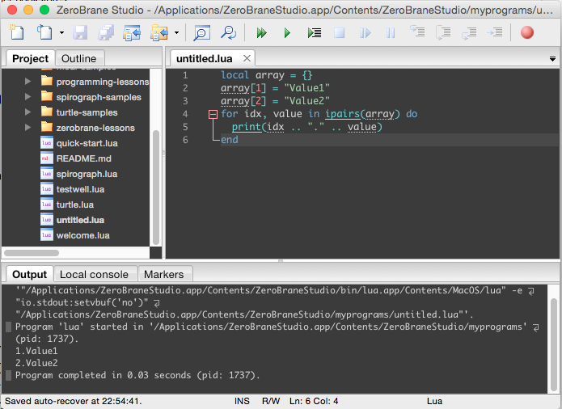
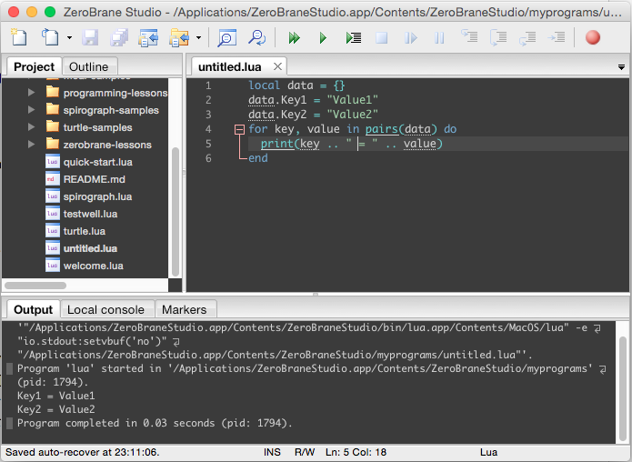

Lua generic for 語法要遍巡處理陣列的話，語法如下：    

<!-- More -->

```Lua
for idx[, value] in ipairs(array) do 
  ... 
end
```

<br/>


像是要遍巡陣列然後將陣列索引與陣列元素顯示出來，就可以像下面這樣撰寫：  

```Lua
local array = {}
array[1] = "Value1"
array[2] = "Value2"
for idx, value in ipairs(array) do
  print(idx .. "." .. value)
end
```



<br/>


如果是要遍巡字典，語法會像下面這樣：  

```Lua
for key[, value] in pairs(dict) do
  ...
end
```

<br/>


像是要遍巡字典然後將字典內元素的鍵值與元素值顯示出來，就可以像下面這樣撰寫：  

```Lua
local data = {}
data.Key1 = "Value1"
data.Key2 = "Value2"
for key, value in pairs(data) do
  print(key .. " = " .. value)
end
```



<br/>


Link
