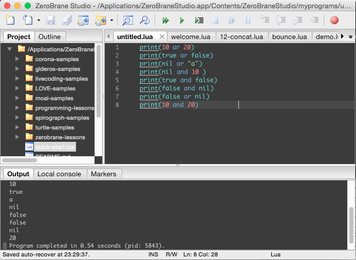
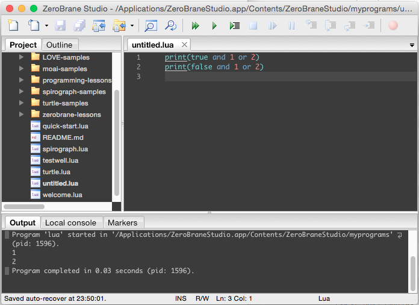
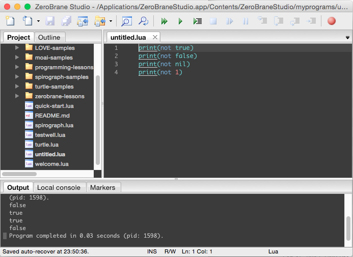

Lua 的邏輯運算會將 false 與 nil 視為 false，其它值視為 true。  

<!-- More -->

<br/>


所以 and、or 運算寫起來就會像下面這樣。  

```Lua
print(10 or 20)            
print(true or false)    
print(nil or "a")          
print(nil and 10 )         
print(true and false) 
print(false and nil)       
print(false or nil)        
print(10 and 20)           
```

<br/>




<br/>


and、or 運算也可以用作三元運算處理，最前面是條件值，然後用 and 運算接條件成立時要回傳的值，再 or 運算接條件不成立時要回傳的值即可。  

```Lua
print(true and 1 or 2)
print(false and 1 or 2)
```

<br/>




<br/>


至於 not 運算就是把 true、false 反轉。  

```Lua
print(not true)
print(not false)
print(not nil)
print(not 1)
```

<br/>




<br/>


Link
-----
* [[Lua] 邏輯運算 « Huli's Blog](http://huli.logdown.com/posts/198881-lua-logical-operators)
* [Lua 5.1 Reference Manual](http://www.lua.org/manual/5.1/manual.html#2.5.2)
