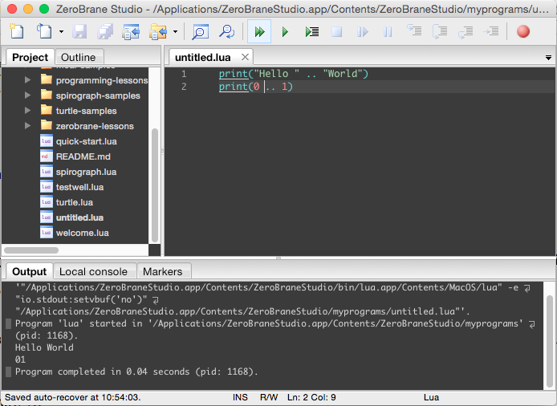

Lua 的字串要作串接的話，可以使用 .. 運算子。該運算子能將前後的字串相加，若是運算子的前後為數值的話，則會轉成字串後再做相加。  

<!-- More -->

<br/>


程式寫起來會像下面這樣：  

```Lua
print("Hello " .. "World")
print(0 .. 1)
```

<br/>




<br/>


Link
----
* [Programming in Lua : 3.4](https://www.lua.org/pil/3.4.html)
