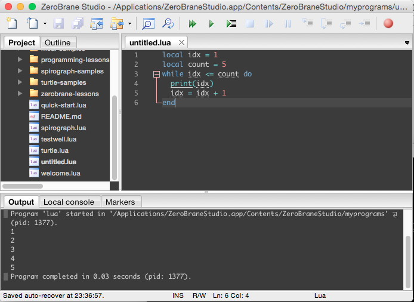

Lua 的 while 寫法如下，while 後面帶上要進入迴圈的條件，然後用 do…end 設定迴圈的區塊，在迴圈的區塊內帶入要運行的動作即可。  

<!-- More -->

```Lua
while condition do
  ...
end
```

<br/>


像是要簡單的跑迴圈五次，然後印出 1 到 5 的數值，就可以像下面這樣撰寫：  

```Lua
local idx = 1
local count = 5
while idx <= count do
  print(idx)
  idx = idx + 1
end
```

<br/>




<br/>


Link
----
* [Programming in Lua : 4.3.2](https://www.lua.org/pil/4.3.2.html)
