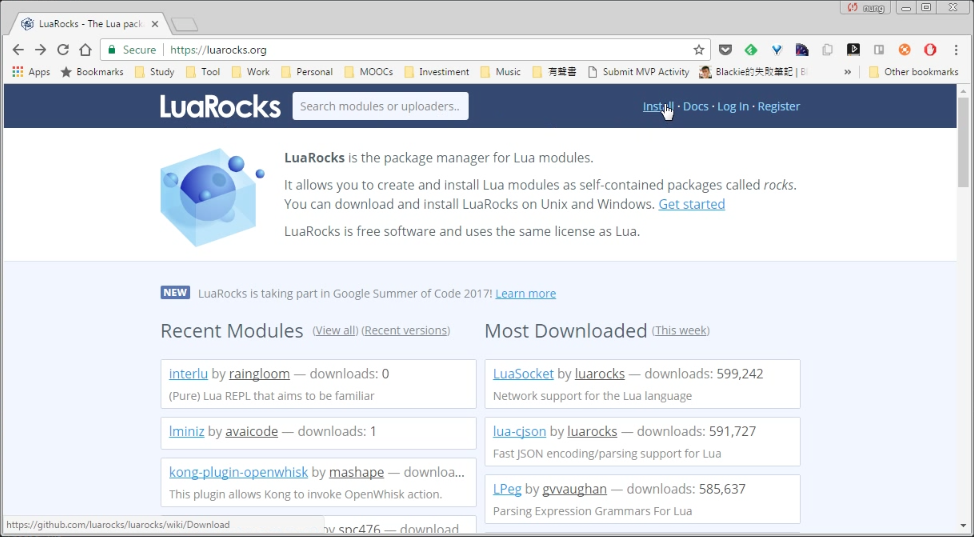
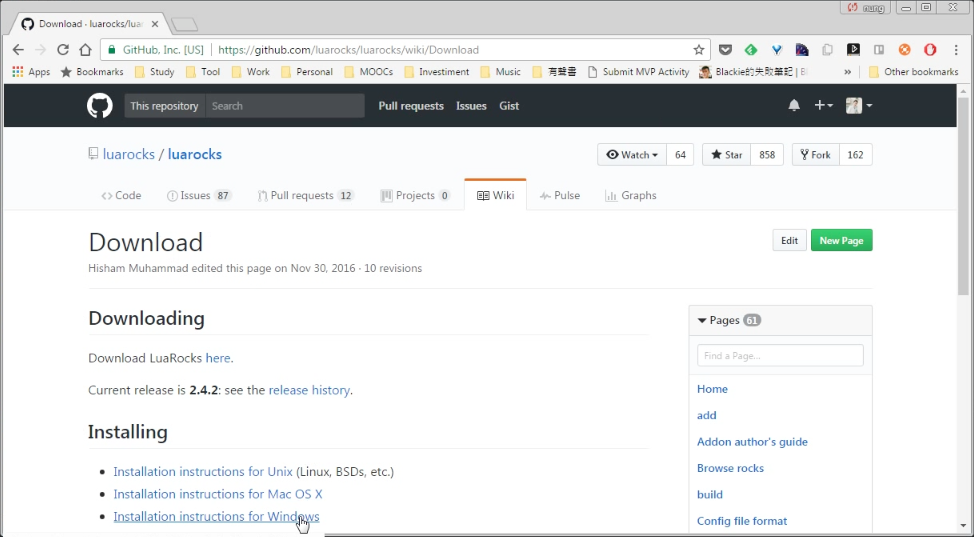
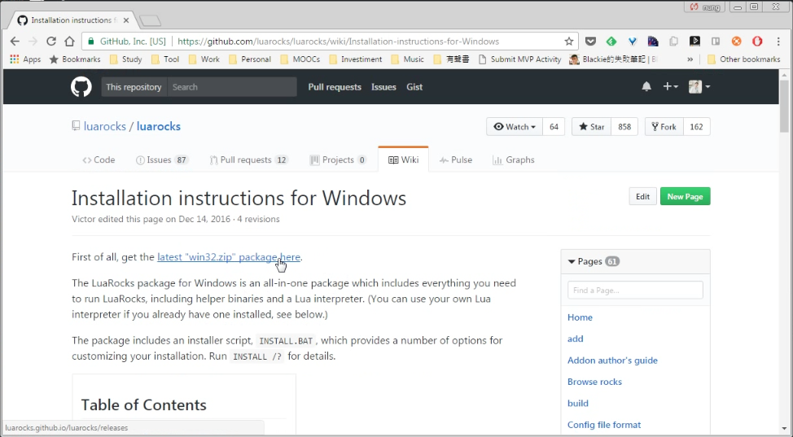
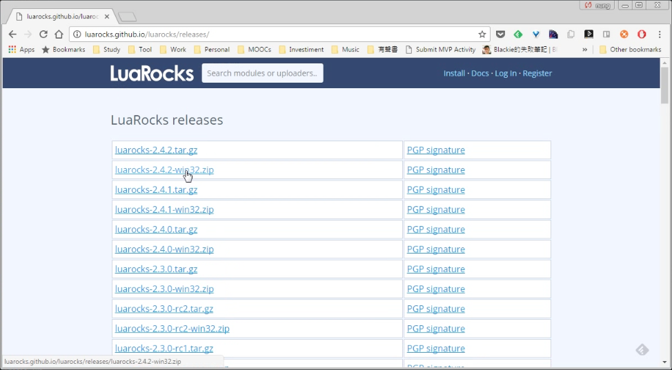
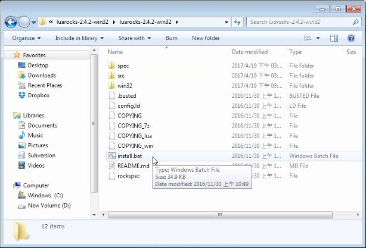
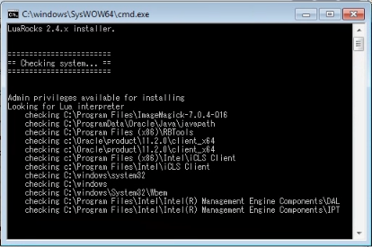
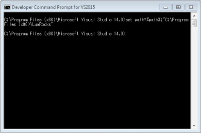
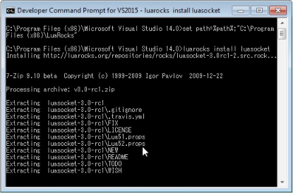

LuaRocks 是 Lua 的套件管理程式，可在官網找到下載頁面。

點選下載所要使用的版本。

安裝包下載下來後，解壓縮即可進行安裝，但是安裝前需先確定是否已裝有 Lua binary，如果 Lua binary 已經備妥，可以運行 'install.bat' 進行 LuaRocks 的安裝。

因為 LuaRocks 需要 C compiler，MinGW 或是 Microsoft compiler 都可以，所以這邊筆者直接使用 Visual Studio 內建的命令列模式來操作。

設定 LuaRocks 的路徑。

就可以用 LuaRocks install 安裝指定的 Lua 套件。

LuaRocks install

Link
----
* [LuaRocks - The Lua package manager](https://luarocks.org/)