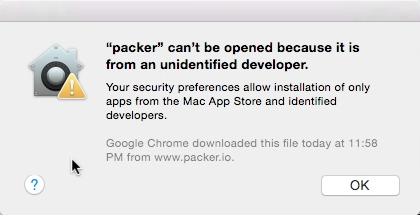
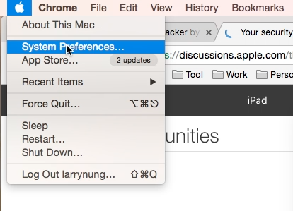
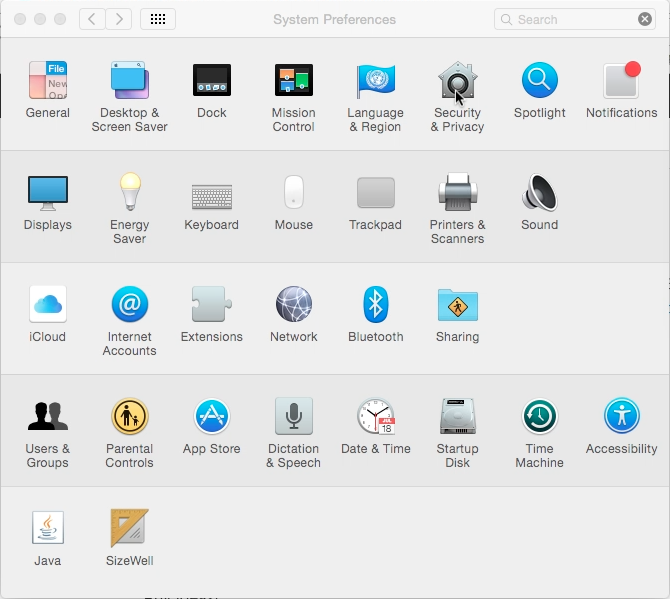
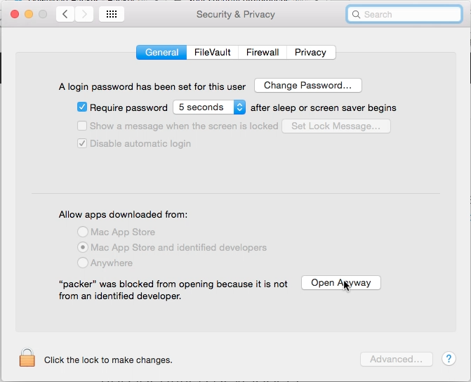
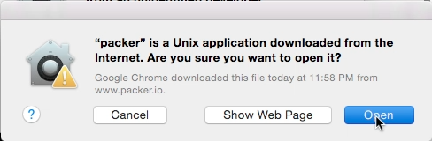
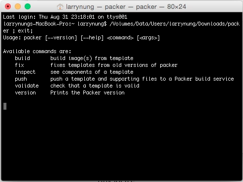
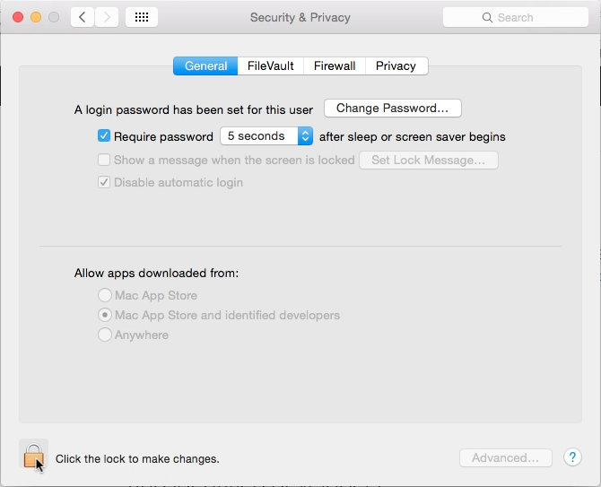
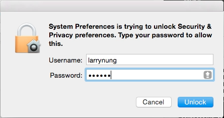
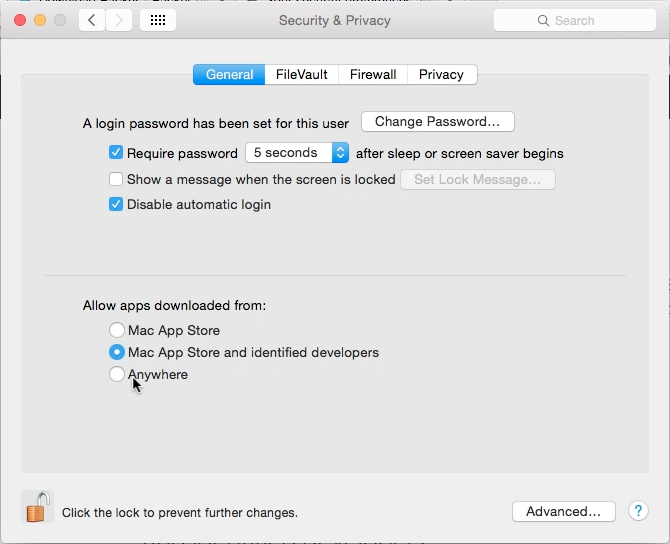
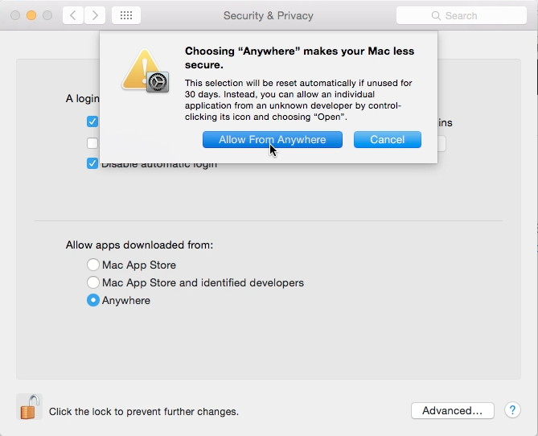

在 Mac 上運行的程式若是 unidentified developers 的 app 的話，app 的運行可能會被擋住。

要繼續運行的話，可開啟 System Perferemces。

點選開啟 Security & Privacy。

如果只是暫時要繼續運行，只要按下 Open Anyway 按鈕。

再按下 Open 按鈕。

即可暫時放行被擋住的 app。

如果覺得每次 unidentified developers 的 app 都被擋住很麻煩的話，可直接放寬設定。

先點選左下角的鎖。

輸入帳密解鎖。

將設定改為 Anywhere 即可，

Link
----
* [macOS Sierra: Open an app from an unidentified developer](https://support.apple.com/kb/PH25088?locale=en_US)