Mailgun 使用 Sandbox subdomain 時，預設只能發送訊息給自己的信箱，除非加上自己的 Domain 或是設定 Authorized recipients。

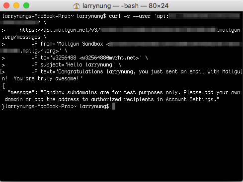

要設定 Autorized recipients，點選網頁右上角的帳號名稱，點選 Account Settings 選單選項。

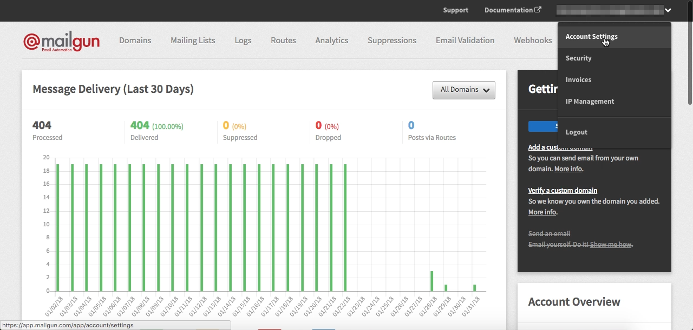

接著切至 Autorized recipients 頁面。

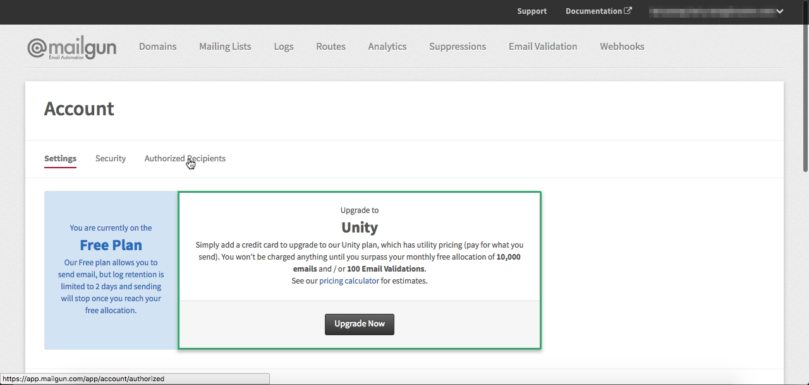

點選 Invite New Recipient 按鈕。

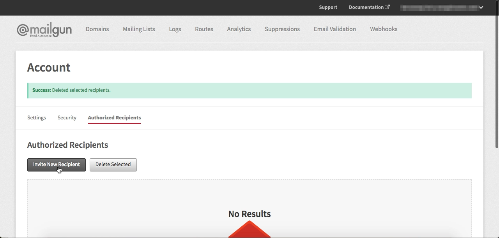

將要加入的 Recipient mail 位置填入，按下 Invite Recipient 按鈕。

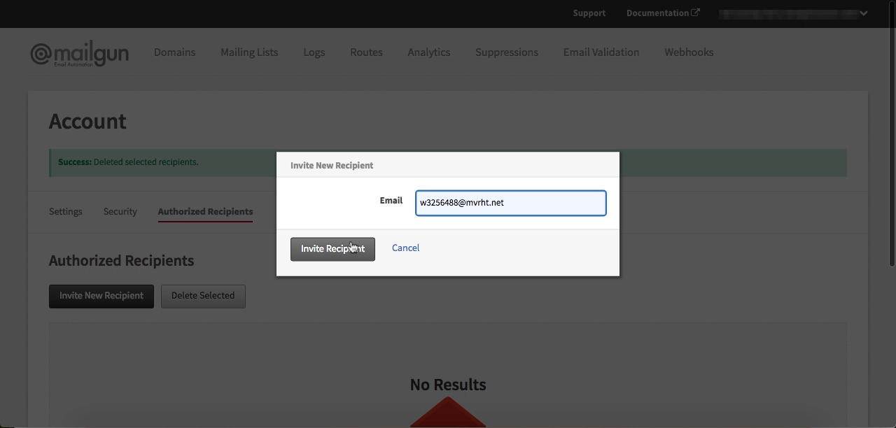

Recipient 就會被加到列表中，此時還是 Unverified 的狀態。

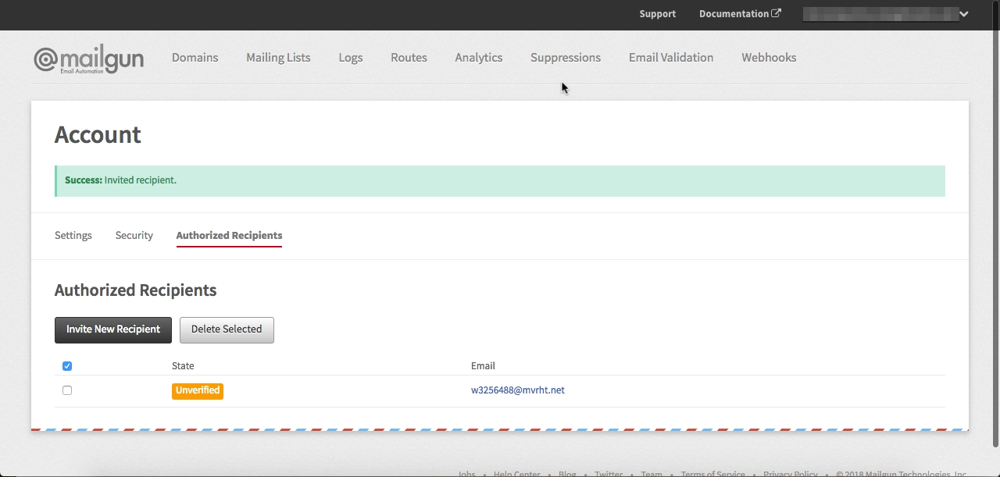

Recipient 會收到來自 Mailgun 的驗證信件，按下 Aggree 按鈕進行驗證的動作。

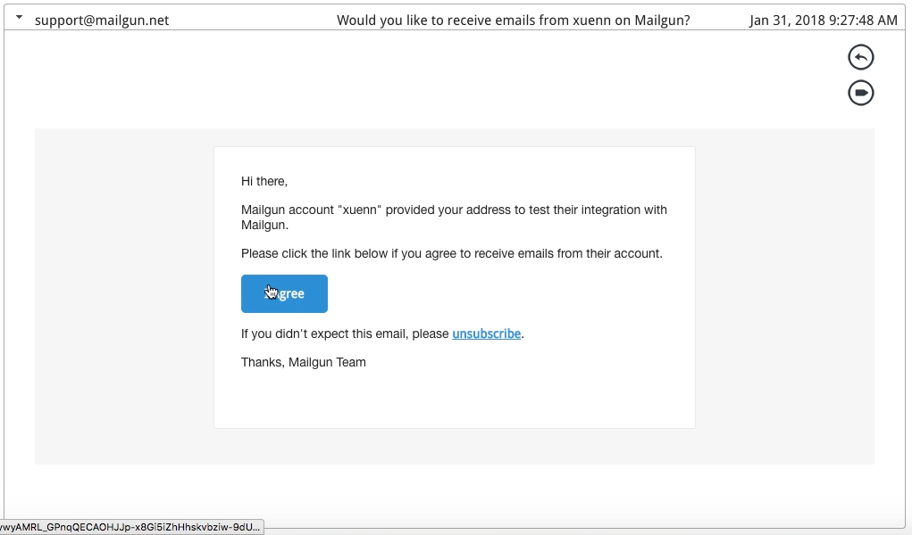

再次按下 Yes 按鈕確認。

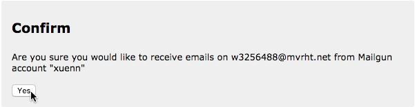

驗證的動作就完成了。

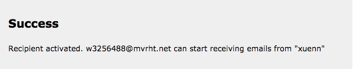

此時 Mailgun 的 Authorized Recipients 內的狀態會變為 Verified。

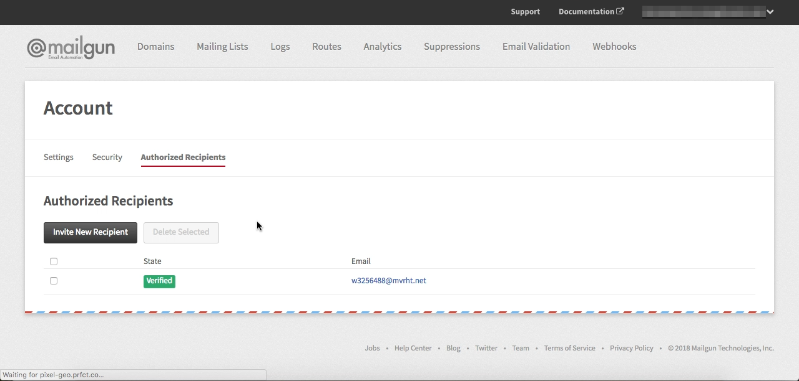

Mailgun 就可以正常的發送信件給 Recipient 了。

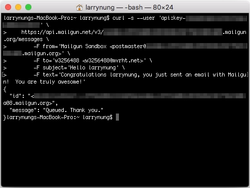