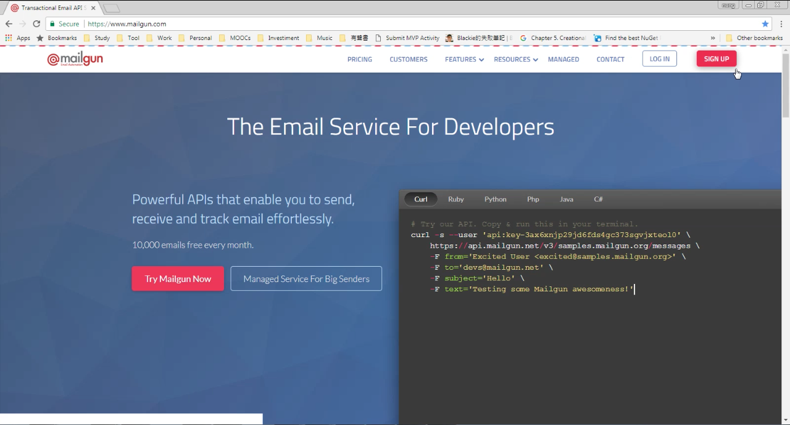
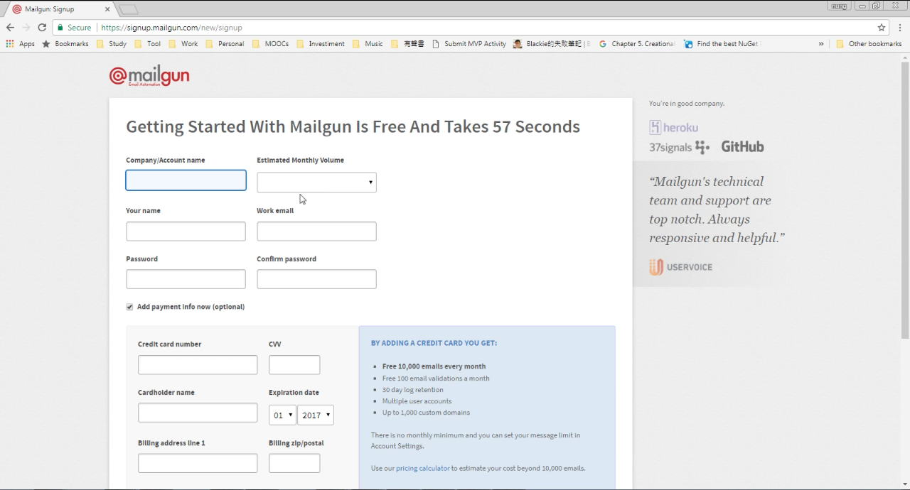
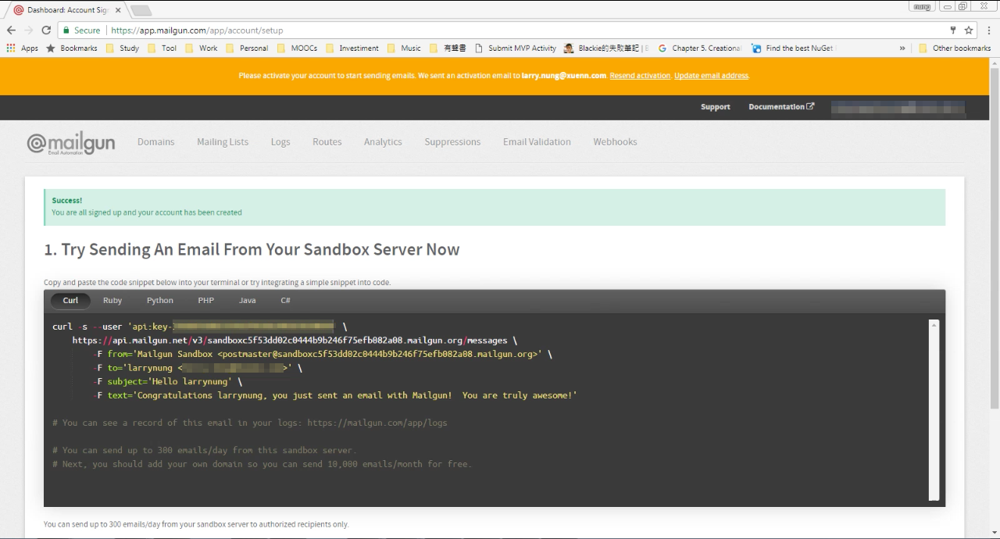
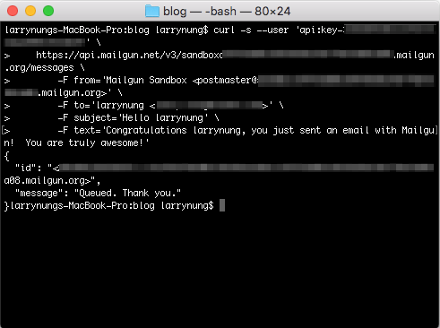
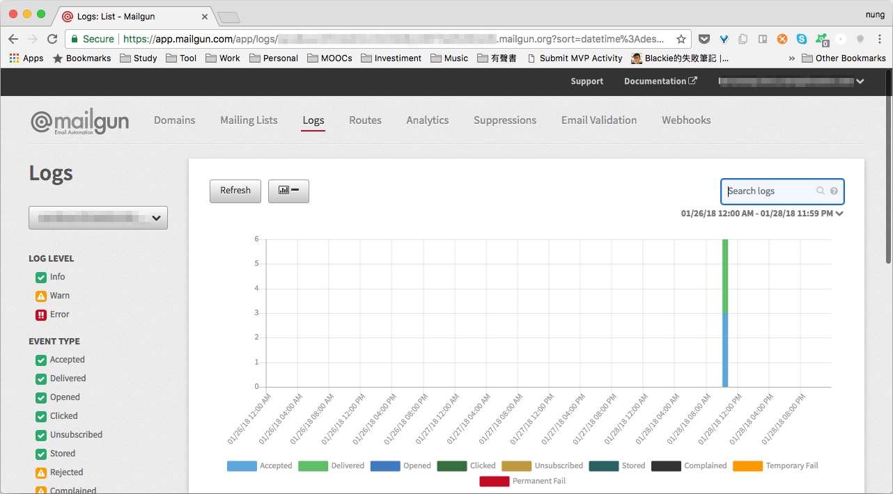
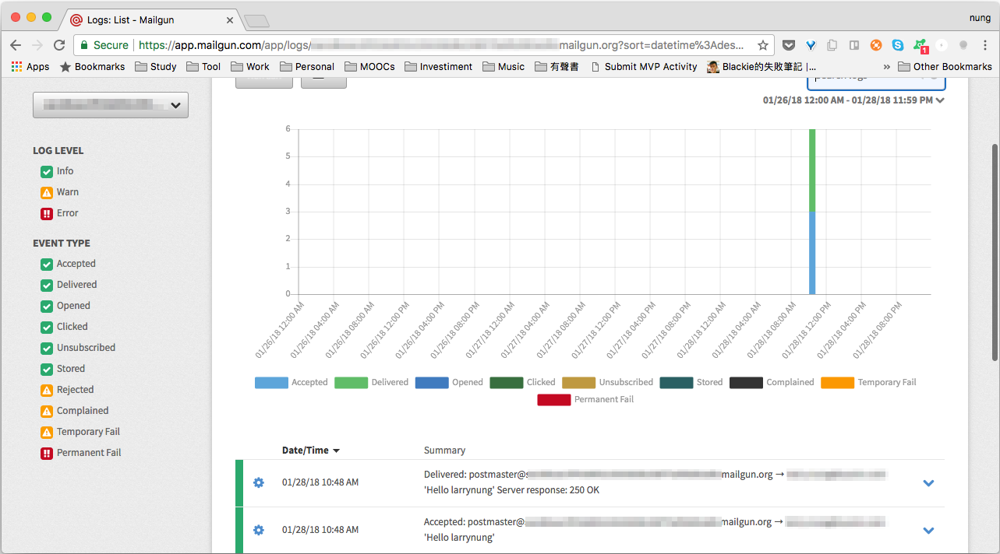
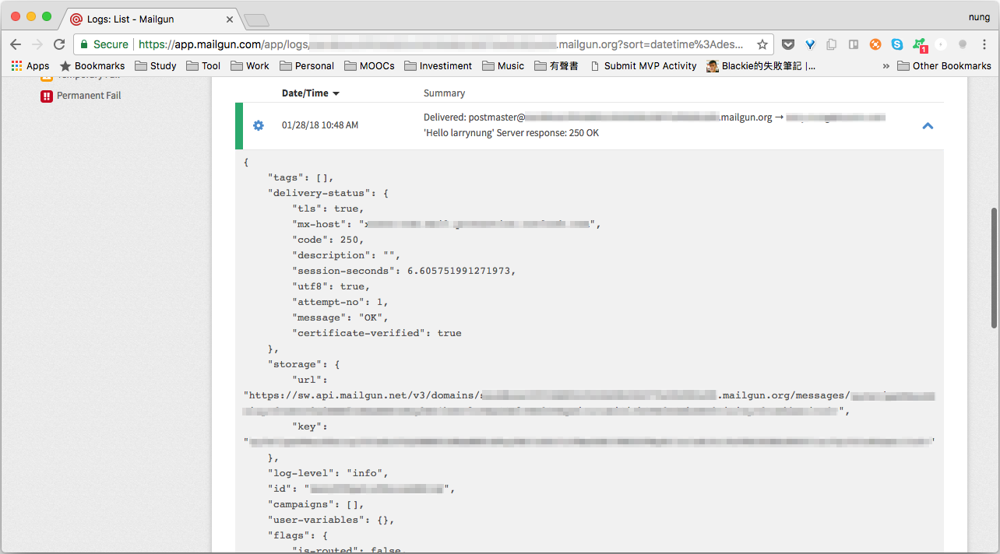

要使用 Mailgun 發送 Email，先要有 Mailgun 會員帳號。  

<!-- More -->

 
 

 
 

註冊成為 Mailgun 會員後，會被導到 https://app.mailgun.com/app/account/setup 頁面，該頁面會簡單的展示 Curl、Ruby、Python、PHP、Java、與 C# 等不同的使用方式。  

 
 

這邊可以簡單的用 Curl 測試一下，下完 Curl 命令後可從 API 的回應看到訊息已發送至 Mailgun 且被 Queue 起來供後續處理。  

 
 

處理的紀錄可在 Mailgun 的 Logs 頁面查閱。  

 
 

若有需要也可以進一步展開查閱更為細節的部分。  

 
 

 
 

Link
====
* [Transactional Email API Service For Developers | Mailgun](https://www.mailgun.com/)
