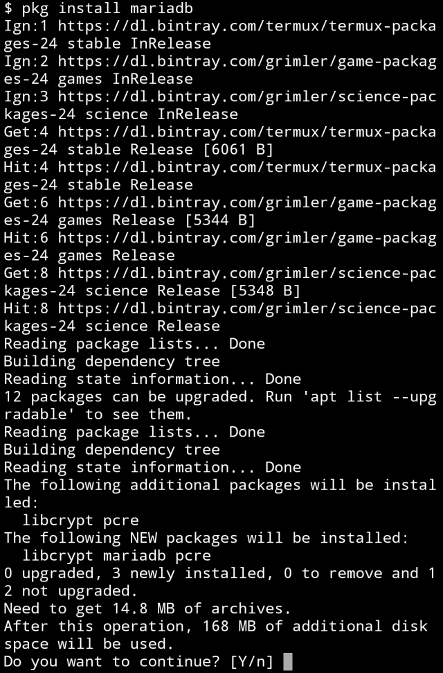
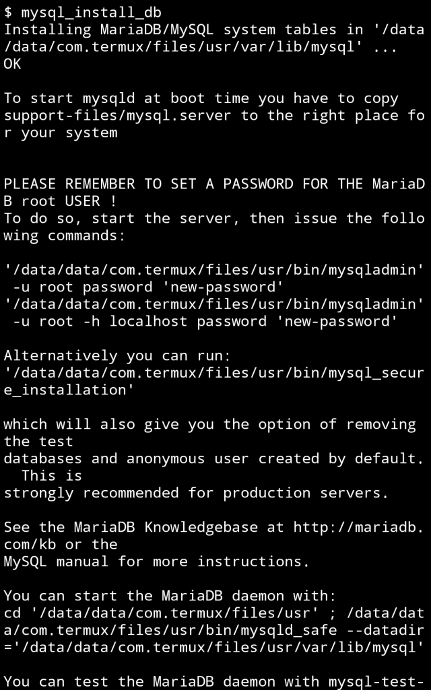
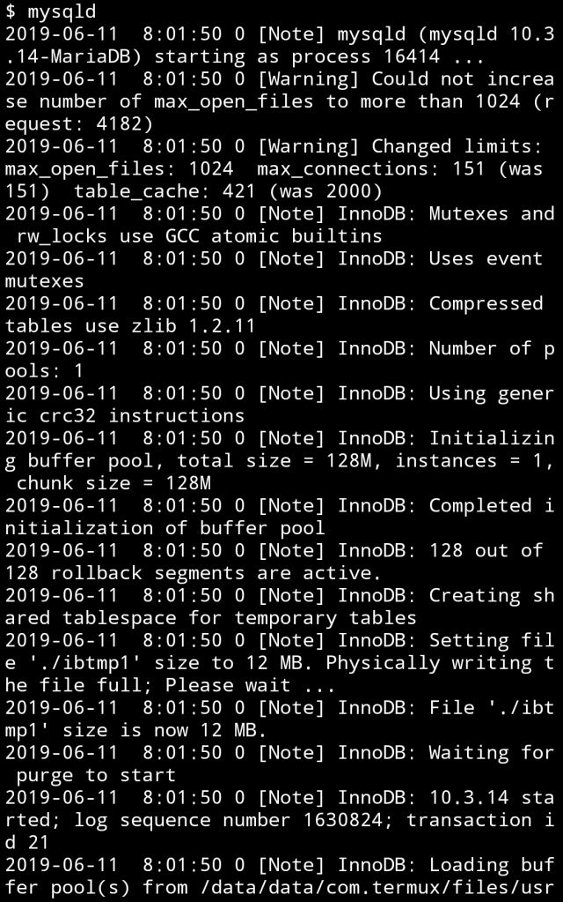
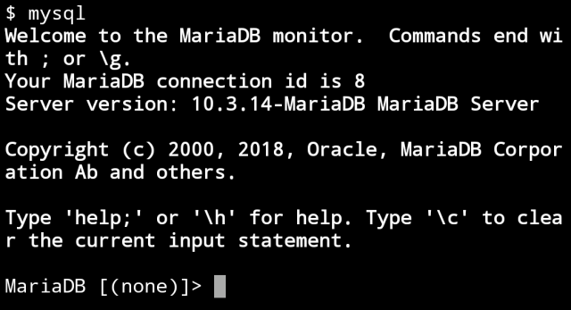

在 Termux 安裝 MariaDB，可透過 pkg 或是 apt 安裝。  

<!-- More -->

    pkg install MariaDB

 

安裝完調用 mysql_install_db 命令安裝資料庫。  

    mysql_install_db

 

調用 mysqld 命令啟動服務。  

    mysqld

 

在另一個 Session 調用 mysql 命令即可連進 MariaDB。  

    mysql

