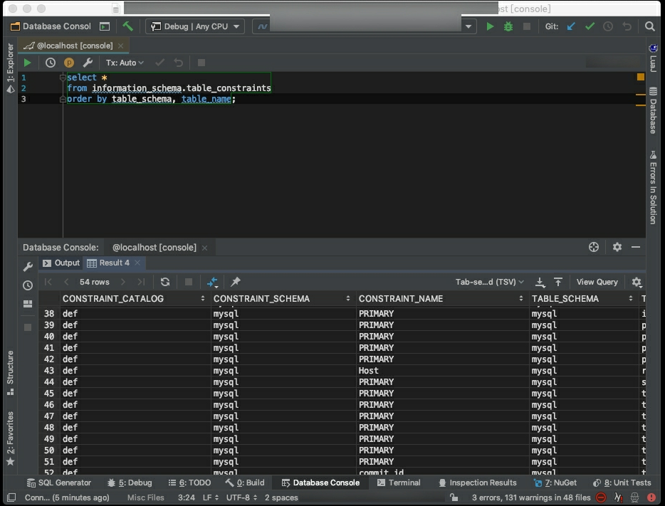

要查詢資料庫的 Constraints 可查閱 information_schema schema 的 table_constraints table。

```sql
select *
from information_schema.table_constraints
order by table_schema, table_name;
```



Link
----
* [List table check constraints in MariaDB database - MariaDB Query Toolbox](https://dataedo.com/kb/query/mariadb/list-table-check-constraints)