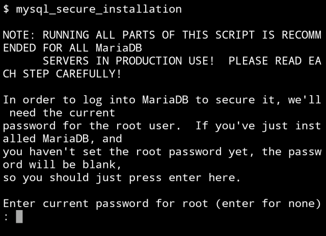
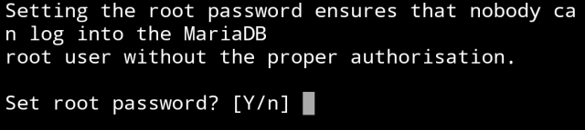
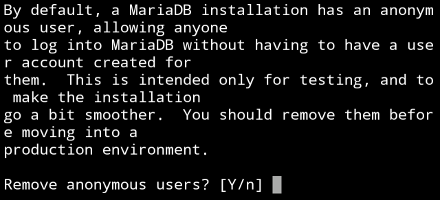
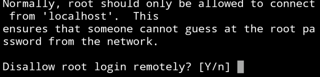
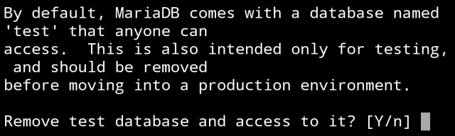
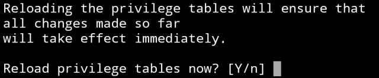

MariaDB 安裝完後可調用 mysql_secure_installation 命令進行一連串的安全性設定。  

<!-- More -->

    mysql_secure_installation

 

像是 root 的密碼。  

 

是否移除匿名使用者?  

 

是否允許 root 帳號遠端登入?

 

移除測試用資料庫?

 

是否重新載入設定?

 

照著設定完 MariaDB 就會有基本的安全性在。  
