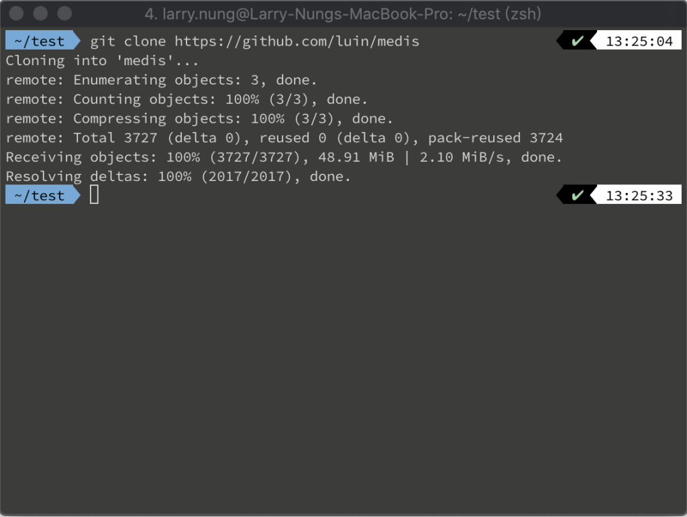
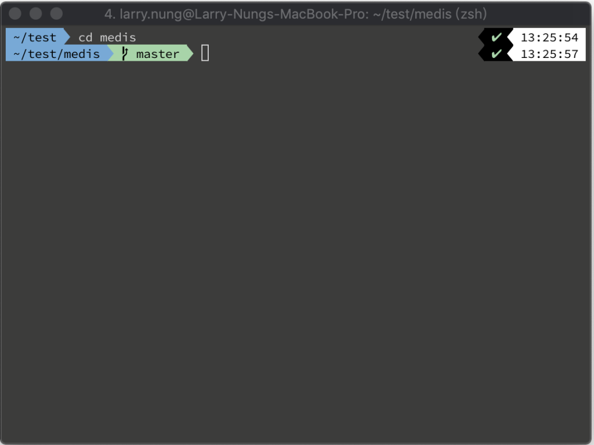
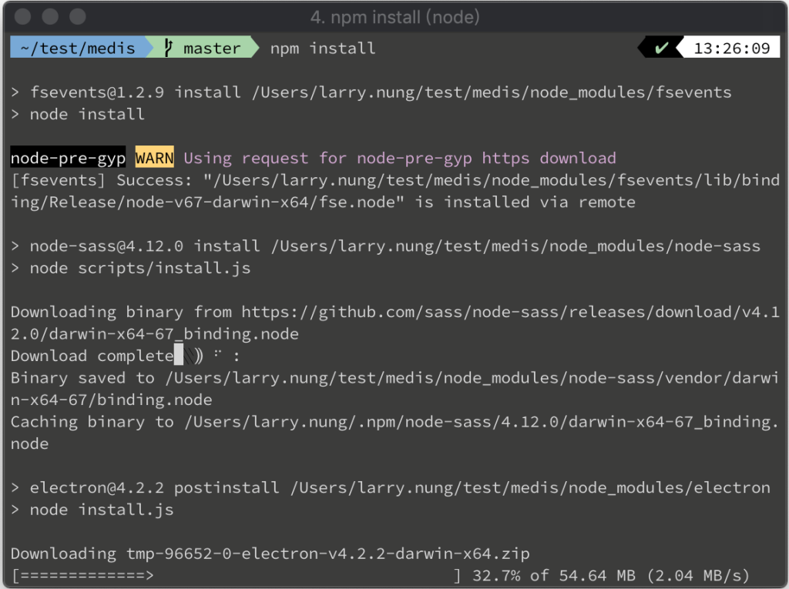
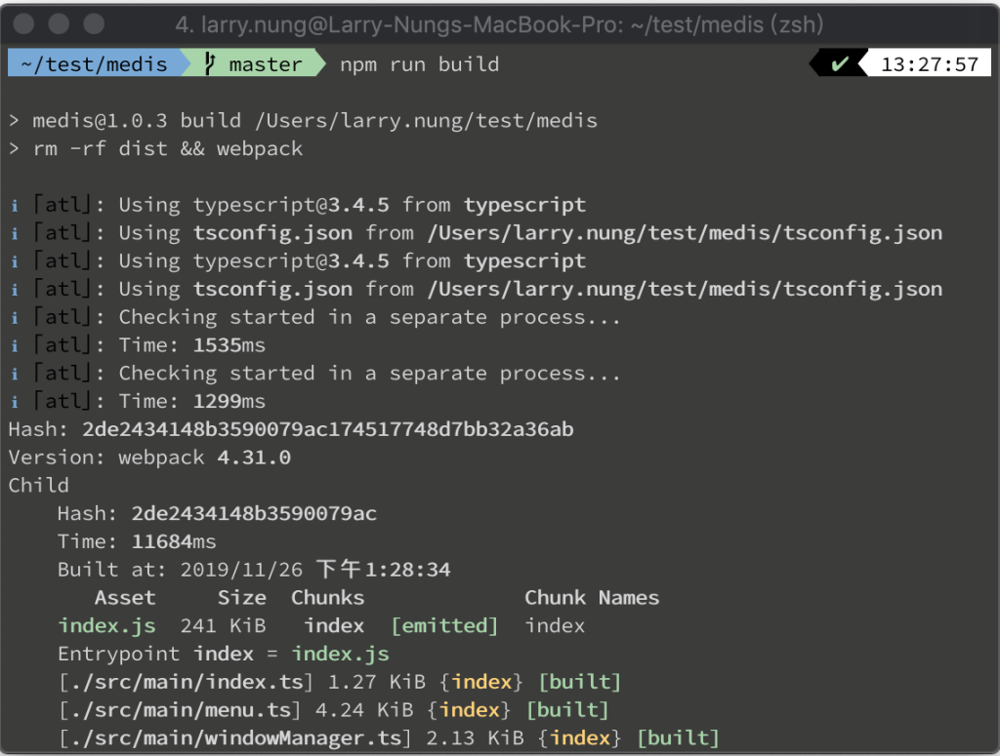
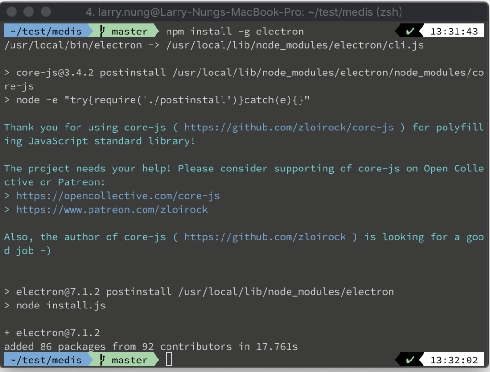
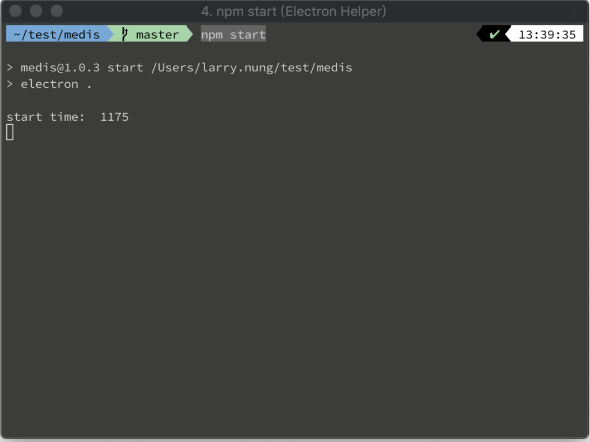
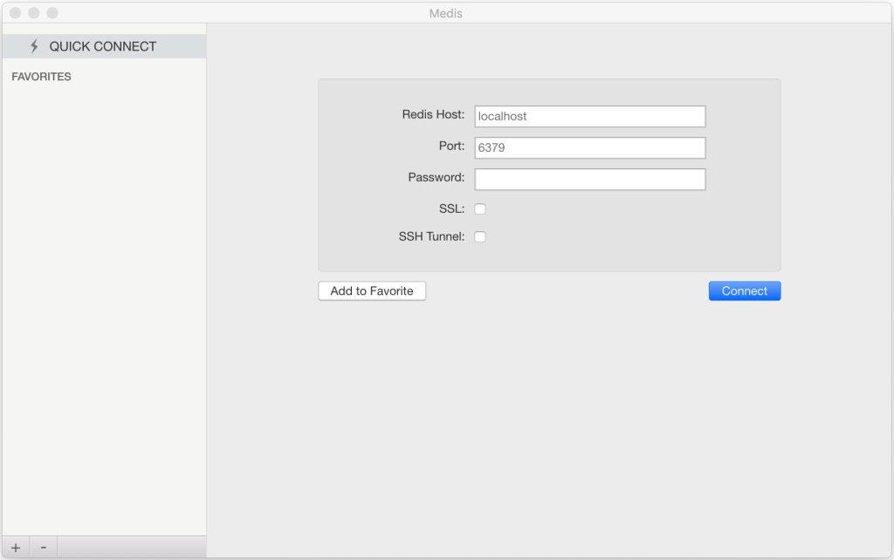

要在本地運行 Medis，先要將 Medis 下載下來。  

<!-- More -->

    git clone https://github.com/luin/medis

 

進入 Media 目錄。  

    cd medis

 

安裝需要的 npm 套件。

    npm install

 

建置。  

    npm run build

 

因為運行需依賴 electron，若未安裝，這邊可進行全域安裝。  

    npm install -g electron

 

最後使用 npm 的 start 命令啟用程式即可。  

    npm start

 

