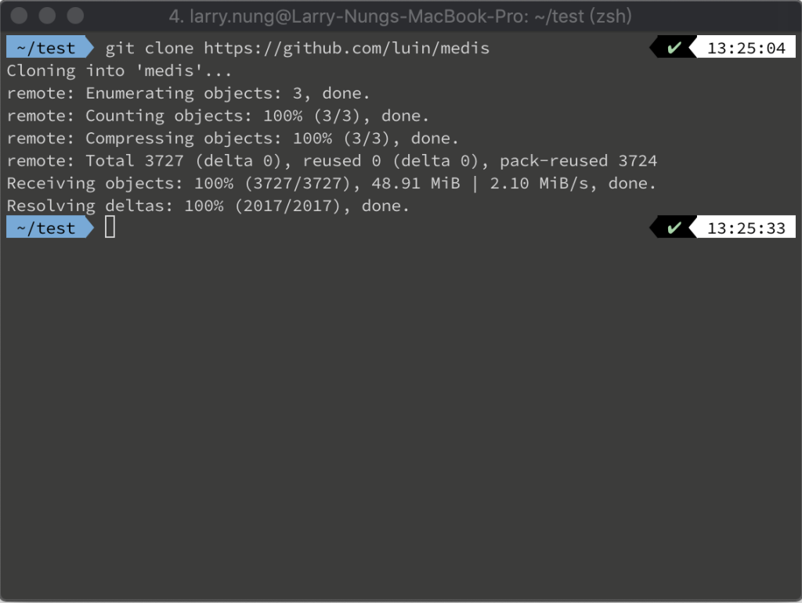
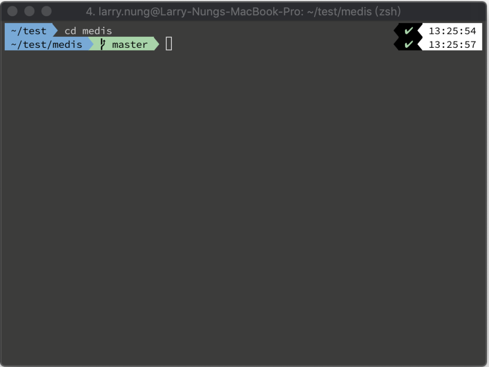
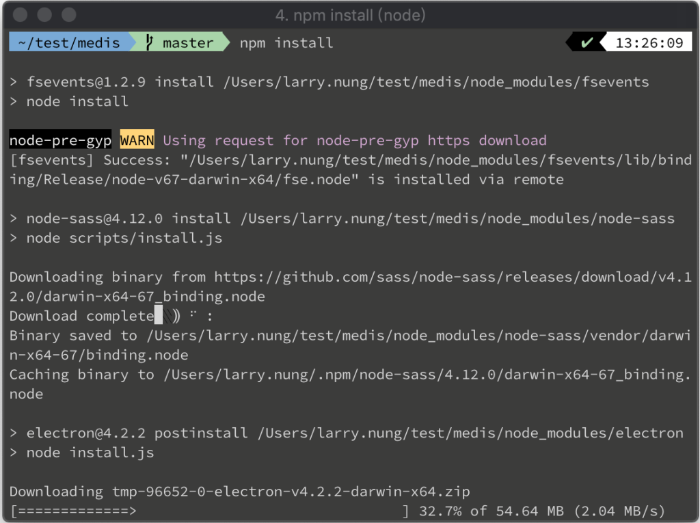
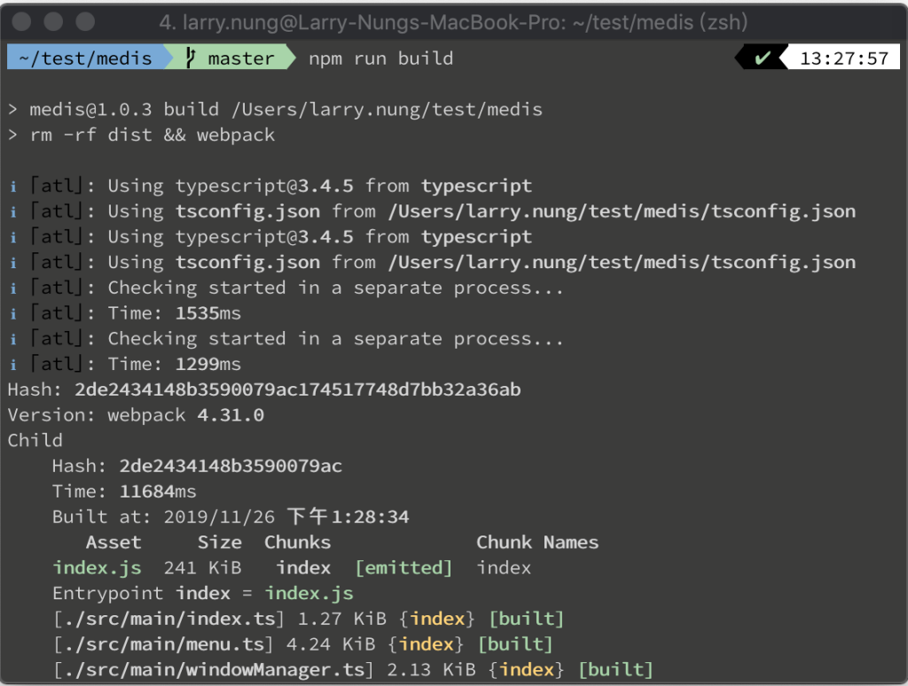
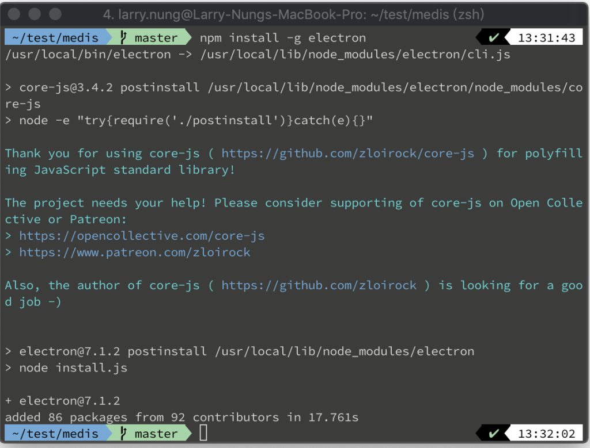
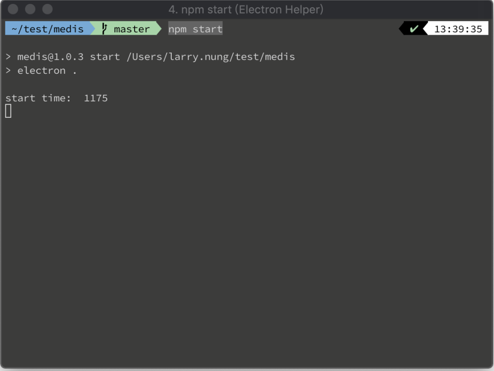
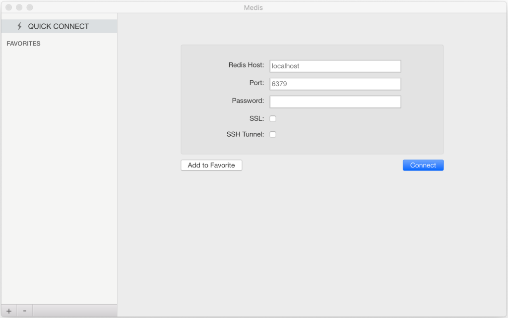

要在本地運行 Medis，先要將 Medis 下載下來。

git clone https://github.com/luin/medis

進入 Media 目錄。

cd medis

安裝需要的 npm 套件。

npm install

建置。

npm run build

因為運行需依賴 electron，若未安裝，這邊可進行全域安裝。

npm install -g electron

最後使用 npm 的 start 命令啟用程式即可。

npm start

