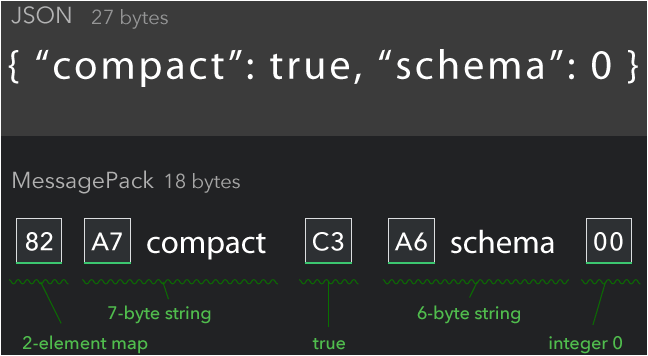
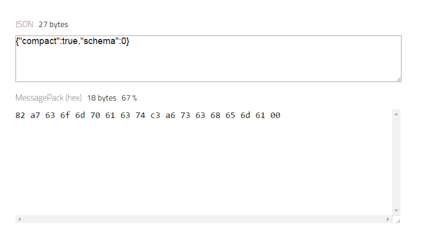

MessagePack 是一個有效率的二進制序列化格式，傳遞的資料內容有點像是 JSON，但是因為是二進制的序列化格式，所以資料量更快且更小。  

<!-- More -->

 

像是下面這張官網的圖，可以看到 {"compact":true,"schema":0} 這樣的 JSON 資料換由 MessagePack 來處理，資料量會從 27 bytes 降到 18 bytes，減少了 67%。  

 

不過官網這張圖只是簡單的示意，實際上 compact 與 schema 這兩個字串得替換為 ascii，所以實際傳送的資料會變為 82 a7 63 6f 6d 70 61 63 74 c3 a6 73 63 68 65 6d 61 00。  

 

若想要讀懂 MessagePack 格式的資料，必需先了解 MessagePack 的 format，其定義如下：  

| format name | first byte (in binary) | first byte (in hex) |
|:-------------:|:-------------:|:-------------:|
|positive fixint | 0xxxxxxx | 0x00 - 0x7f |
|fixmap | 1000xxxx | 0x80 - 0x8f |
|fixarray | 1001xxxx | 0x90 - 0x9f |
|fixstr | 101xxxxx | 0xa0 - 0xbf |
|nil | 11000000 | 0xc0 |
|(never used) | 11000001 | 0xc1 |
|false | 11000010 | 0xc2 |
|true | 11000011 | 0xc3 |
|bin 8 | 11000100 | 0xc4 |
|bin 16 | 11000101 | 0xc5 |
|bin 32 | 11000110 | 0xc6 |
|ext 8 | 11000111 | 0xc7 |
|ext 16 | 11001000 | 0xc8 |
|ext 32 | 11001001 | 0xc9 |
|float 32 | 11001010 | 0xca |
|float 64 | 11001011 | 0xcb |
|uint 8 | 11001100 | 0xcc |
|uint 16 | 11001101 | 0xcd |
|uint 32 | 11001110 | 0xce |
|uint 64 | 11001111 | 0xcf |
|int 8 | 11010000 | 0xd0 |
|int 16 | 11010001 | 0xd1 |
|int 32 | 11010010 | 0xd2 |
|int 64 | 11010011 | 0xd3 |
|fixext 1 | 11010100 | 0xd4 |
|fixext 2 | 11010101 | 0xd5 |
|fixext 4 | 11010110 | 0xd6 |
|fixext 8 | 11010111 | 0xd7 |
|fixext 16 | 11011000 | 0xd8 |
|str 8 | 11011001 | 0xd9 |
|str 16 | 11011010 | 0xda |
|str 32 | 11011011 | 0xdb |
|array 16 | 11011100 | 0xdc |
|array 32 | 11011101 | 0xdd |
|map 16 | 11011110 | 0xde |
|map 32 | 11011111 | 0xdf |
| negative fixint | 111xxxxx | 0xe0 - 0xff |

 

這邊舉幾個簡單的例子來看。  

 

Nil、False、True 這些簡易資料可經由查表直接得知為 0xc0、0xc2、0xc3。  

 

如果是正整數的話，其格式為 0xxxxxxx，所以 0 的話就是 00000000，也就是 0x00。1 的話就是 00000001，也就是 0x01。  

 

如果是字串的話，其格式為 101xxxxx，xxxxx 的部份要用來描述字串的長度，後面要接字串的內容，所以像是 Compact 字串，就會變成 10100007 01100011 01101111 01101101 01110000 01100001 01100011 01110100，也就是 a7 63 6f 6d 70 61 63 74。
