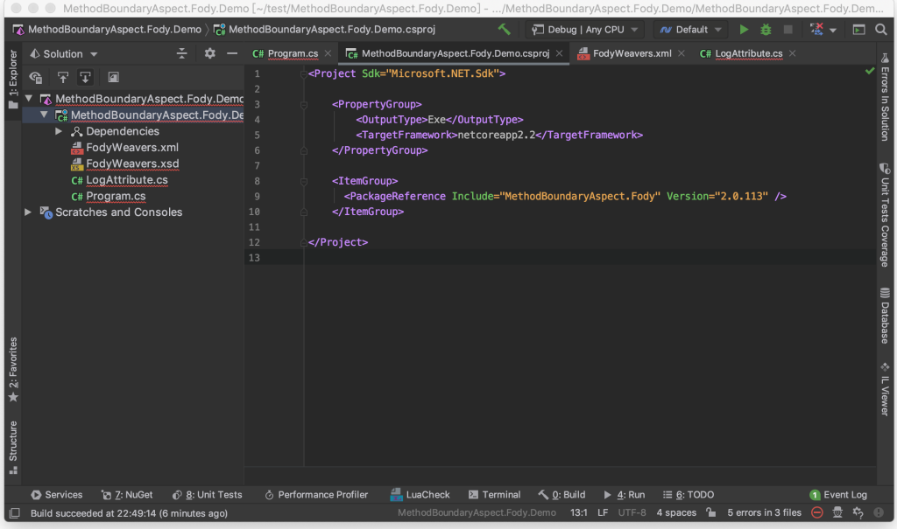
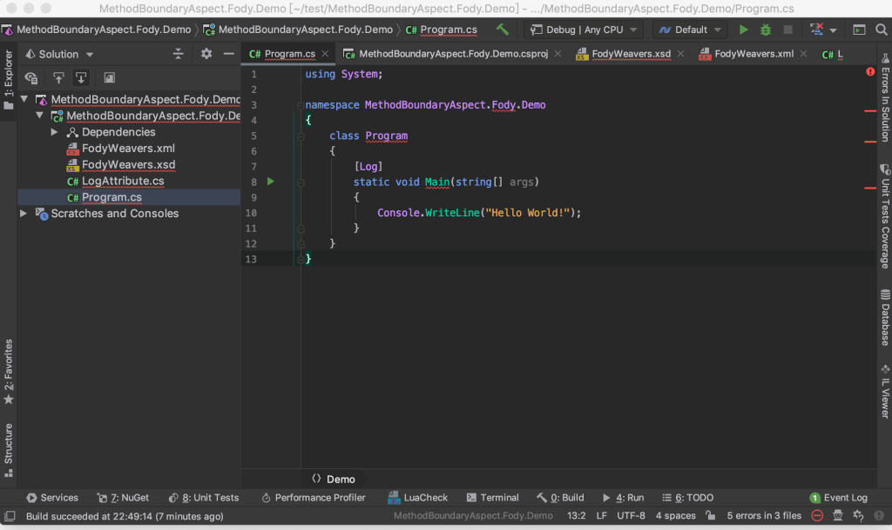
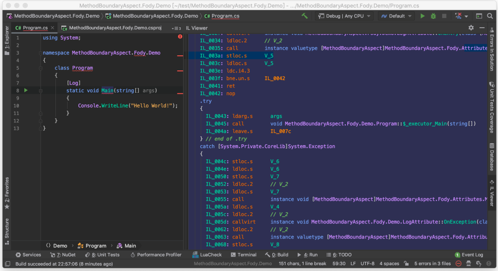

MethodBoundaryAspect.Fody 能透過 Fody 在程式編譯時將進出方法與方法丟出錯誤時的處理掛入系統中。  

<!-- More -->

</br>


使用時需先引用 MethodBoundaryAspect.Fody 套件。  

```xml
<Project Sdk="Microsoft.NET.Sdk">


    <PropertyGroup>
        <OutputType>Exe</OutputType>
        <TargetFramework>netcoreapp2.2</TargetFramework>
    </PropertyGroup>


    <ItemGroup>
      <PackageReference Include="MethodBoundaryAspect.Fody" Version="2.0.113" />
    </ItemGroup>


</Project>
```



</br>


然後加入 FodyWeavers.xml 檔，指示 Fody 要使用 MethodBoundaryAspect。

```xml
<?xml version="1.0" encoding="utf-8"?>
<Weavers xmlns:xsi="http://www.w3.org/2001/XMLSchema-instance" xsi:noNamespaceSchemaLocation="FodyWeavers.xsd">
  <MethodBoundaryAspect />
</Weavers>
```


</br>


接著開一個 Attribute 類別繼承 OnMethodBoundaryAspect，在 OnEntry 撰寫方法進入時的處理、OnExit 撰寫方法離開時的處理、OnException 撰寫方法發生例外時的處理。  

```c#
using System;
using MethodBoundaryAspect.Fody.Attributes;


namespace MethodBoundaryAspect.Fody.Demo
{
    public sealed class LogAttribute : OnMethodBoundaryAspect
    {
        public override void OnEntry(MethodExecutionArgs args)
        {
            Console.WriteLine("OnEntry...");
        }


        public override void OnExit(MethodExecutionArgs args)
        {
            Console.WriteLine("OnExit....");
        }


        public override void OnException(MethodExecutionArgs args)
        {
            Console.WriteLine("OnException....");
        }
    }
}
```


</br>


最後將剛撰寫的 Attribute 掛在要套用的方法上。  

```c#
using System;


namespace MethodBoundaryAspect.Fody.Demo
{
    class Program
    {
        [Log]
        static void Main(string[] args)
        {
            Console.WriteLine("Hello World!");
        }
    }
}
```



</br>


編譯器在編譯時就會將對應的處理掛上系統。  


