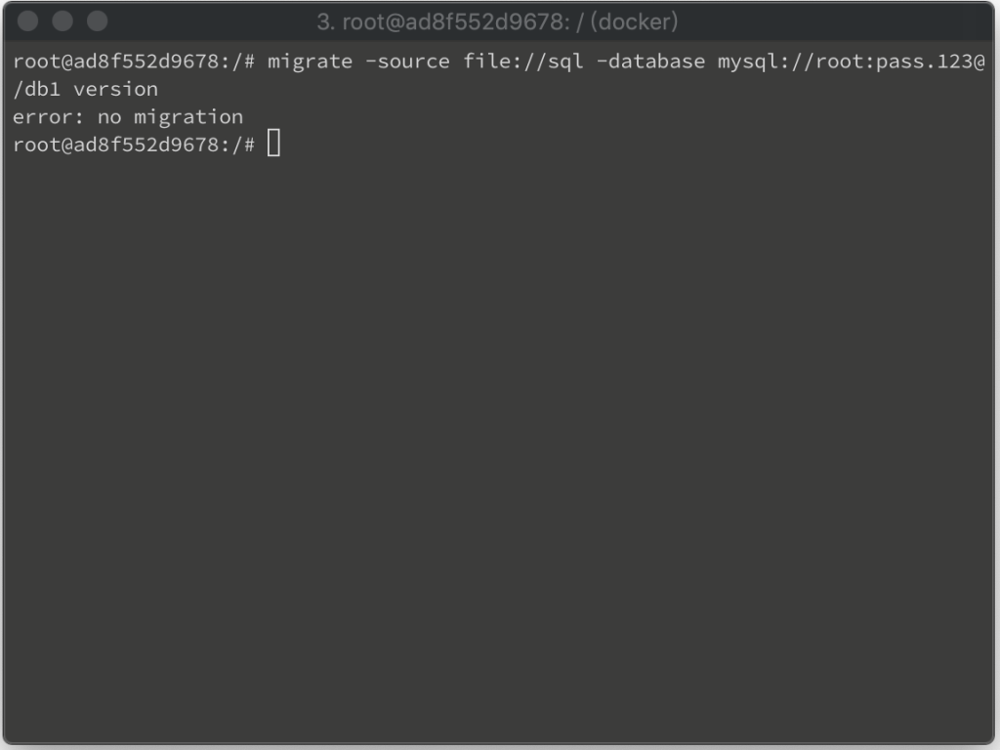
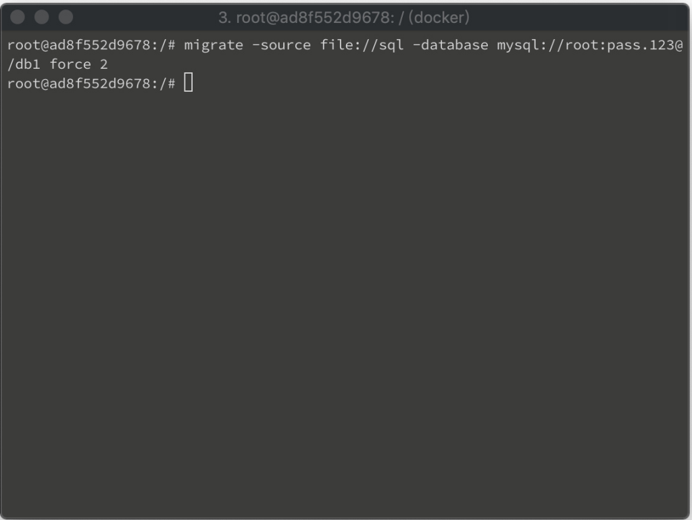
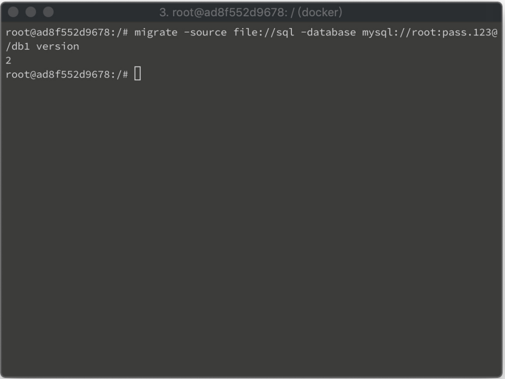

migrate 的 force 命令可不運行 migration 就強制設定版本。  

<!-- More -->

 

像是筆者這邊有個沒套過 migration 的資料庫。

    migrate -source $source -database $database version

 

筆者強制設定資料庫版本。  

    migrate -source $source -database $database force $version

 

資料庫版本就會被強制設為指定的版本。  

    migrate -source $source -database $database version

