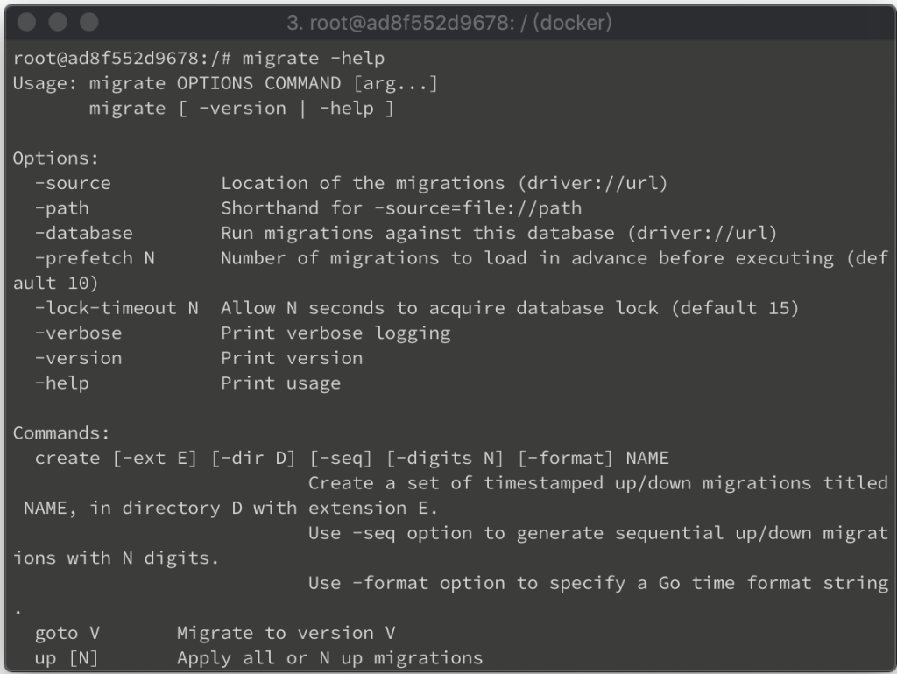
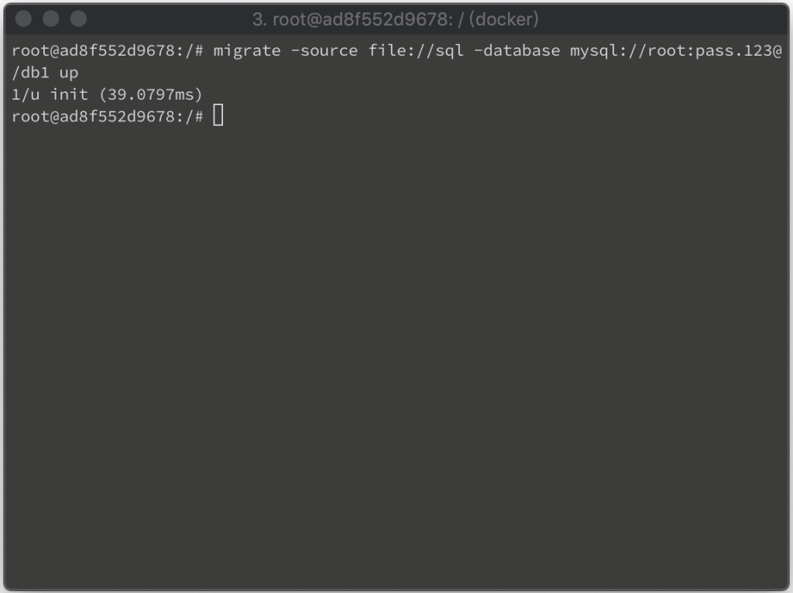
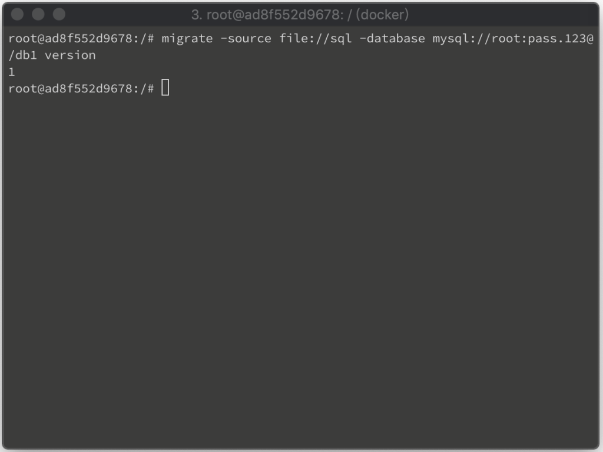
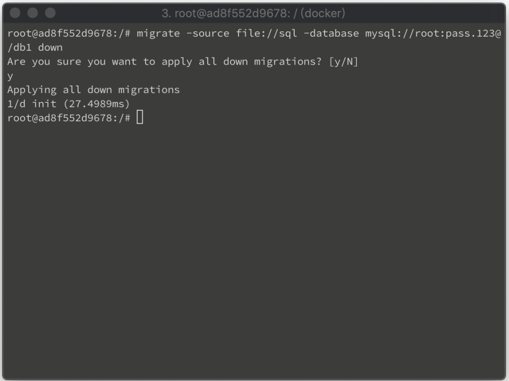
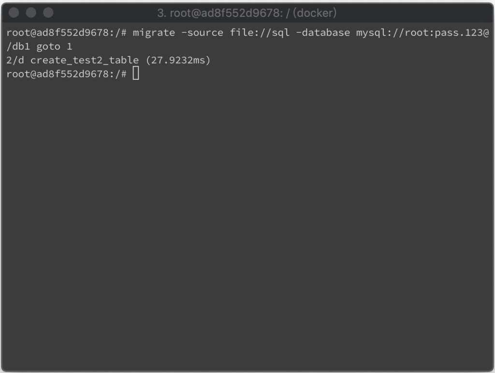
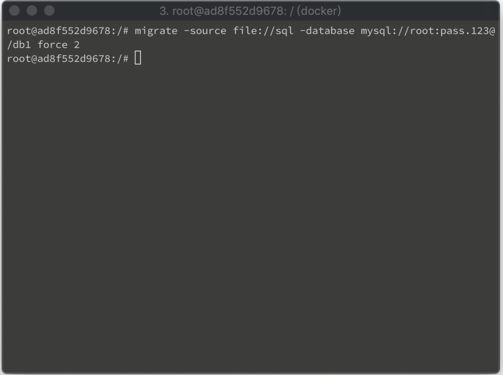
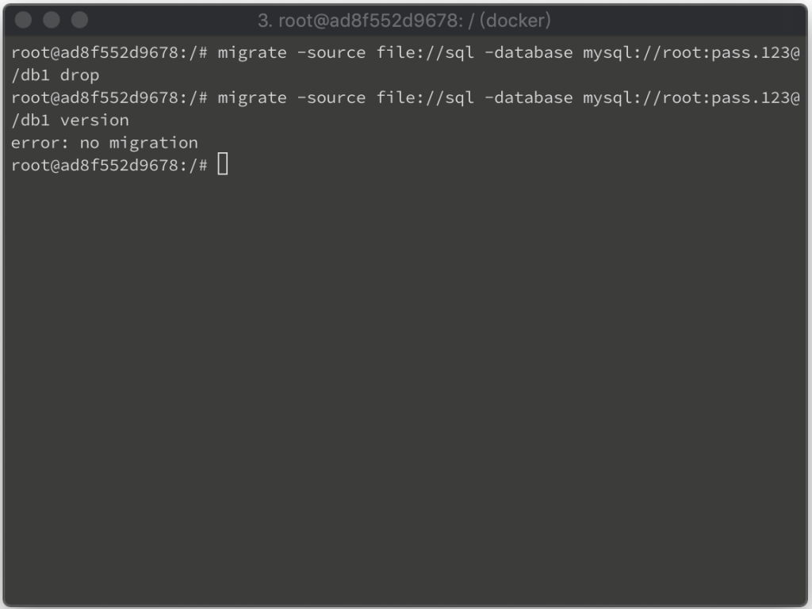

migrate 安裝後可調用命令查閱 CLI 使用方式。  

<!-- More -->

    migrate -help



</br>


使用方式如下:  

```
Usage: migrate OPTIONS COMMAND [arg...]
       migrate [ -version | -help ]

Options:
  -source          Location of the migrations (driver://url)
  -path            Shorthand for -source=file://path
  -database        Run migrations against this database (driver://url)
  -prefetch N      Number of migrations to load in advance before executing (default 10)
  -lock-timeout N  Allow N seconds to acquire database lock (default 15)
  -verbose         Print verbose logging
  -version         Print version
  -help            Print usage

Commands:
  create [-ext E] [-dir D] [-seq] [-digits N] [-format] NAME
               Create a set of timestamped up/down migrations titled NAME, in directory D with extension E.
               Use -seq option to generate sequential up/down migrations with N digits.
               Use -format option to specify a Go time format string.
  goto V       Migrate to version V
  up [N]       Apply all or N up migrations
  down [N]     Apply all or N down migrations
  drop         Drop everything inside database
  force V      Set version V but don't run migration (ignores dirty state)
  version      Print current migration version
```

</br>


簡單說 -source 跟 -database 這兩個 Options 與要運行的 Command 是必帶的。-source 指定 Migration 來源位置，-database 指定要運行 Command 的資料庫，Command 是要運行的命令。  

</br>

migrate 的 Source 跟 Database 支援眾多，各有不同的設定方式，Migration 撰寫方式也有所差異，需參閱對應文件找出對應的設定方式，及 Migration 的撰寫方式。  

</br>


設定好 Source、Migration、Database，即可開始對資料庫調用 migrate Command。

</br>


像是用 up 命令將 Migration 套用到資料庫。  



</br>


用 version 命令查閱當前資料庫的 Migration 版本。  



</br>


用 down 命令還原已套用的 Migration。  



</br>


用 goto 命令跳到指定的版本。 



</br>


用 force 命令強制將當前資料庫版本竄改為指定版本。  



</br>


用 drop 命令將資料庫內容清除。  


