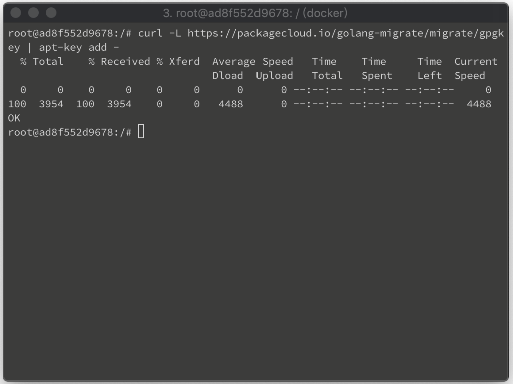
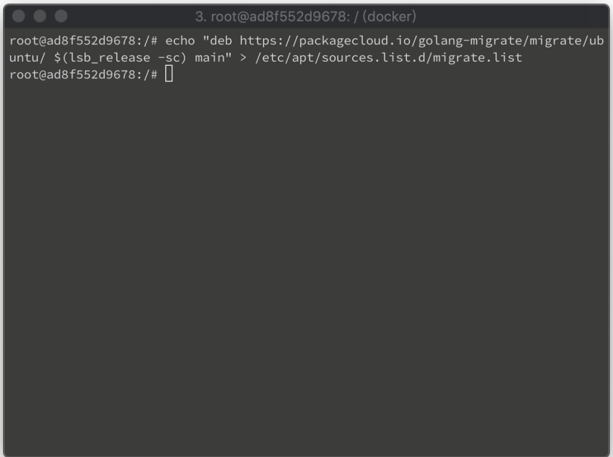
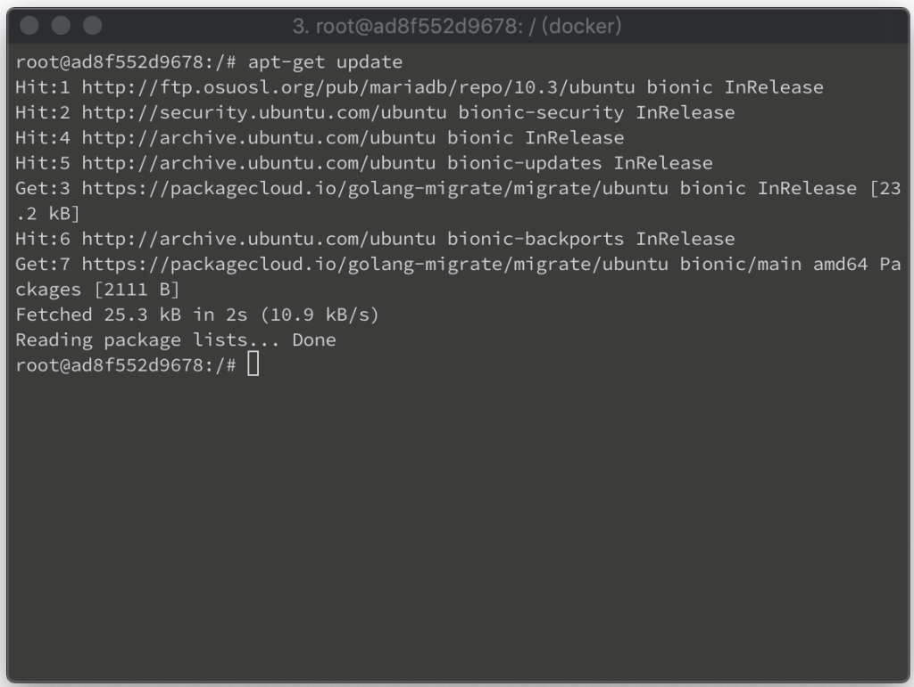
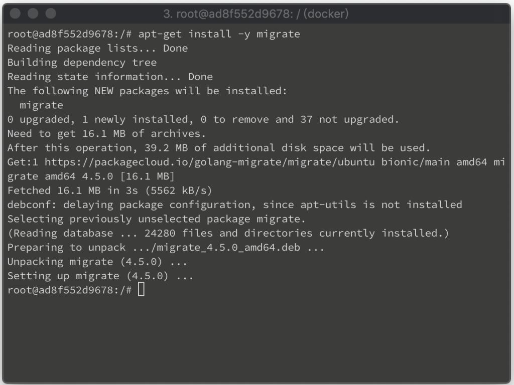
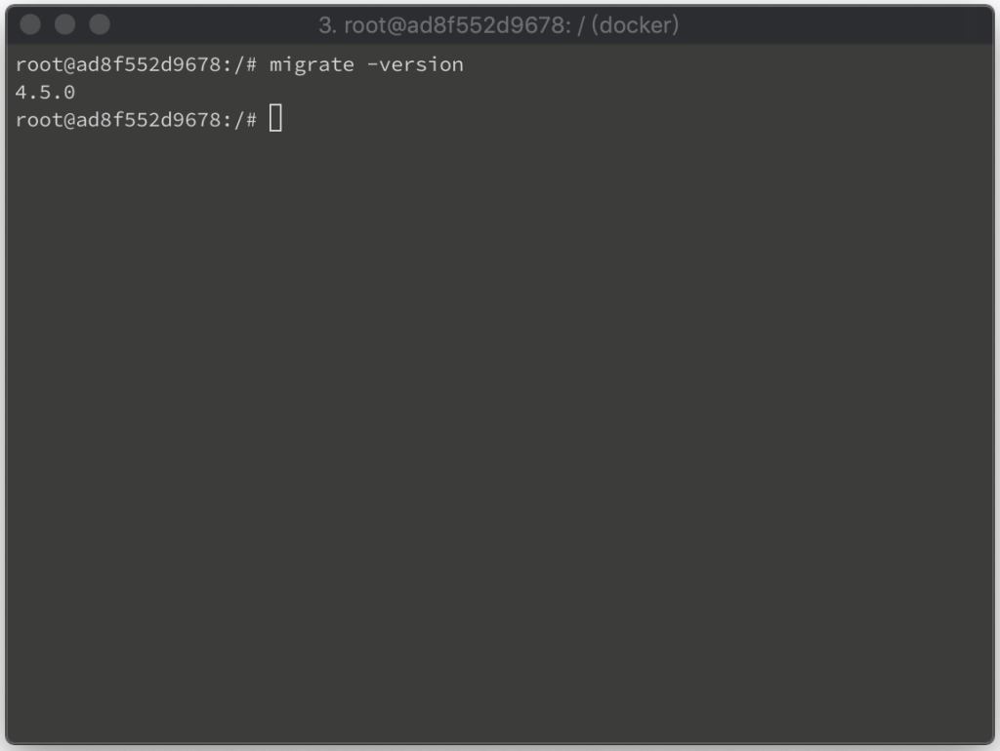

要在 Linux 上安裝 migrate，先將 migrate 的金鑰加入。

curl -L https://packagecloud.io/golang-migrate/migrate/gpgkey | apt-key add -

將 migrate 加入套件來源清單。

echo "deb https://packagecloud.io/golang-migrate/migrate/ubuntu/ $(lsb_release -sc) main" > /etc/apt/sources.list.d/migrate.list

更新套件清單。

apt-get update

進行 migrate 套件安裝。

apt-get install -y migrate

最後調用命令查閱 migrate 版本，確認安裝無誤。

migrate -version

Link
=====
* [migrate CLI](https://github.com/golang-migrate/migrate/tree/master/cmd/migrate)