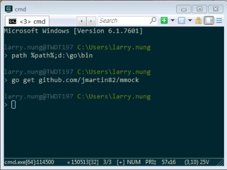
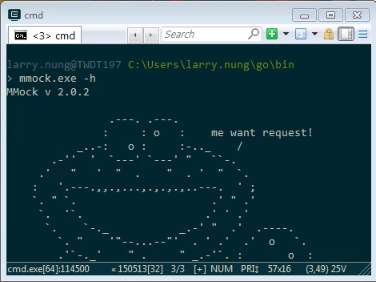
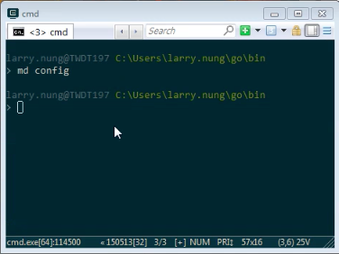
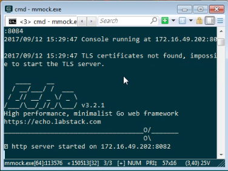
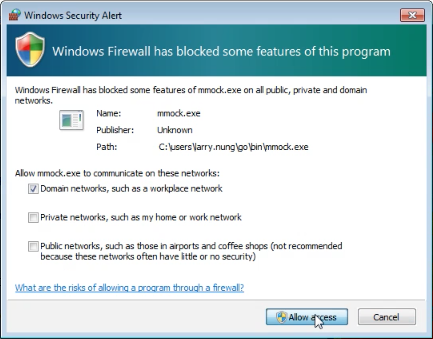
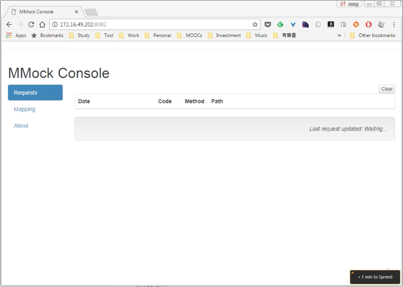

要使用 mmock，可先安裝 go 語言，透過 go get 下載 mmock command。   

<!-- More -->

    go get github.com/jmartin82/mmock

 

下載下來後可簡單的測試一下，順便查閱 mmock 的使用方式。  

    mmock -h

 

    Usage of ./mmock:
      -cconsole-port int
          Console server Port (default 8082)
      -config-path string
          Mocks definition folder (default "execution_path/config")
      -console
          Console enabled  (true/false) (default true)
      -console-ip string
          Console Server IP (default "public_ip")
      -server-ip string
          Mock server IP (default "public_ip")
      -server-port int
          Mock server Port (default 8083)
      -server-tls-port int
          Mock HTTPS server Port (default 8084)
      -tls-path
          TLS config folder (It will load any crt/key combination, for example server.crt/server.key)

 

服務運行前記得要建立 config 目錄，供存放 mmock 設定之用，設定檔不一定要馬上放置，但是目錄要先建立服務才能運行。  

 

服務的運行可參閱 mmock command 的使用方式，最簡單的運行方式就是直接不帶參數叫用 mmock，就會依照 mmock command 預設的參數啟用 mmock 服務。  

 

 

服務啟用畫面上會帶有 http、https、console 服務的資訊，可開啟 console 頁面確認服務正常的運作。  

 

Link
----
* [jmartin82/mmock: Mmock is an HTTP mocking application for testing and fast prototyping](https://github.com/jmartin82/mmock)
