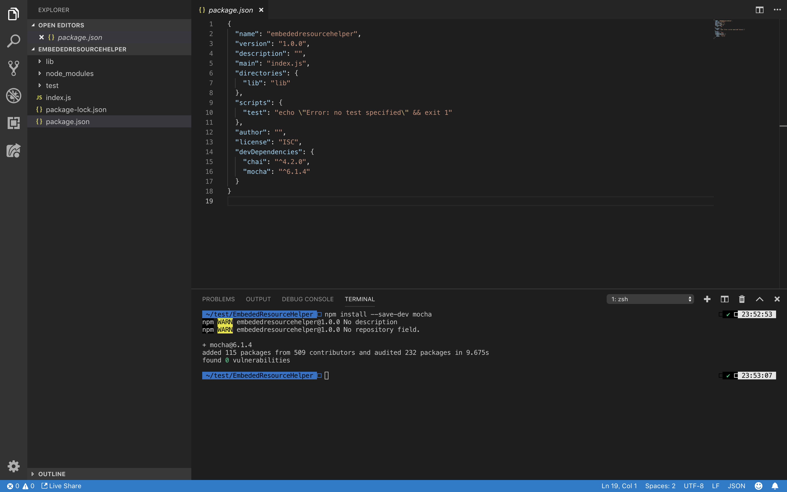
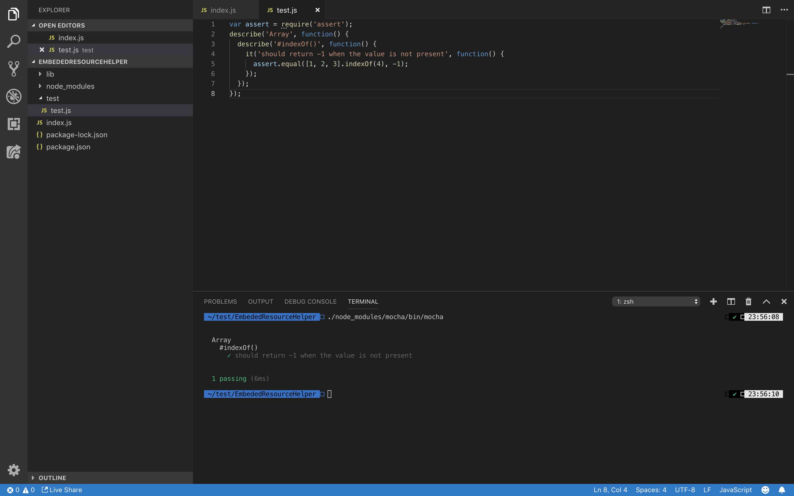
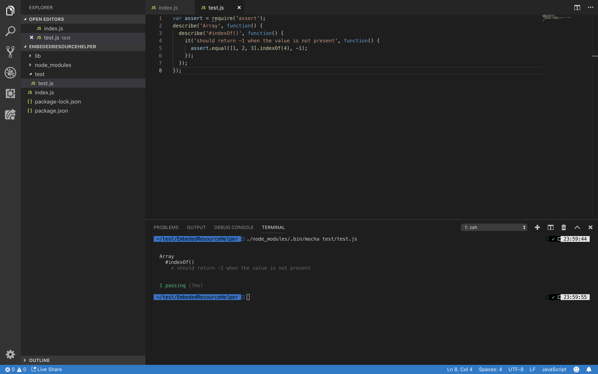
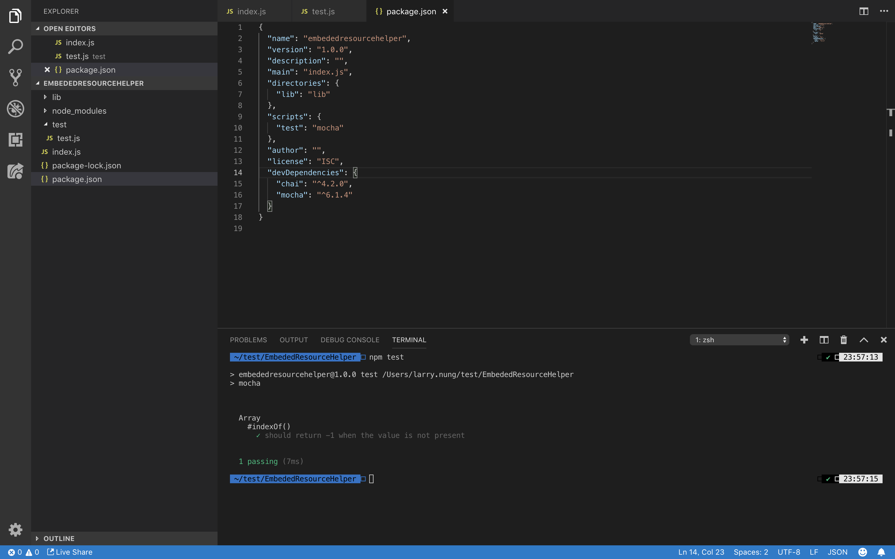

Mocha 是 Node.js 上的單元測試框架。該單元測試框架能讓我們撰寫測試案例、運行單元測試、及產生測試報告等。    

<!-- More -->

</br>


使用前先從 Registry 下載套件。  

    npm install mocha --save-dev



</br>


然後透過 Mocha 提供的 describe、it、before、after、beforeEach、afterEach 這幾個方法撰寫單元測試。  

</br>


describe 用來設定描述測試的功能或情境，it 用來設定測試案例，before 用來設定測試情境下所有測試案例運行前要做的動作，after 用來設定測試情境下所有測試案例運行後要做的動作，beforeEach 用來設定每個測試案例運行前要做的動作，afterEach 用來設定每個測試案例運行後要做的動作。  

</br>


像是下面這樣:  

```js
describe('Array', function() {
  describe('#indexOf()', function() {
    it('should return -1 when the value is not present', function() {
      ...
    });
  });
});
```

</br>


單元測試的斷言部份 Mocha 並未提供，需額外使用 Chai 之類的斷言套件搭配撰寫。

</br>


所以如果用 Mocha 搭配 Chai 撰寫，程式就會像下面這樣:  

```js
var assert = require('assert');
describe('Array', function() {
  describe('#indexOf()', function() {
    it('should return -1 when the value is not present', function() {
      assert.equal([1, 2, 3].indexOf(4), -1);
    });
  });
});
```

</br>


撰寫完可直接調用 Mocha 進行測試，若未指定檔案，Mocha 會自行找出當前目錄及其子目錄下的所有單元測試並運行。  

    ./node_modules/.bin/mocha



</br>


若要指定測試特定測試檔案，調用 Mocha 並將其帶入即可。  

    ./node_modules/.bin/mocha ${File}



</br>


也可以在 package.json 加入 Script 設定。  

```json
...
"scripts": {
    "test": "mocha"
  },
...
```

</br>


然後透過 npm 調用 Mocha。



</br>
