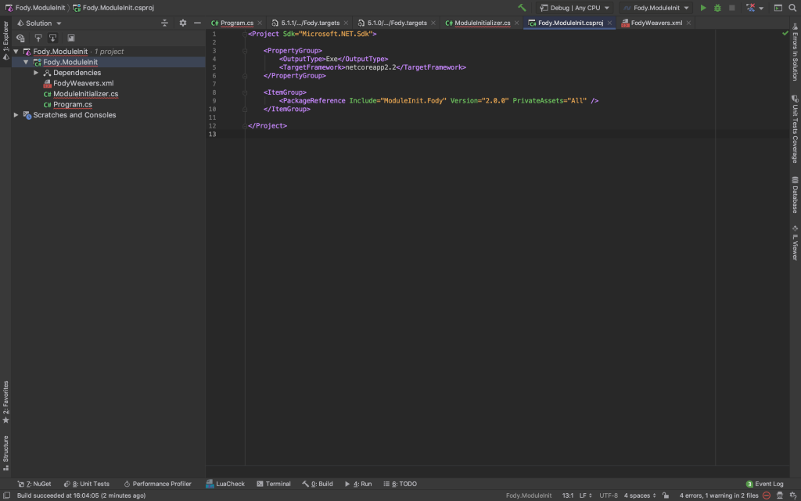
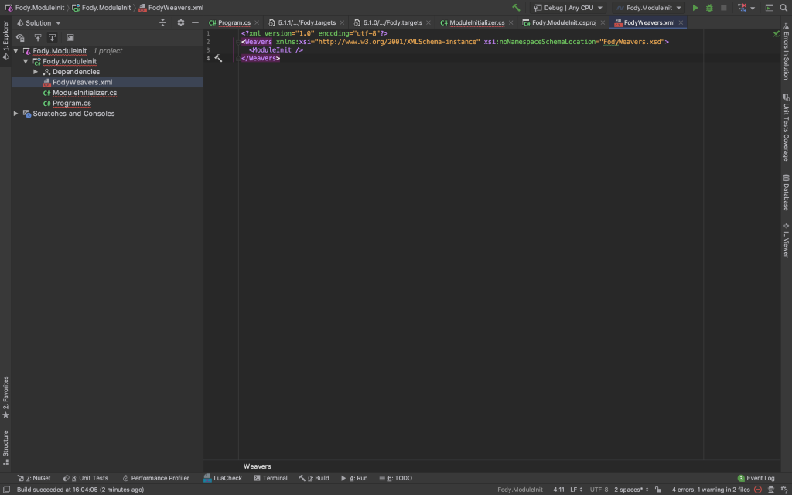
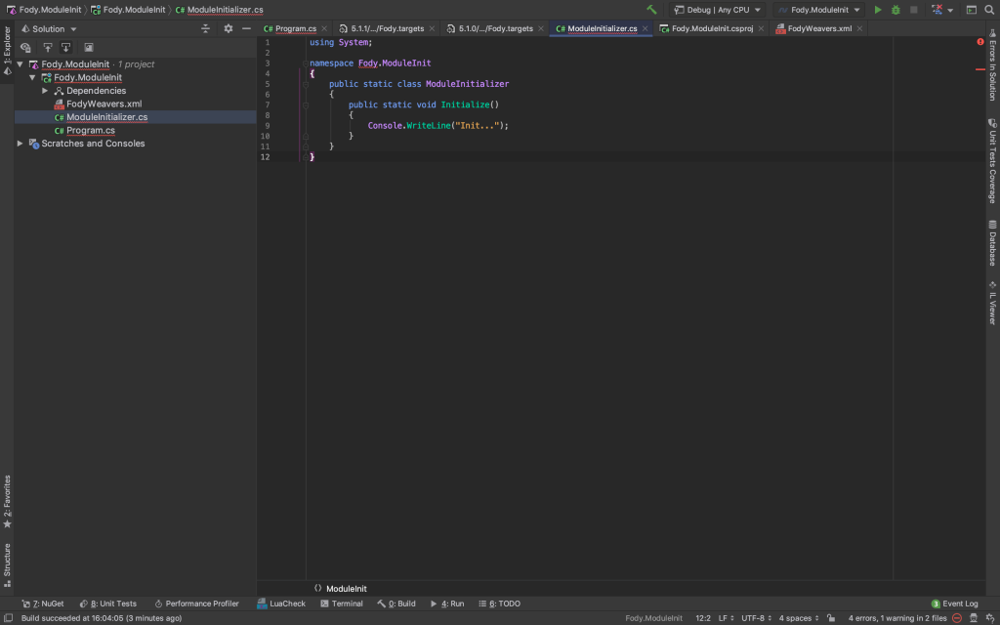
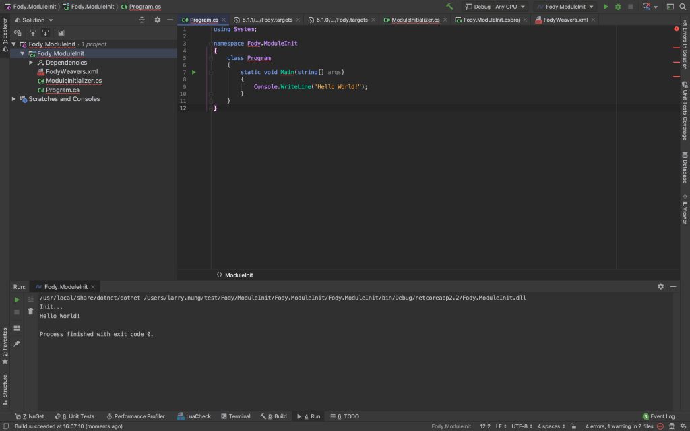

ModuleInit.Fody 能透過 Fody 在程式編譯時將初始化處理掛入系統程式中，能在系統一開始運行時做初始的動作。  

<!-- More -->

</br>


使用時需先引用 ModuleInit.Fody 套件。

```xml
<Project Sdk="Microsoft.NET.Sdk">

    <PropertyGroup>
        <OutputType>Exe</OutputType>
        <TargetFramework>netcoreapp2.2</TargetFramework>
    </PropertyGroup>

    <ItemGroup>
        <PackageReference Include="ModuleInit.Fody" Version="2.0.0" PrivateAssets="All" />
    </ItemGroup>

</Project>
```



</br>


然後加入 FodyWeavers.xml 檔，檔案內容如下，指示 Fody 要使用 ModuleInit。

```xml
<?xml version="1.0" encoding="utf-8"?>
<Weavers xmlns:xsi="http://www.w3.org/2001/XMLSchema-instance" xsi:noNamespaceSchemaLocation="FodyWeavers.xsd">
  <ModuleInit />
</Weavers>
```



</br>


接著在 ModuleInitializer 的 Initialize 方法撰寫初始化的部分。



</br>


運行後可看到程式會在啟動時先運行初始化程式。  



</br>


Link
====
* [Fody/ModuleInit: Adds a module initializer to an assembly](https://github.com/Fody/ModuleInit)
