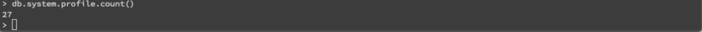
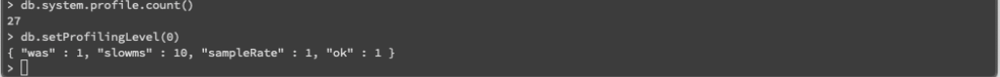
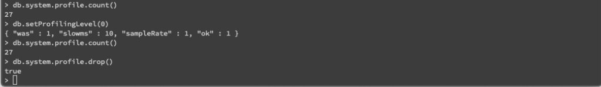
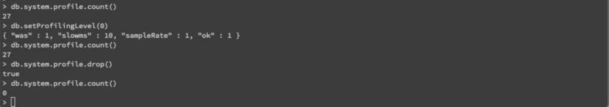

在做 MongoDB 的 Profiling 時，有時我們會需要清除 system.profile collection 內的資料。  

<!-- More -->

 

像是這邊筆者已經有資料在 system.profile collection 內。

    db.system.profile.count()

 

要將 system.profile collection 清除，先要將 Profiler 關閉，也就是透過 db.setProfilingLevel 將 Profiling 等級設為 0。  

    db.setProfilingLevel(0)

 

然後 drop system.profile collection。  

    db.system.profile.drop()

 

 

Link
=====
* [profiling - How to delete system.profile collection from a MongoDB? - Stack Overflow](https://stackoverflow.com/questions/24908047/how-to-delete-system-profile-collection-from-a-mongodb)
