要用 Docker 測試 MongoDB replica set 我們要先建立 Docker network。

<!-- More -->

    docker network ls

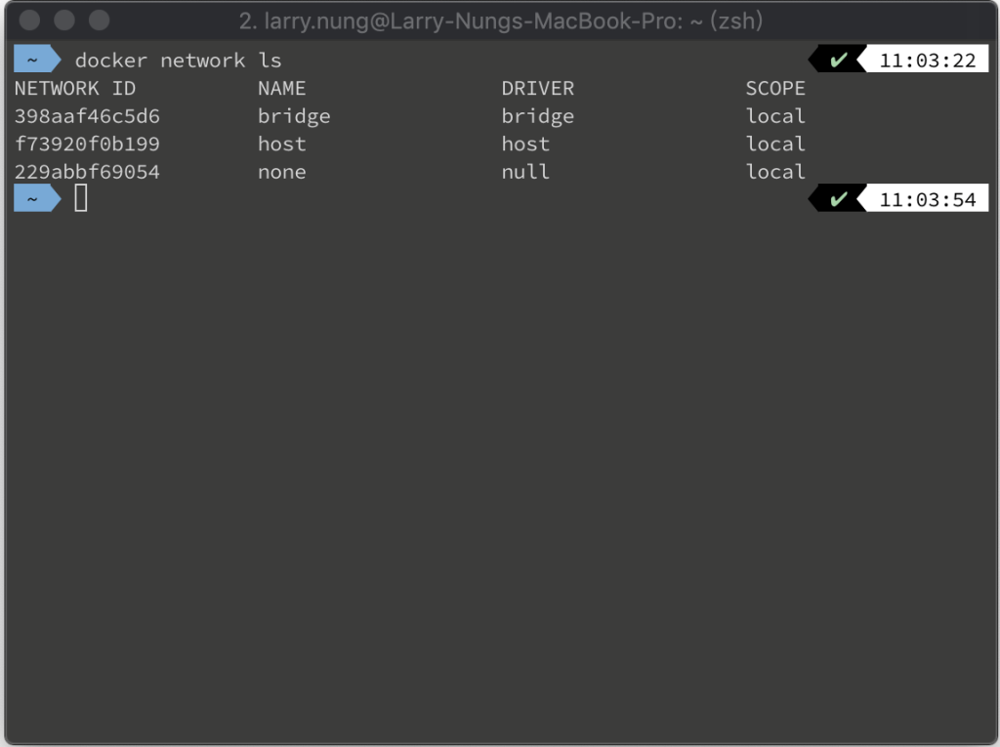

 

    docker network create mongo-cluster

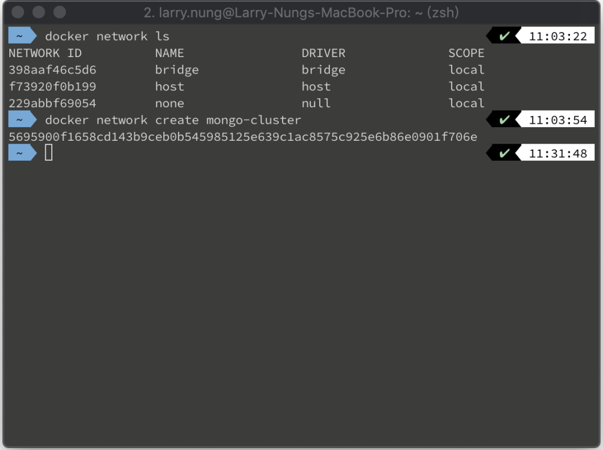

 

    docker network ls

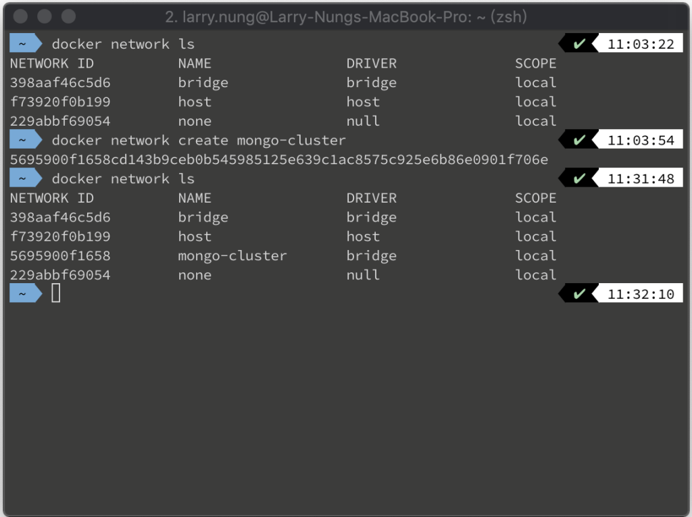

 

然後起第一個 MongoDB 的 Docker 容器，設定使用 Docker network，並用 --replSet 參數指定 replSet 的名稱。  

    docker run -p 27017:27017 --name mongo1 --net mongo-cluster mongo mongod --replSet rs0

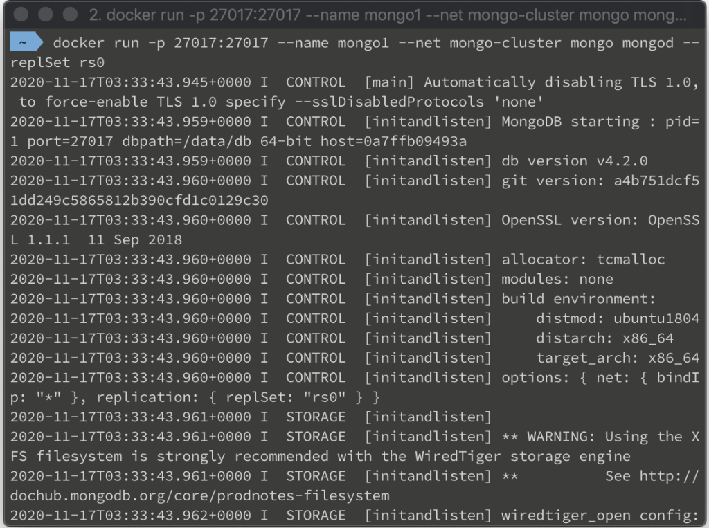

 

接著起第二個 MongoDB 的 Docker 容器，一樣設定使>    用 Docker network，且用 --replSet 參數指定 replSet 的名稱。

    docker run -p 27027:27017 --name mongo2 --net mongo-cluster mongo mongod --replSet rs0

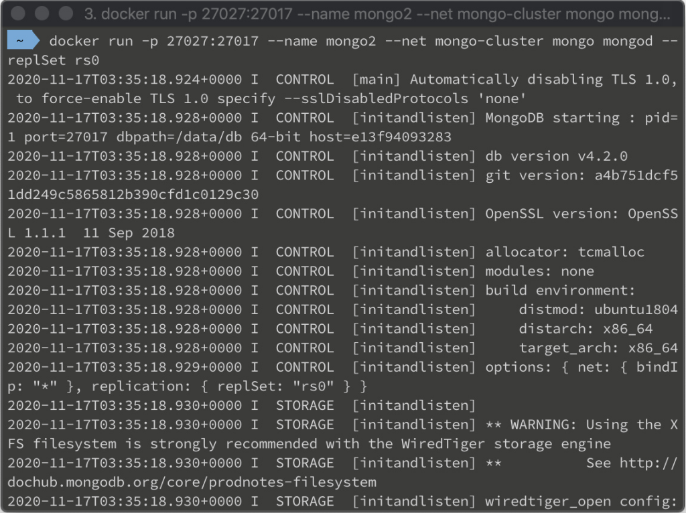

 

最後起第三個 MongoDB 的 Docker 容器，一樣設定使用 Docker network，且用 --replSet 參數指定 replSet 的名稱。

    docker run -p 27037:27017 --name mongo3 --net mongo-cluster mongo mongod --replSet rs0

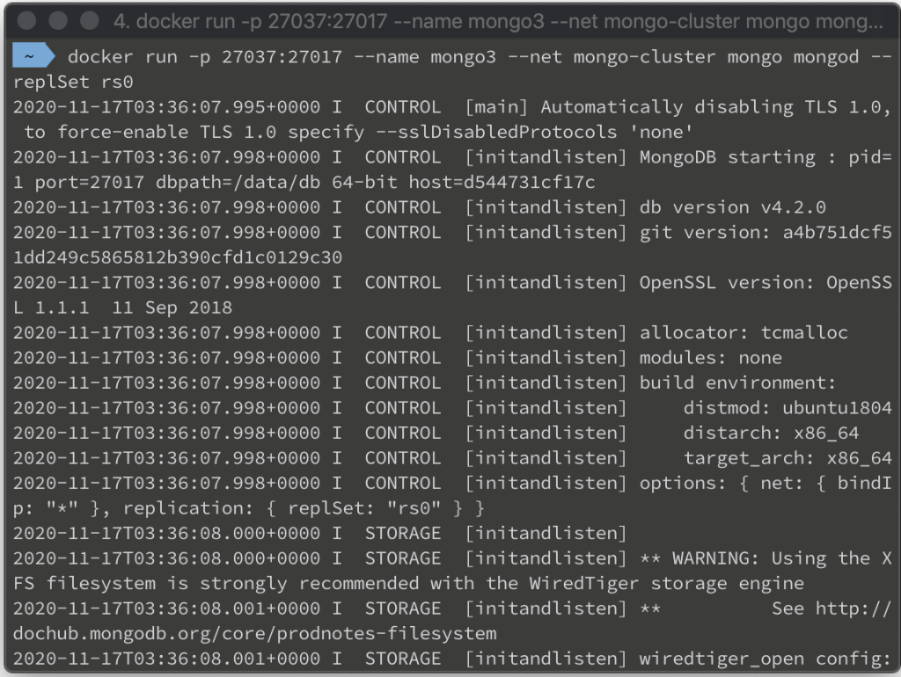

 

然後連進某一個容器內運行 mongo 命令。

    docker exec -it mongo1 mongo

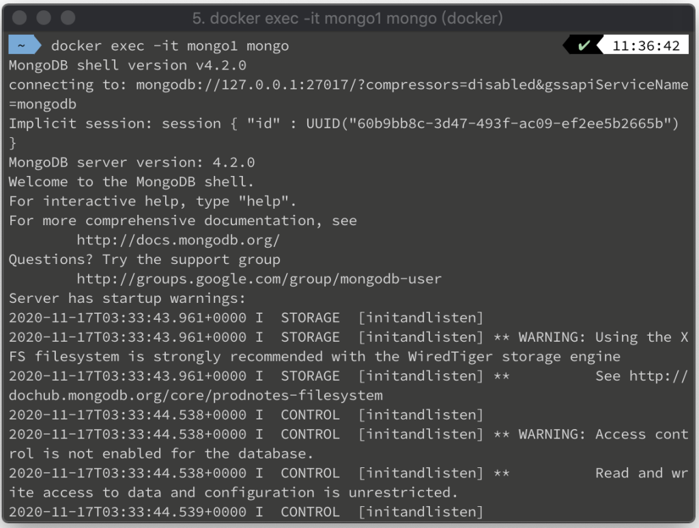

 

調用 rs.initate 命令，將三個 MongoDB instance 資料帶入，初始 MongoDB 的 replica set。  
    rs.initiate( { _id : "rs0",members: [{ _id: 0, host: "mongo1" },{ _id: 1, host: "mongo2" },{ _id: 2, host: "mongo3" }   ]})

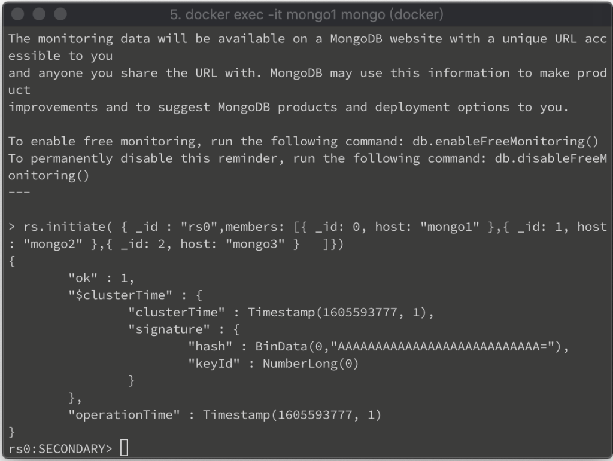

 

設完後可調用 rs.conf 命令確認設定。  

    rs.conf()

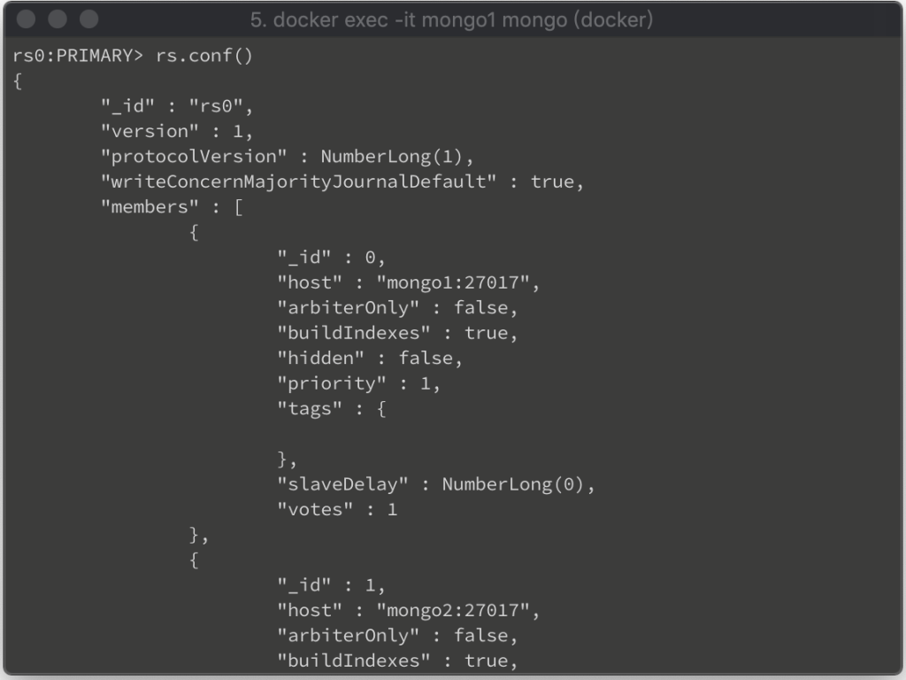

 

並調用 rs.status 命令確認 replica set 的 primary/secondary 的切換、抄寫、狀態、設定都是正常的。

    rs.status()

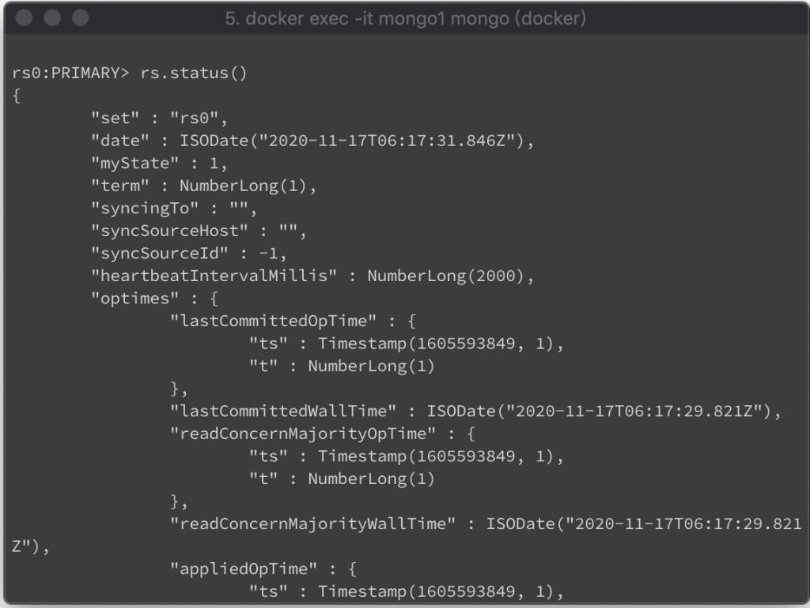

 

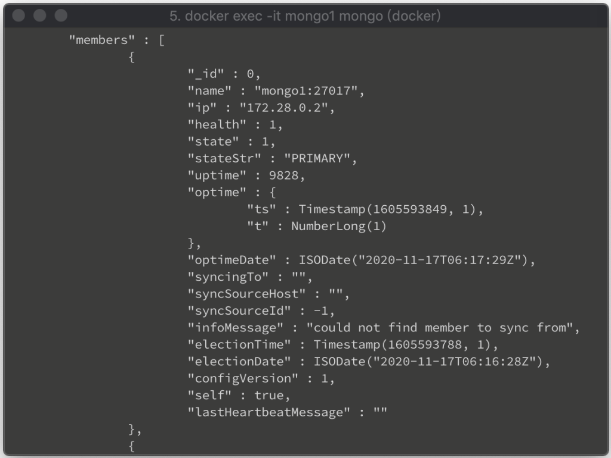

 

Link
====
* [Creating a MongoDB replica set using Docker 🍃 - Soham's blog](https://www.sohamkamani.com/blog/2016/06/30/docker-mongo-replica-set/)
