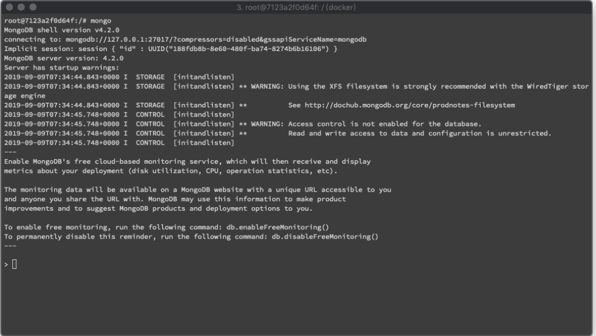
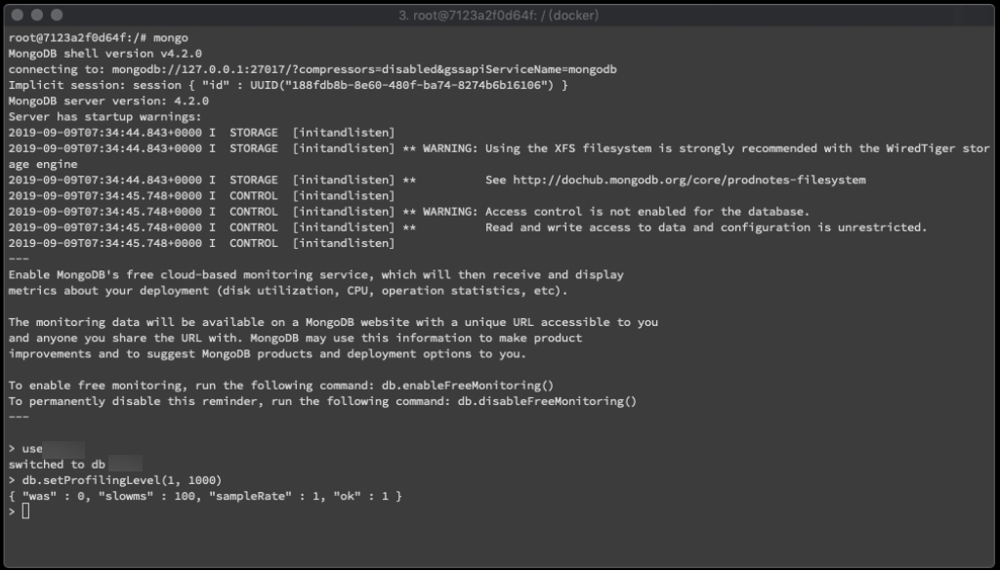
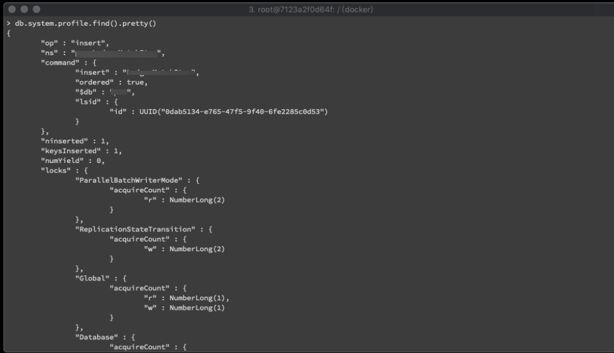

要設定或啟用 MongoDB Profiler 功能去能監控較慢的運行，可先進入 MongoDB。  

<!-- More -->

    mongo

 

切到指定資料庫。  

    use $db

 

透過 db.setProfilingLevel 設定 Profiling 的層級與定義耗費多少毫秒是慢的處理。  

    db.setProfilingLevel($level, $slowms)

                   

 

Profiling 的層級如下:  

| Level | Description |
| :---: | :---------: |
| 0     | The profiler is off and does not collect any data. This is the default profiler level. |
| 1     | The profiler collects data for operations that take longer than the value of slowms. |
| 2     | The profiler collects data for all operations. |

 

如果層級設為 0，則會停止 Profiling;設為 1，則會抓取比 slowms 久的操作;設為 2，則會抓取所有操作。  

 

設定完實際運行程式，MongoDB Profiler 就會依 Profiling 的設定幫我們抓出慢的操作。  

 

Profiler 抓出的資料會被放置在 db.system.profile，可對此操作查閱。  

    db.system.profile.find().pretty()

