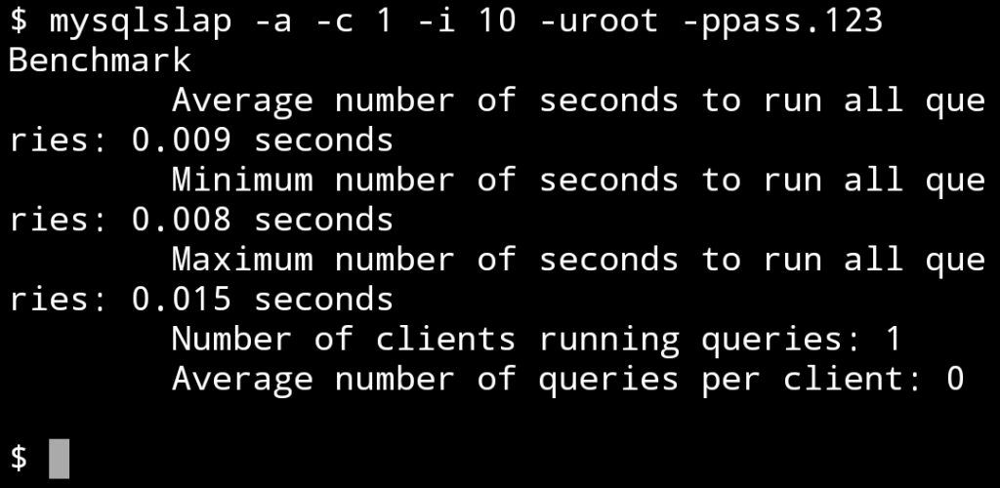
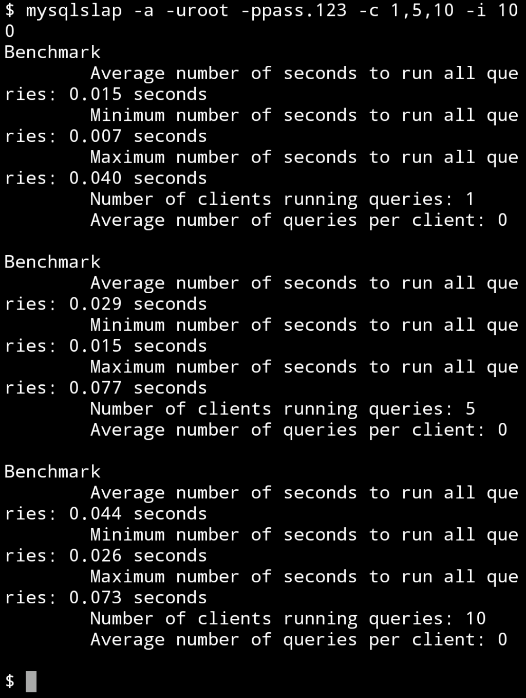
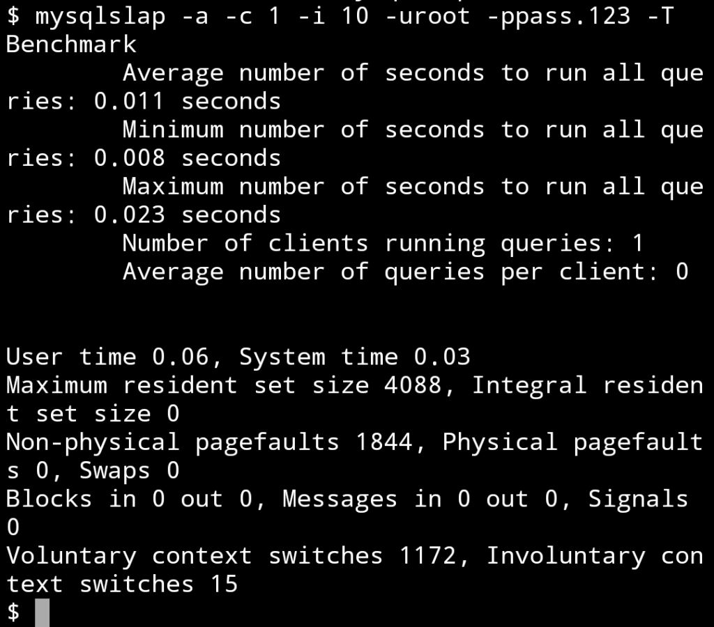
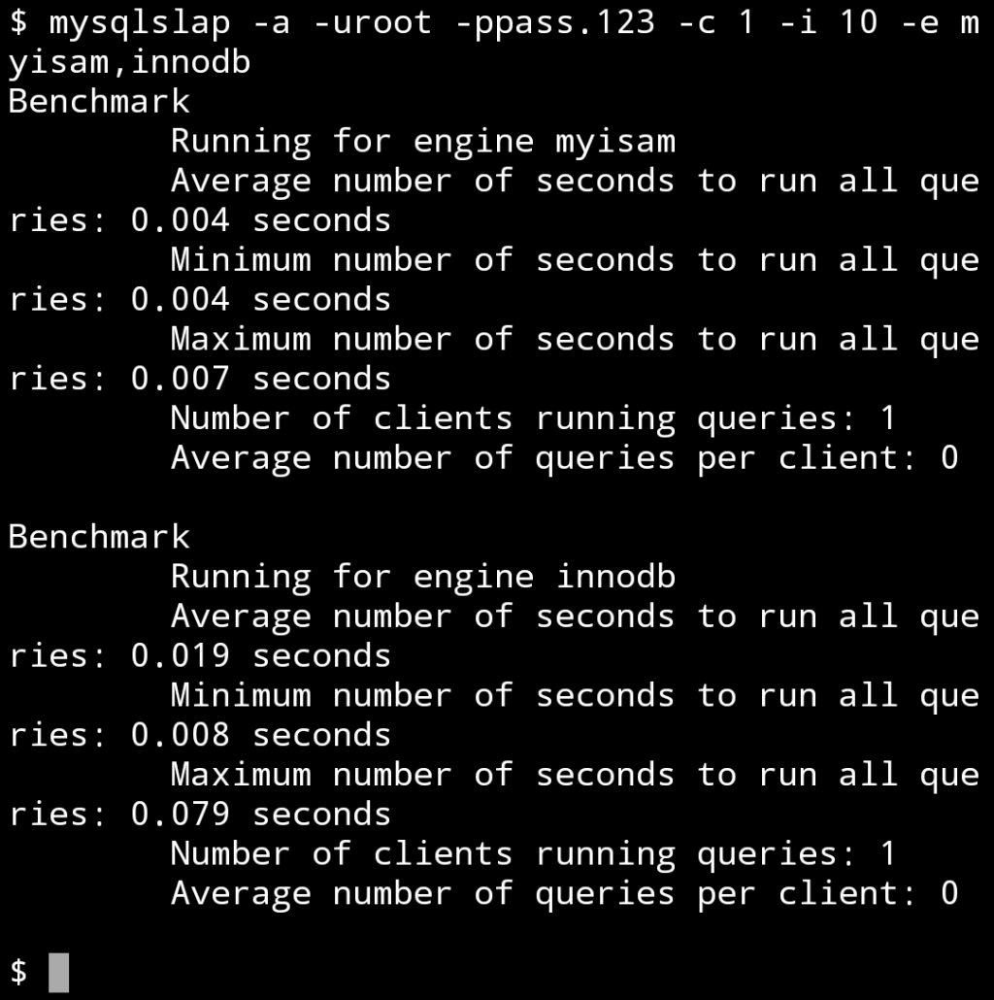
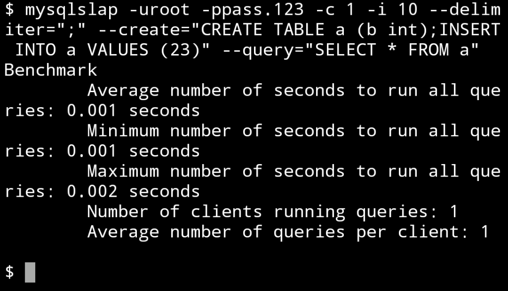
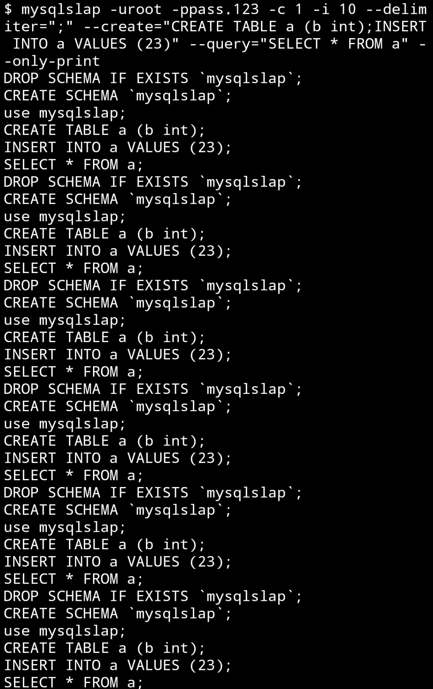

mysqlslap 是 MariaDB 自帶的壓力測試工具。  

<!-- More -->

 

使用方式可調閱命令。  

    mysqlslap --help

 

簡單的說如果資料庫不在本機，調用命令時可帶入 -h, --host=name 指定資料庫位置。  

 

如果資料庫使用的不是預設埠號，可帶入 -P, --port=# 指定埠號。  

 

參數 -i, --iterations=# 可指定運行的次數。  

 

參數 -c, --concurrency=name 指定連結資料庫的 Client 數，也就是所謂的並行數。  

 

參數 -a, --auto-generate-sql 指定自動產生測試的指令。  

 

以一個簡單的測試來說，我們會指定運行的次數、並行 Client 數、與自動產生測試的指令。  

    mysqlslap -c $concurrent -i $number -a

 

如果要運行不同的測試次數，可用逗號隔空。  

 

參數 -T, --debug-info 可指定印出一些更為細部的資訊。  

    mysqlslap -c $concurrent -i $number -a -T

 

參數 -e, --engine=name 可指定測試的資料庫引擎。  

 

可用來指定測試 myisam 或是 innodb。  

    mysqlslap -c $concurrent -i $number -a -e $engine

 

參數 -F, --delimiter=name 可指定 SQL 語法的 Delimiter。  

 

參數 --create-schema=name 可指定測試會用到的 Schema。  

 

參數 -q, --query=name 可指定測試會運行的查詢。  

 

所以如果不想用自動產生的方式去做測試，可以明確的指定測試的 Schema 與查詢語句。  

    mysqlslap -c $concurrent -i $number -a --delimiter=$delimiter --create=$createsql --query=$querysql

 

參數 --only-print 可指定只顯示要執行的動作。  

 

如果不想實際運行測試，只是想確認運行會做的動作，可指定只顯示要執行的動作。  

    mysqlslap -c $concurrent -i $number -a --only-print

