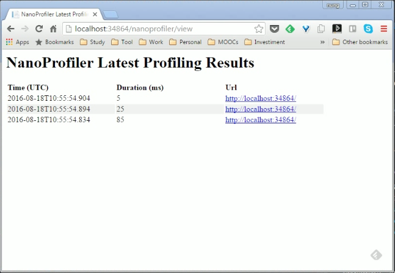

NanoProfiler 有許多的套件。  

如果是 Web 專案，安裝 NanoProfiler.Web 即可 (會連帶安裝 NanoProfiler)。  

套件安裝完後要設定 CircularBuffer，可透過程式設定...   

```c#
protected void Application_Start(object sender, EventArgs e)
{
    ...
    ProfilingSession.CircularBuffer = new CircularBuffer(200, session => false);
    ...
}
```

也可以透過設定檔設定...  

```xml

  ...

```

CircularBuffer 設定完後，就可以設定要 Profile 的部分，像是每個 Request 的進出。    
```c#
        protected void Application_BeginRequest(object sender, EventArgs e)
        {
            ProfilingSession.Start("root");
        }

        protected void Application_EndRequest(object sender, EventArgs e)
        {
            ProfilingSession.Stop();
        }
```

以及 Request 中想要監測的部分。  

```c#
using (var step = ProfilingSession.Current.Step("[StepName]"))
{
    ...
}
```

將程式運行起來，訪問 http://[Domain]/nanoprofiler/view 即可看到 profile 的結果。  


這邊如果要將資料保存下來，可以加裝 NanoProfiler.Storages.Json，並修改設定去指定使用 Storage。  

```xml

    ...
  
  ...

```

如果 Profile 要過濾掉一些位置，可以透過程式設定 filter。  

```c#
        protected void Application_Start()
        {
            ...
            // register profiling filters to exclude some URLs from profiling
            ProfilingSession.ProfilingFilters.Add(new NameContainsProfilingFilter("_tools/"));
            ProfilingSession.ProfilingFilters.Add(new FileExtensionProfilingFilter("jpg", "js", "css"));
            ...
        }
```

或是透過設定檔設定也可以。  

```xml

    ...
  
  ...

```

Link
----
* [ef-labs/nanoprofiler: NanoProfiler - a light weight .NET profiling library](https://github.com/ef-labs/nanoprofiler)
* [Home · ef-labs/nanoprofiler Wiki](https://github.com/ef-labs/nanoprofiler/wiki)
* [使用 NanoProfiler 對 ASP.NET Web API 進行性能監控 | mrkt的程式學習筆記 - 點部落](https://dotblogs.com.tw/mrkt/2016/06/05/142546)