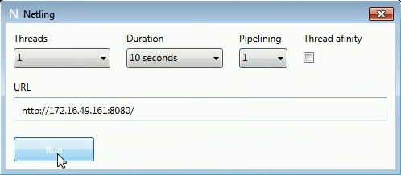
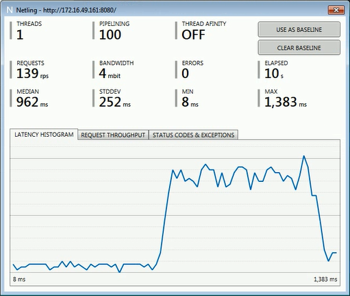
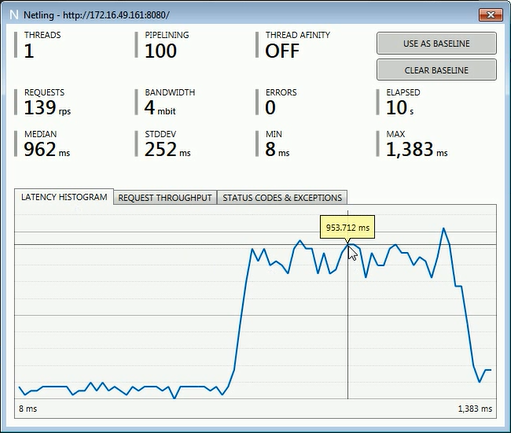
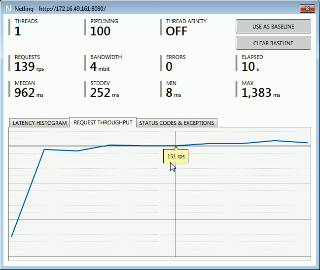
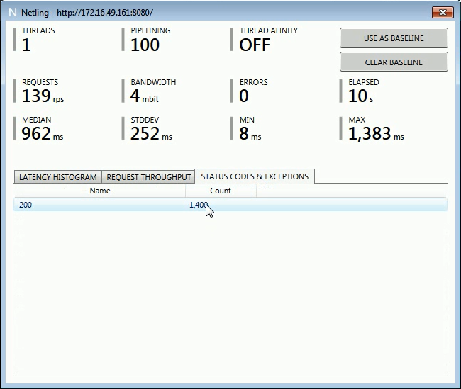
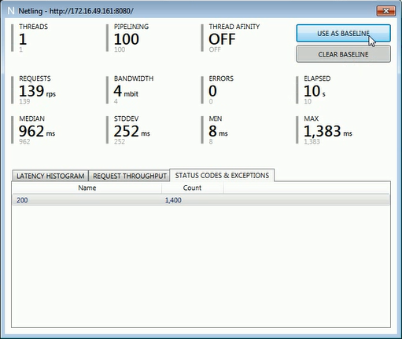
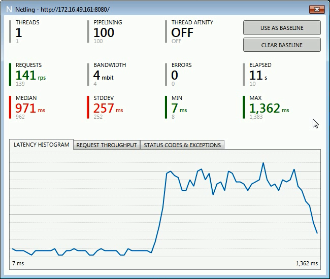
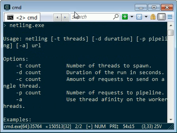
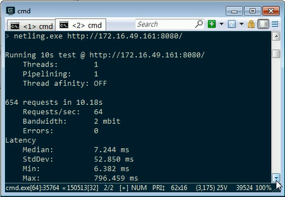
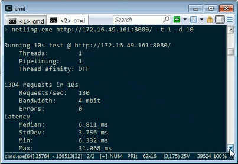

Netling 是一簡易的網站測試工具，目前沒有尚未直接釋出版本，需要自行下載程式碼編譯後運行。  

<!-- More -->

 

  
他有支援兩種 Client 版本，一種是 WPF client，一種是 Console client。  

 

WPF client 運行起來會向下面這樣，只要設定用多少的執行緒、多少的運行時間、Piplining、Thread afinity、以及要測試的網站位置，按下 `Run` 按鈕即可開始運行測試。  

 

測試完會用另外一個視窗顯示測試的結果。  

 

 

 

 

如果想在進行網站的調整後做個比較的話，這邊可以先按下 `USE AS BASELINE` 按鈕，將當前的測試數據設為基準。  

 

基準設定後網站調完再進行一次測試，測試結果就會跟基準值去做個比對，但下方的圖形部分不會進行比對，所以有需要的話基準的測試結果是不能關閉的。  

 

至於 Console clinet 的部份，直接調用命令運行即可看到細部的使用參數。  

 

最簡單的使用方式就是在命令後帶上要測試的網址。

 

也可以帶入 -t 可決定 執行緒個數，帶入 -d 設定測試的時間。  

 

Link
----
* [hallatore/Netling: Netling is a load tester client for easy web testing.](
https://github.com/hallatore/Netling)
