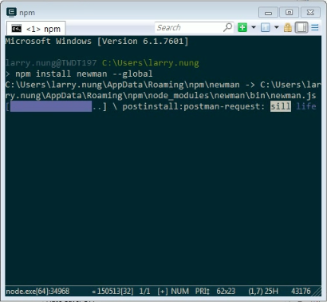
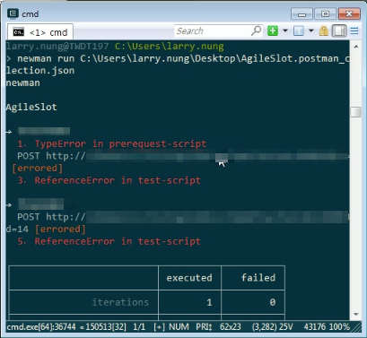
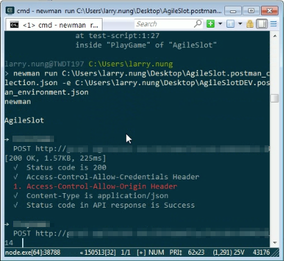

Newman 是一用來運行 Postman collection 的命令列工具，當要在不開啟 Postman 的狀態下運行 Postman collection 時會需要使用。

安裝只要透過 npm 將 Newman 做全域安裝即可。

npm install newman -g

使用上只要透過 newman run 帶入匯出的 collection JSON 檔案運行 Postman collection即可。

newman run

如果要運行多次可使用 -n 參數指定所要運行的次數。

newman run  -n

如果 Postman collection 有使用到環境變數的話，使用 -e 參數指定匯出的環境變數 JSON 檔。

newman run  -e

如果要設定 Report，可使用 -r 參數指定要產出的 Report 格式，可使用的 Report 格式有 html、cli、json、junit。

newman run  -r html,cli,json,junit

Link
----
* [postmanlabs/newman: Newman is a command-line collection runner for Postman](https://github.com/postmanlabs/newman)
* [Newman - Running collections in the command line](https://www.getpostman.com/docs/newman_intro)