nmap 是網路掃描與探測工具。  

<!-- more -->

 

Ubuntu 下可直接透過 apt-get 安裝。  

    apt-get install nmap

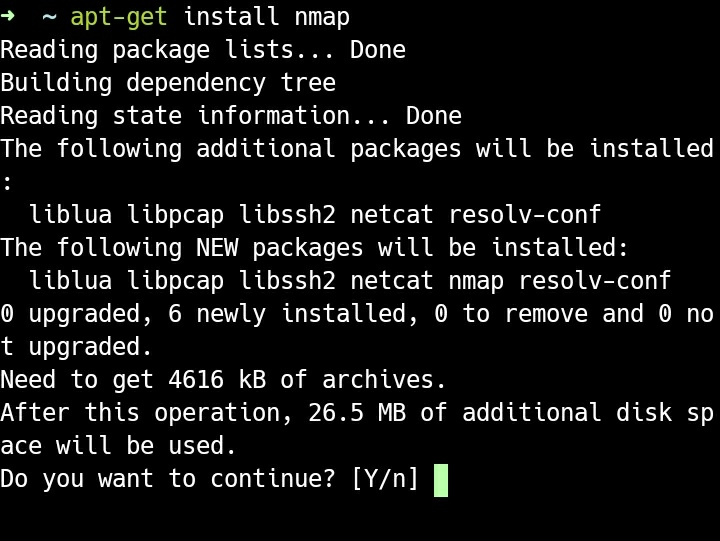

 

安裝完可直接輸入命令查閱使用說明。  

    nmap

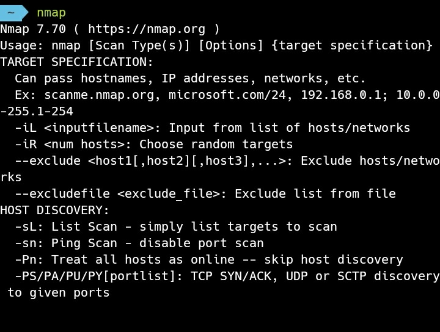

 

最簡單的使用方式就是在命令後面帶入網址。  

    nmap <Url>

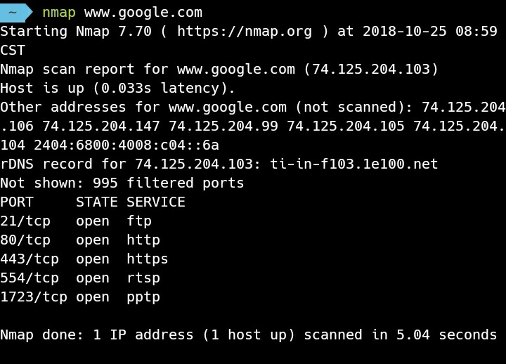

 

或是帶入 IP。  

    nmap <IP>

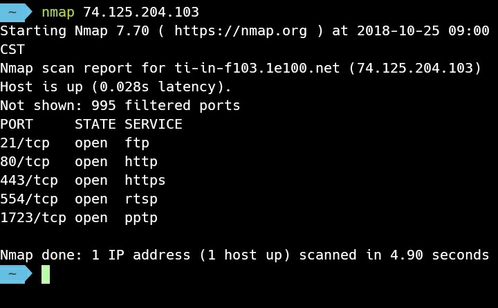

 

也可以帶入 IP 的範圍。  

    nmap <IPRange>

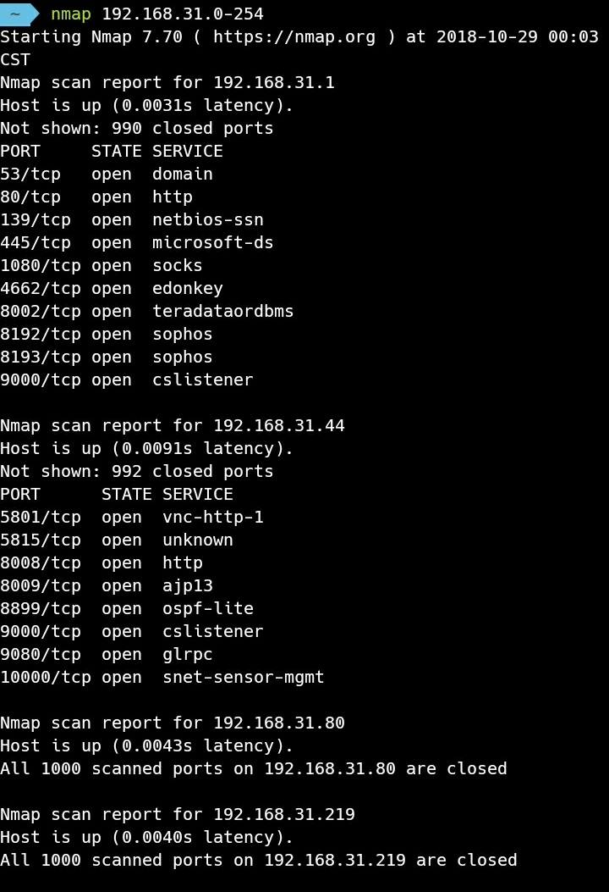

 

或是多組網址或多組 IP。  

    nmap <Url> [<Url>...]

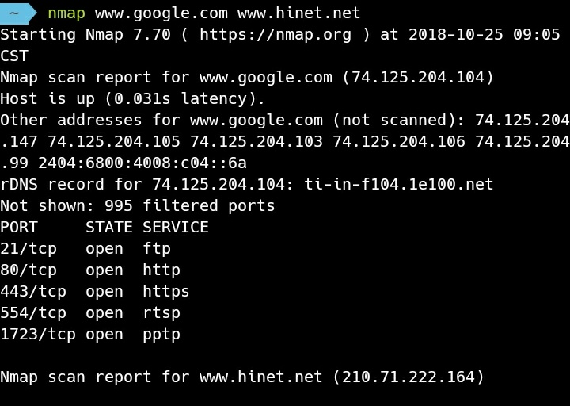

 

nmap 會掃描探測指定位置有開啟的服務。  

 

如果不是所有位置都要掃描或探測，可以使用 --exclude 參數指定要排除的位置。  

    nmap <IPRange> --exclude <IP>

 

若是掃描或探測的位置很多或是想要便於重用，可用參數 -iL 指定內含掃描或探測位置的設定檔。  

    nmap -iL <File>

 

排除位置一樣也支援檔案設定，使用參數 --excludefile 並帶上設定檔即可。  

    nmap -iL <File> --excludefile <File>

 

若是覺得掃描或探測速度過慢，可加上參數 -F 加速運行處理。  

    nmap -F <Url>

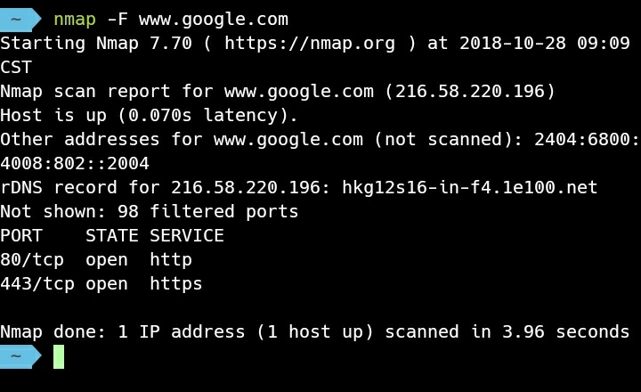

 

若是掃描或探測資訊過少，想要更為詳細的資訊的話，可用參數 -v。

    nmap -v <Url>

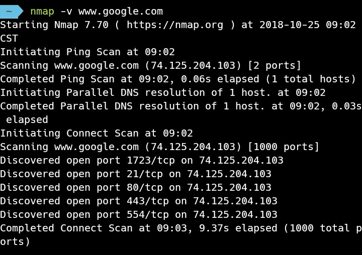

 

若是想要指定掃描或探測特定的 Port，可用參數 -p 指定 Port 號。  

    nmap -p <Port> <Url>

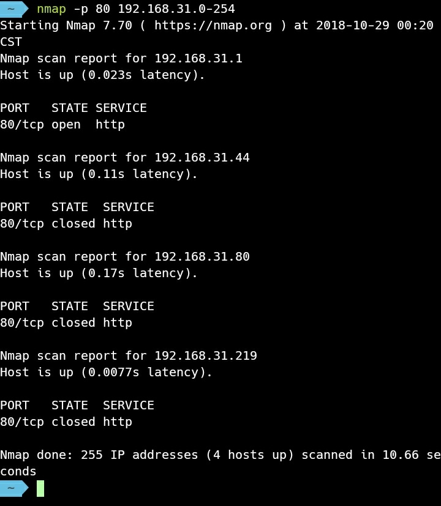

 

    nmap -p <Port>[,<Port>...] <Url>

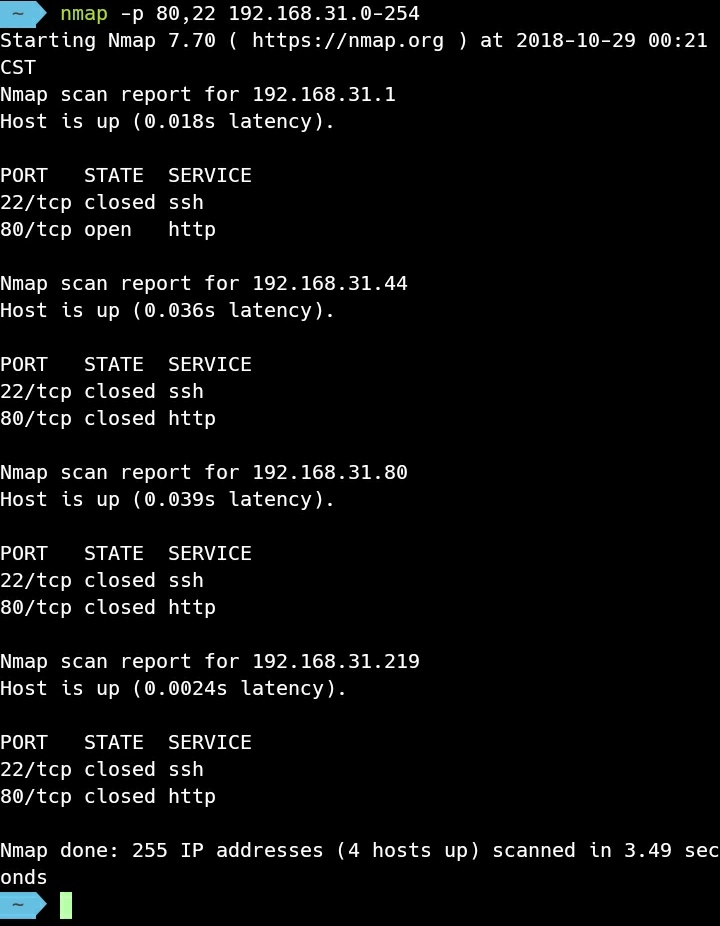

 

若要掃描或探測有開啟的電腦，可用參數 -sP。

    nmap -sP <IPRange>

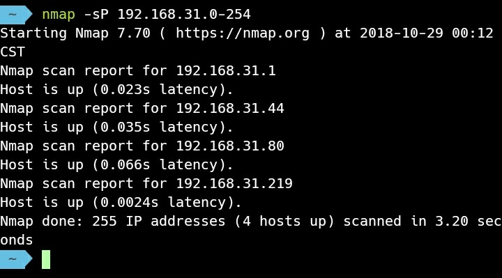

 

Link
----
* [Nmap 網路診斷工具基本使用技巧與教學- G. T. Wang
https://blog.gtwang.org › linux](https://blog.gtwang.org/linux/nmap-command-examples-tutorials/)
* [Nmap - 維基百科，自由的百科全書 - Wikipedia
https://zh.m.wikipedia.org › zh-tw › Nmap](https://zh.m.wikipedia.org/zh-tw/Nmap)
