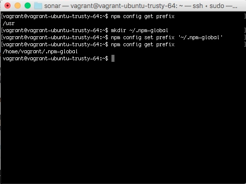

要設定 npm 的預設目錄，只要透過 npm config 命令設定 prefix 為指定的位置即可。  

<!-- More -->

    npm config set prefix [Path]

 

Link
----
* [03 - Fixing npm permissions | npm Documentation](https://docs.npmjs.com/getting-started/fixing-npm-permissions#option-2-change-npms-default-directory-to-another-directory)
