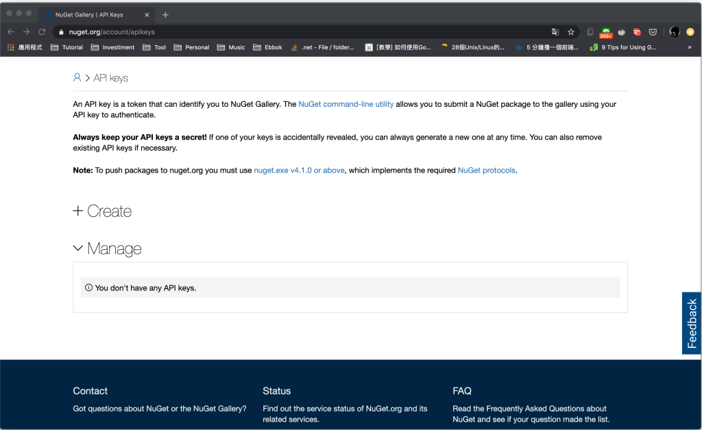

要建立 NuGet 套件，需先確認專案檔內有設計 NuGet 套件所需之資訊，像是套件識別碼、版本、作者、公司等。  

<!-- More -->

<br>


```xml
<PackageId>AppLogger</PackageId>
<Version>1.0.0</Version>
<Authors>your_name</Authors>
<Company>your_company</Company>
```


<br>


然後可用 dotnet pack 命令將套件打包。  

    dotnet pack


<br>


或是在專案檔內加設定 GeneratePackageOnBuild，讓專案在建置時自動產生。  

```xml
<GeneratePackageOnBuild>true</GeneratePackageOnBuild>
```


<br>


<br>


然後確定 NuGet 帳號已註冊且取得 API key。  



<br>


<br>


<br>


再調用 dotnet nuget push，帶入 NuGet 套件檔的位置及 NuGet API key。  

    dotnet nuget push $package -k $key -s https://api.nuget.org/v3/index.json


<br>


NuGet 套件即會被上傳至 NuGet server 上。  


<br>


<br>


Link
====
* [使用 dotnet CLI 建立及發佈 NuGet 套件 | Microsoft Docs](https://docs.microsoft.com/zh-tw/nuget/quickstart/create-and-publish-a-package-using-the-dotnet-cli)
