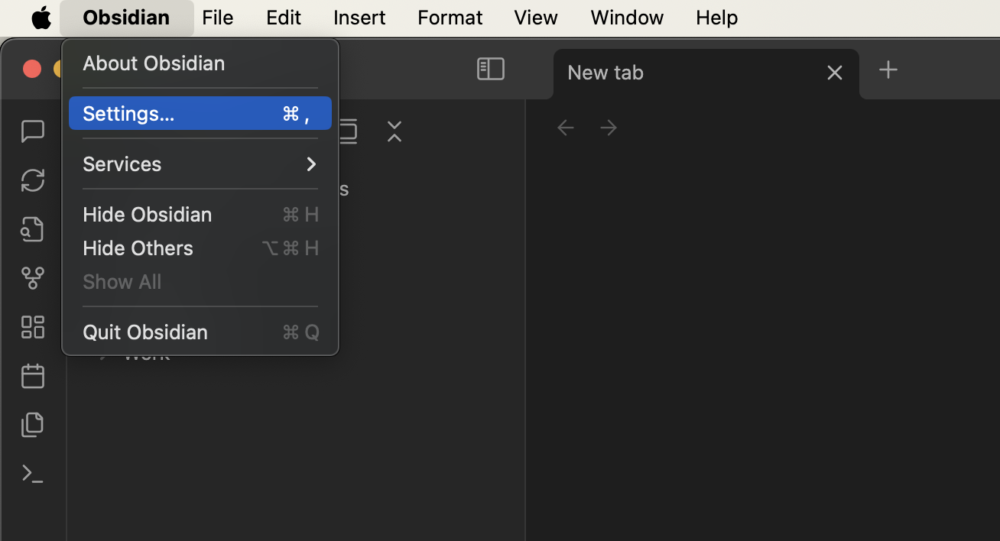
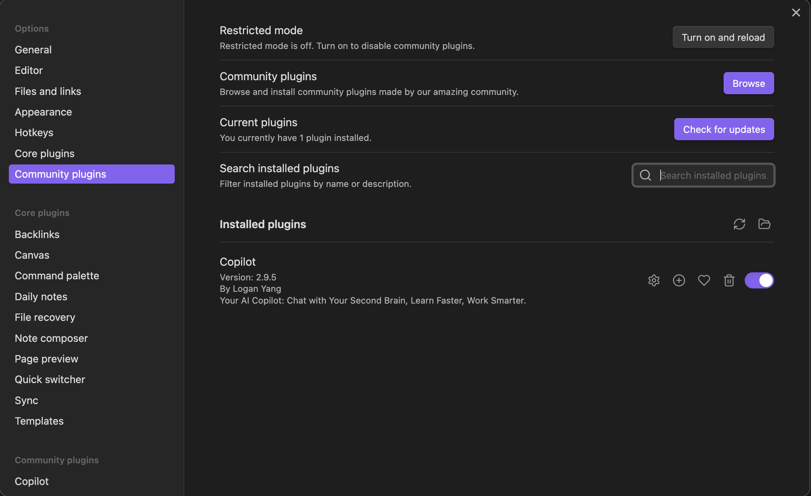
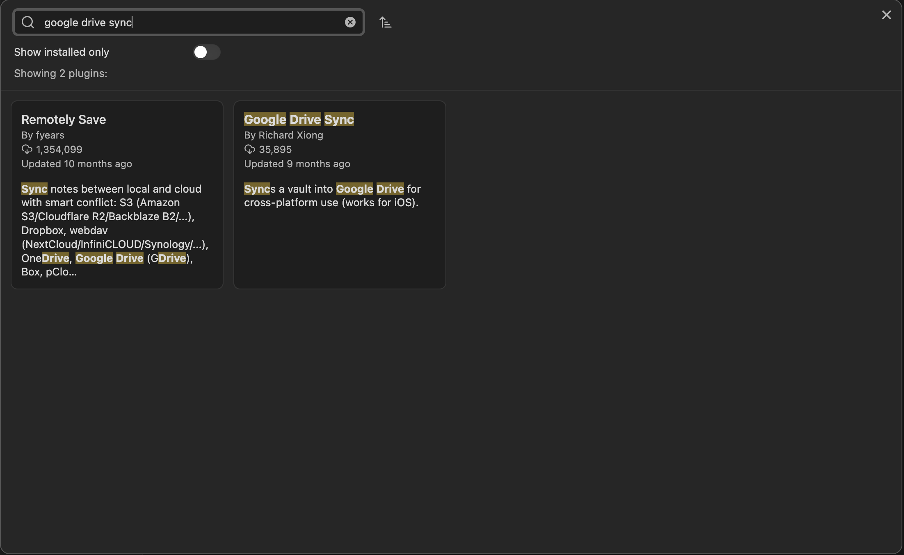
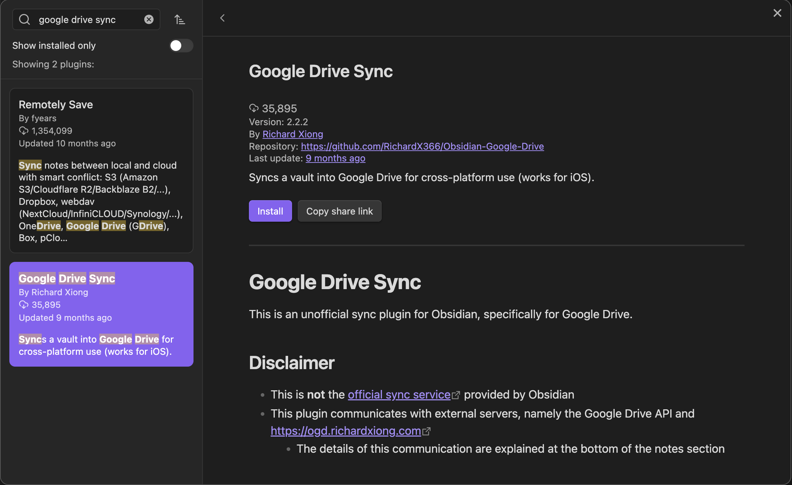
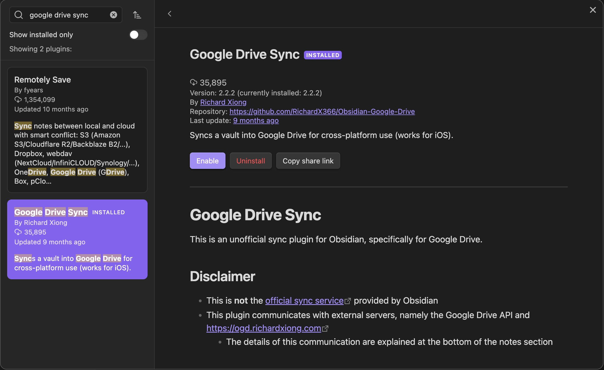
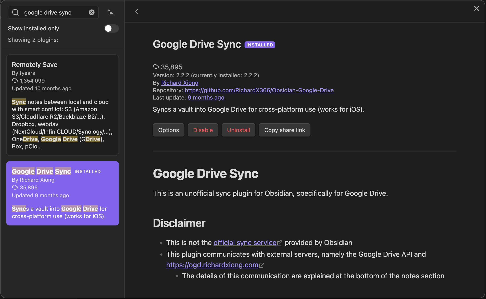
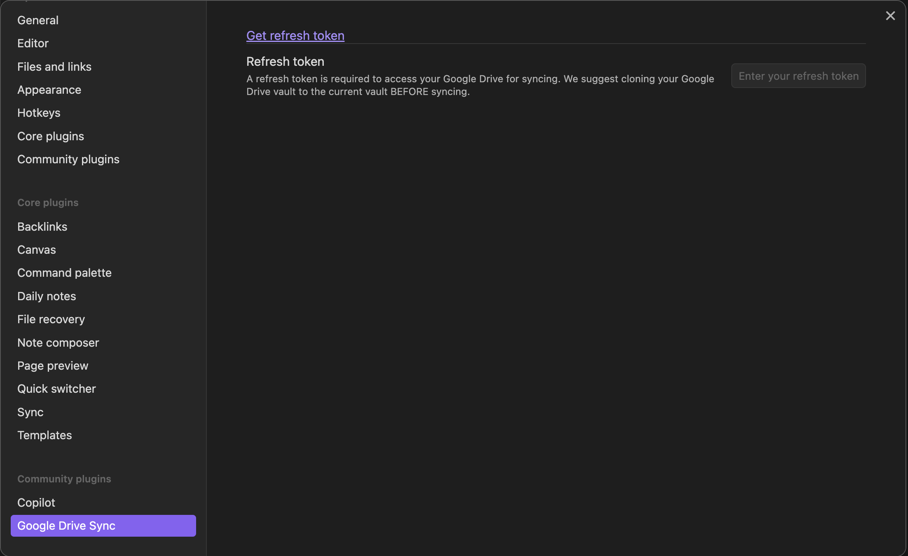
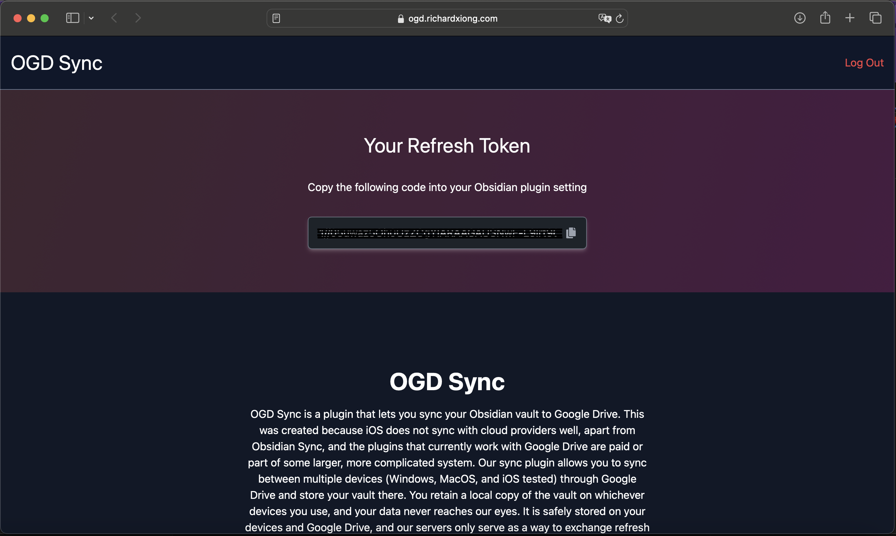
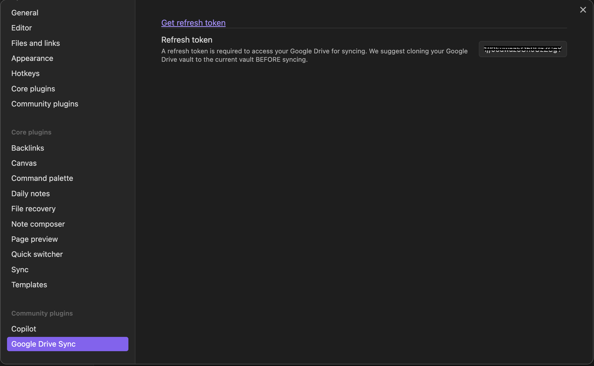
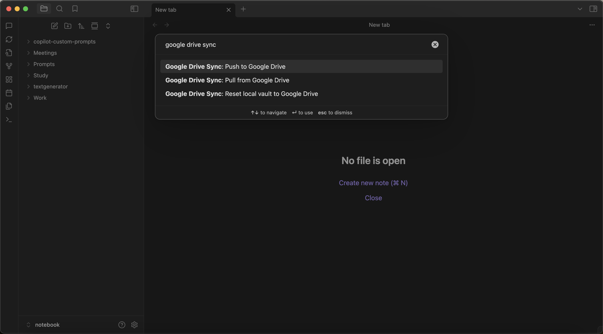

## 簡介

Google Drive Sync 是 Obsidian 的官方外掛，可以讓您輕鬆地將筆記庫同步到 Google Drive。透過 Google Drive 的雲端儲存功能，您可以在不同裝置間無縫同步筆記，無論是在電腦、手機或平板上都能隨時存取最新版本。這個外掛特別適合需要在多台裝置間同步筆記的使用者，且無需額外安裝 Google Drive 桌面應用程式，讓跨裝置筆記同步變得更加簡單方便。

## 安裝 Google Drive Sync 插件

1. 開啟 Obsidian 設定
   
   

2. 選擇「Community plugins」
   
   

3. 搜尋並安裝「Google Drive Sync」
   
   
   
   點擊「Install」按鈕進行安裝
   
   

4. 安裝完成後啟用插件
   
   

## 設定 Google Drive 同步

1. 點擊「Options」按鈕開啟插件設定
   
   

2. 點擊「Get refresh token」連結
   
   

3. 在開啟的網頁中登入 Google 帳號並授權
   
   

4. 將獲取的 refresh token 貼回設定頁面
   
   

## 開始使用

設定完成後，您可以在 Obsidian 中的 Command Palette 中可以看到 Google Drive Sync 的命令

