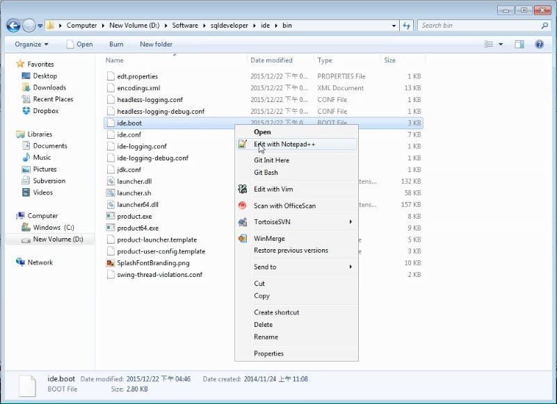
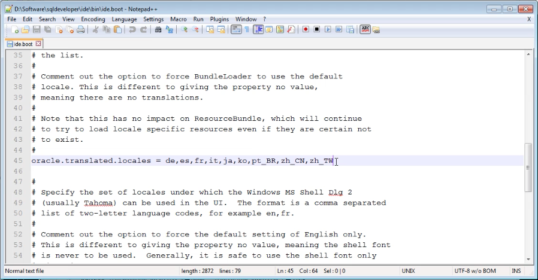
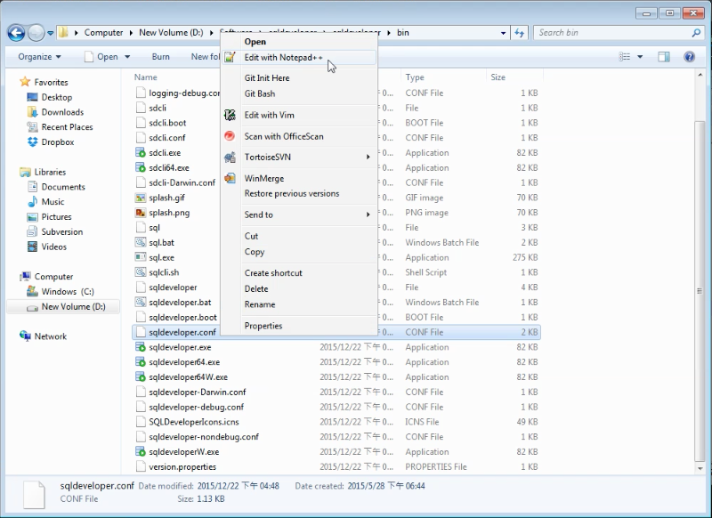
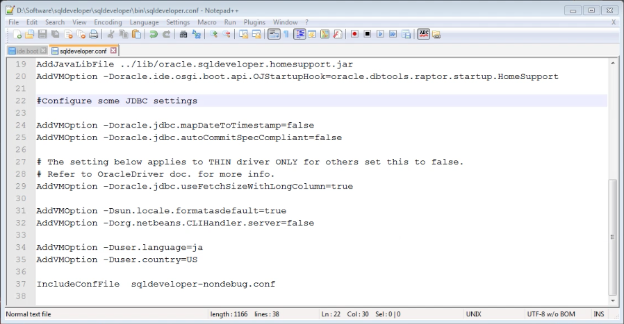
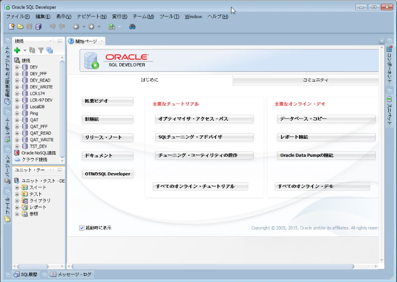

要變更 Oracle SQL Develop 界面的語言，可先開啟 idein\ide.boot 檔。  

<!-- More -->

 

查閱 oracle.translated.locates 設定中可支援的語言有哪些。  

 

再來開啟 sqldeveloperin\sqldeveloper.conf 檔。  

 

將 AddVMOption -Duser.language 設定值設為欲使用的語言，然後重啟 Oracle SQL Developer。  

 

Oracle SQL Developer 就會變成指定的語言界面。  

 
