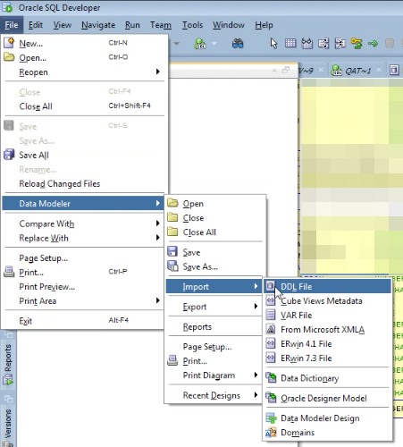
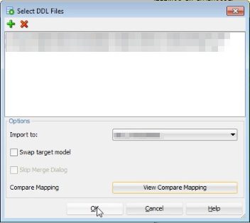
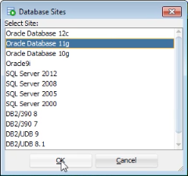
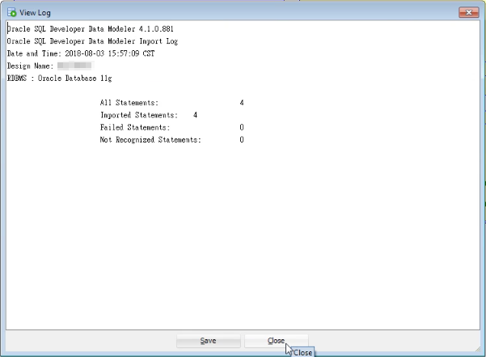
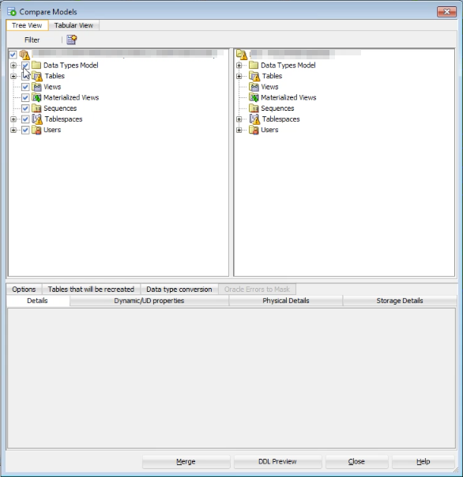
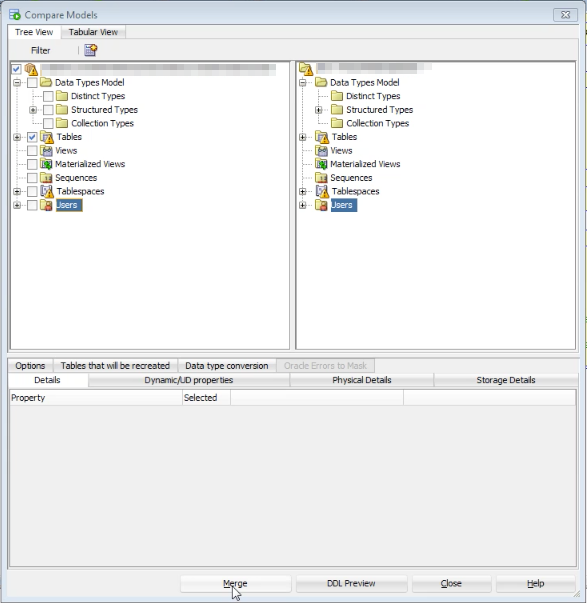
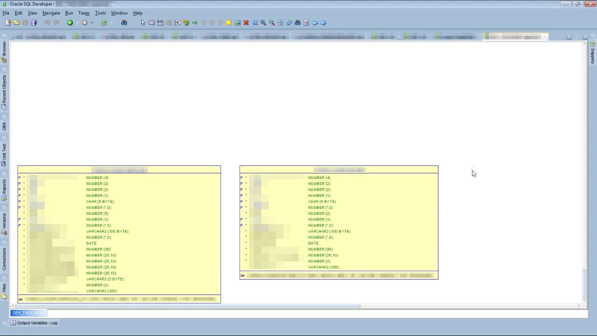

在維護 Data Modeler 時，若已有現成的 DDL File，可以點選 [File | Data Modeler | Import | DDL File] 主選單選項。  

<!-- More -->

 
 

將要匯入的 DDL File 加入，按下 OK 按鈕。  

 
 

選取資料庫類型，按下 OK 按鈕繼續。  

 
 

這邊會帶出匯入的資訊，按下 Close 按鈕關閉。  

 
 

然後會帶出 Compare Models 視窗。  

 
 

透過該視窗可以清楚知道有什麼會被匯入，我們也可以視需要調整要匯入的東西，匯入前可以按下 DDL Preview 按鈕確認一下會做的調動，若無問題則按下 Merge 按鈕進行匯入。  

 
 

匯入完成就可以在 Data Modeler 上看到匯入的東西。  

 
 
