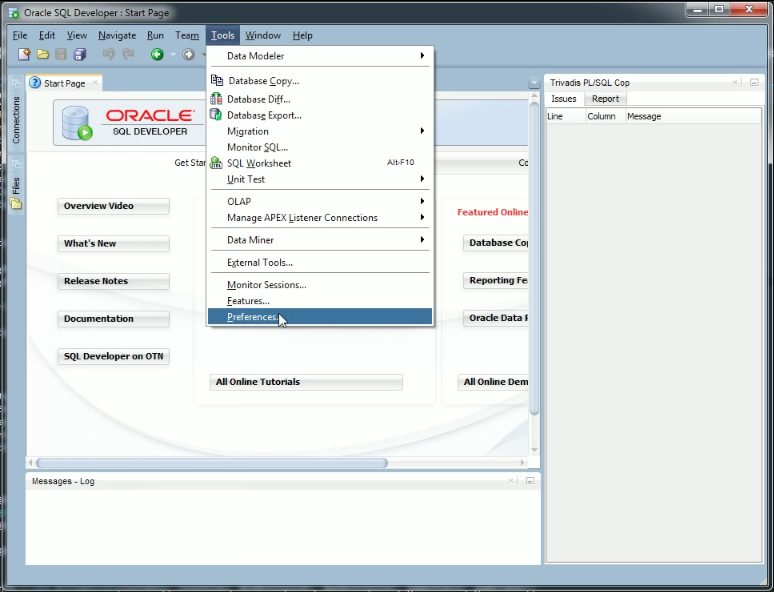
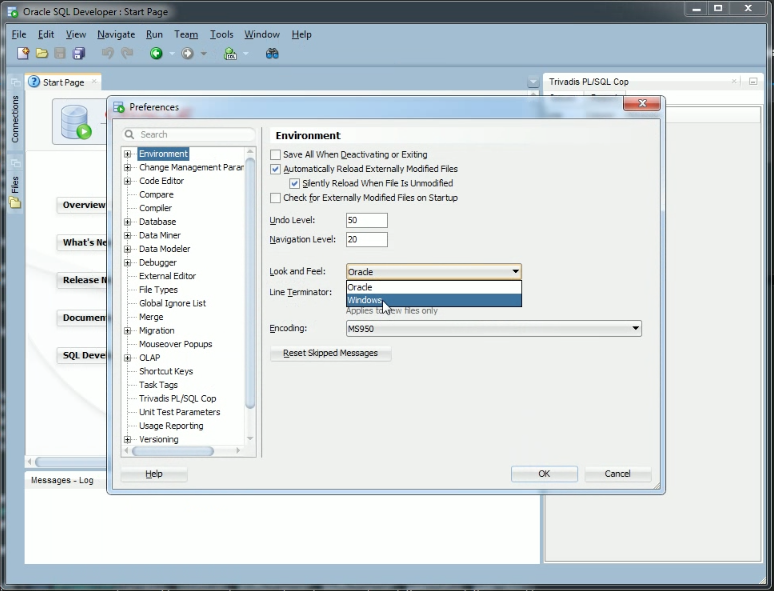
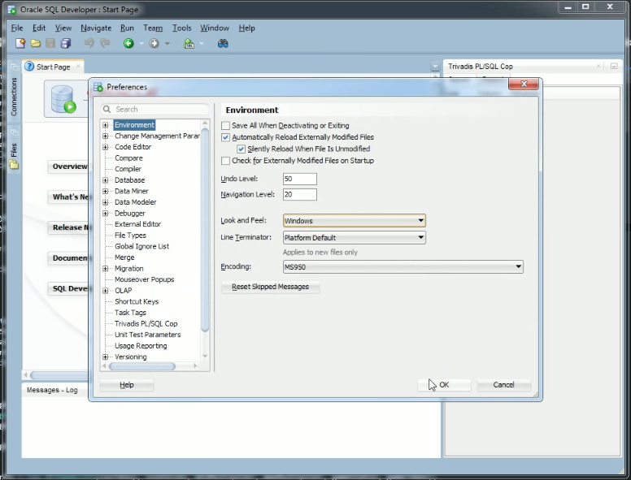
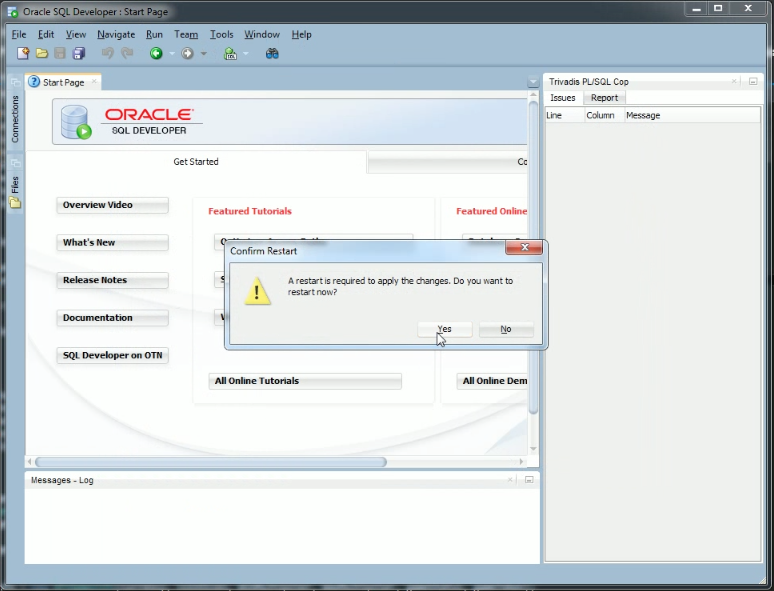
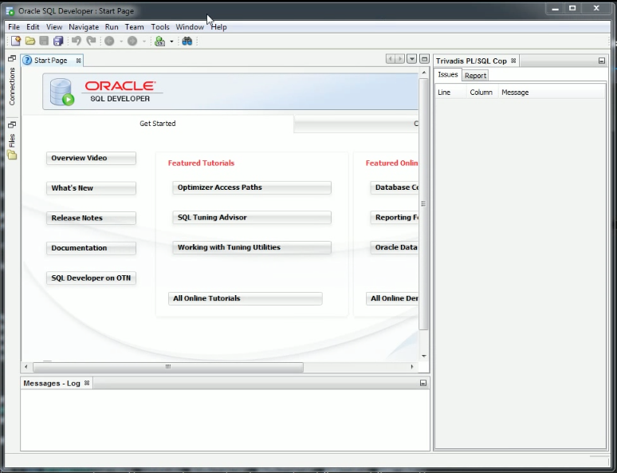

Oracle SQL Developer 可以支援 Look 與 Feel 的調整，所謂的 Look 指的是 Widgets 畫面的外觀，Feel 指的是 Widgets 的行為。  

<!-- More -->

 

透過 Look and Feel 的設定調整，可以讓 Oracle SQL Developer 的外觀與操作更類似於我們習慣的環境，操作上會更為順手。  

 

要設定 Look and Feel，首先必須要點選 [Tools | Perferences...] 主選單選項。  

 

點選切換至 Environment 頁籤，即可對 Look and Feel 進行設定。  

 

像是如果對 Windows 應用程式的操作比較熟悉的話就可將之切換至 Windows 設定。

 

設定完 Oracle SQL Developer 會需要進行重啟。  

 

重啟後 Oracle SQL Developer 的外觀與操作就會接近一般的 Windows 應用程式。  

 
