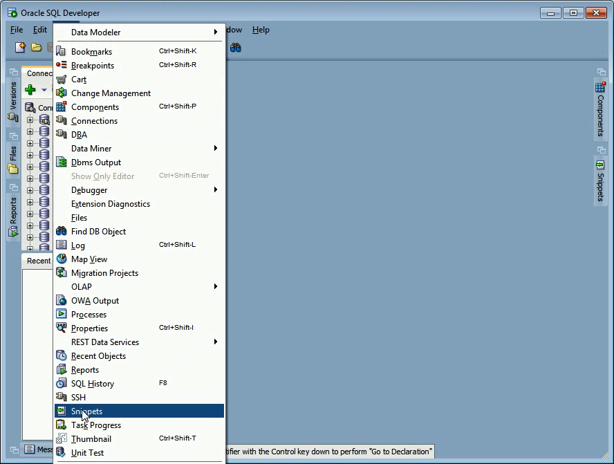
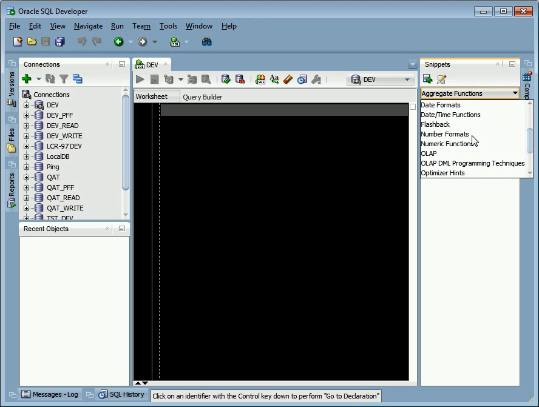
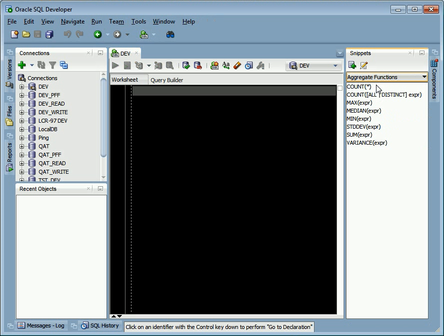
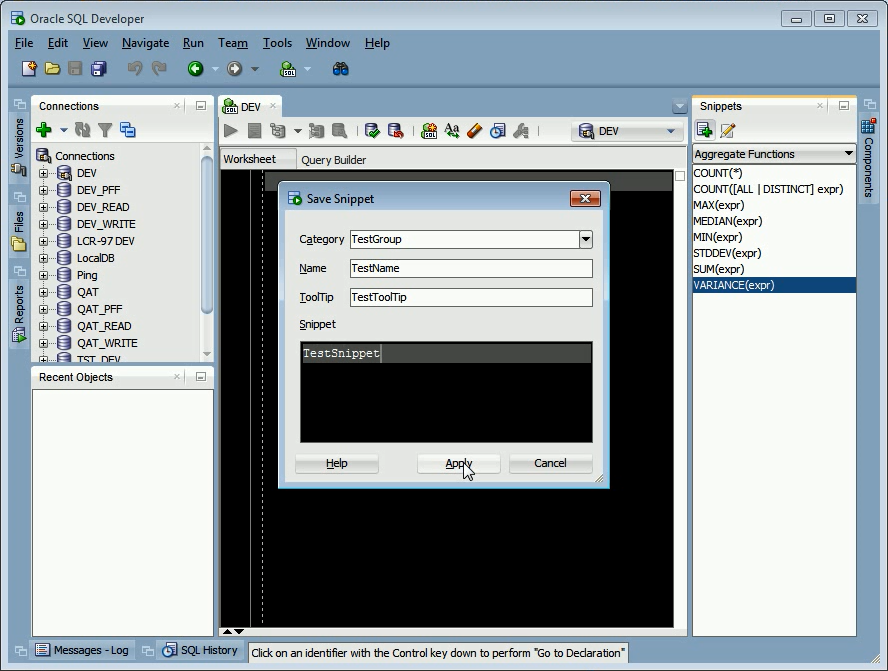
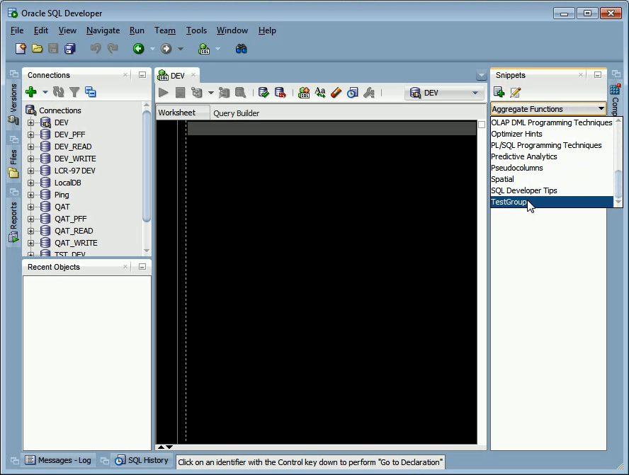
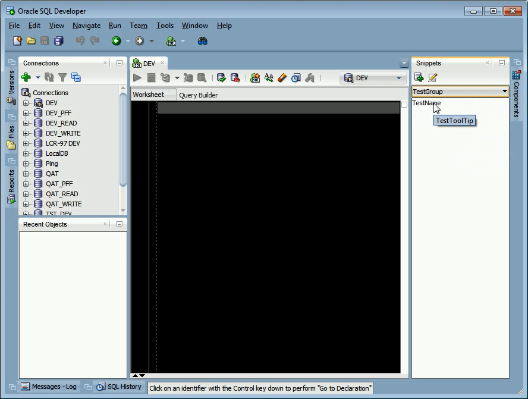
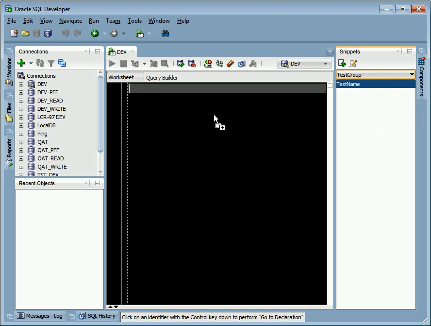
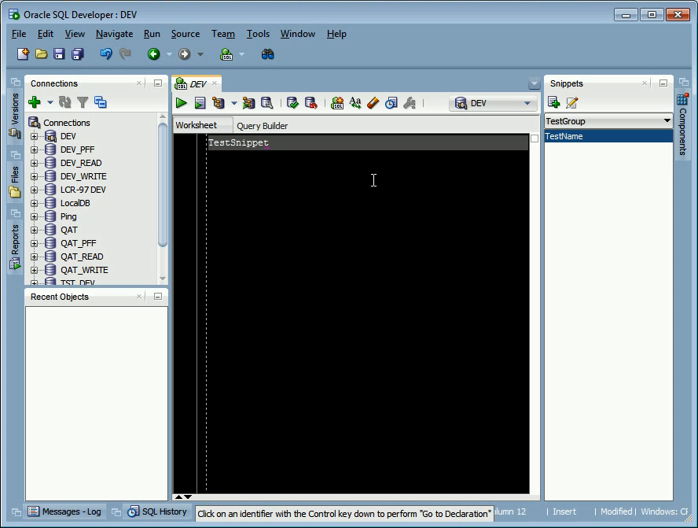
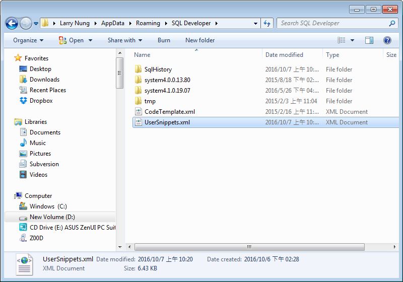

要使用 Oracle SQL Developer 的 Snippets 功能，我們可以點選 [ View | Snippets ] 主選單選項。  

<!-- More -->

 

將 Snippets 視窗帶出後，可以看到 Oracle SQL Developer 已經內建了許多的 Category。  

 

每個 Category 都有對應的 Snippets。  

 

若內建的 Category 不敷使用，這邊也可以自己建造 Snippet。  

 

像是這邊筆者建立了一個新的 Snippet 在新的 Category，建立完就可以馬上看到建立出來的 Category。  

 

以及建立的 Snippet。  

 

Snippet 的使用只要將之拖曳至 SQL 視窗。

 

Snippet 就會被帶到 SQL 視窗

 

自定義的 Snippet 會設定在 `%appdata%\SQL Developer\UserSnippets.xml`，有需要匯入匯出可從這邊下手。

 
