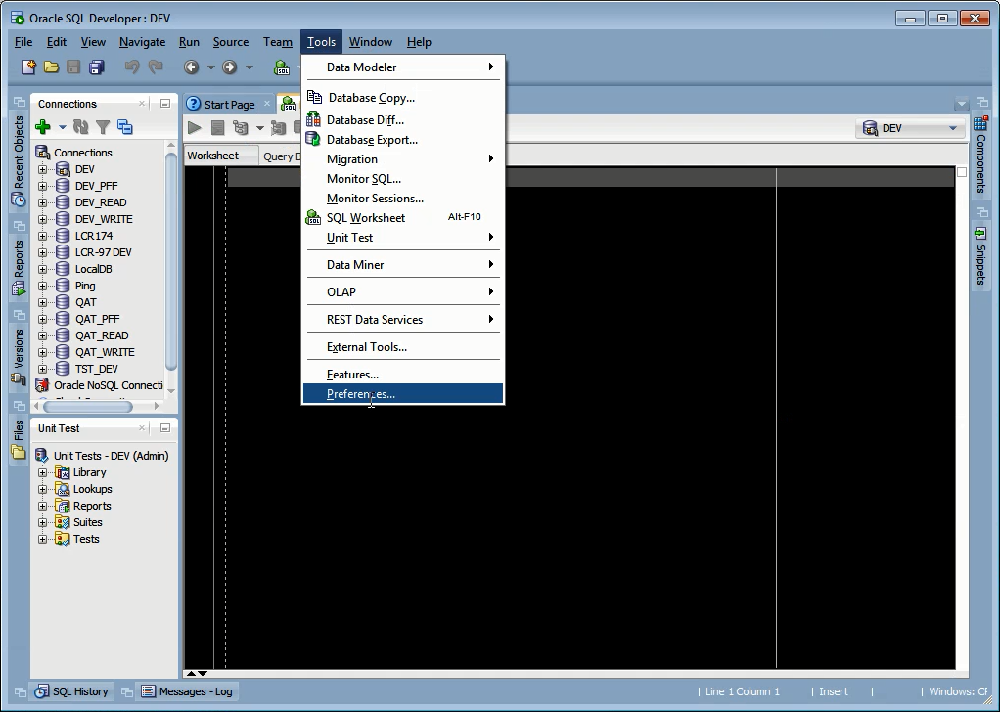
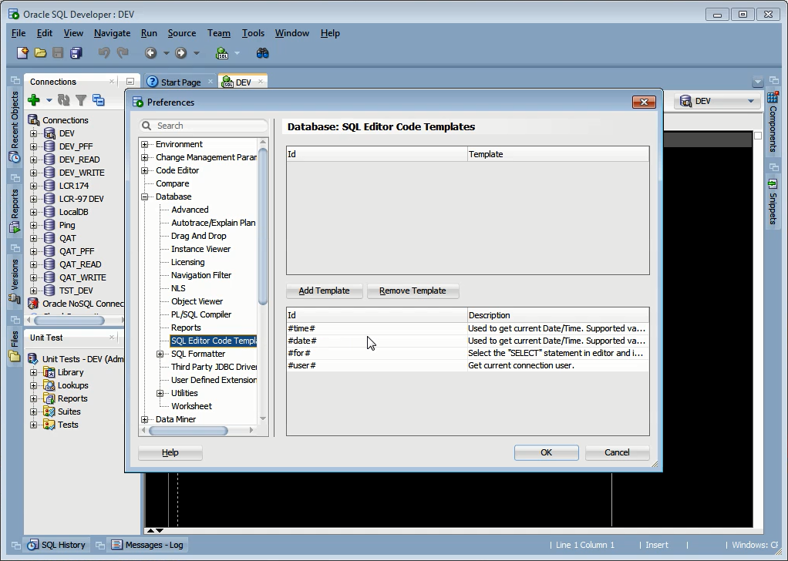
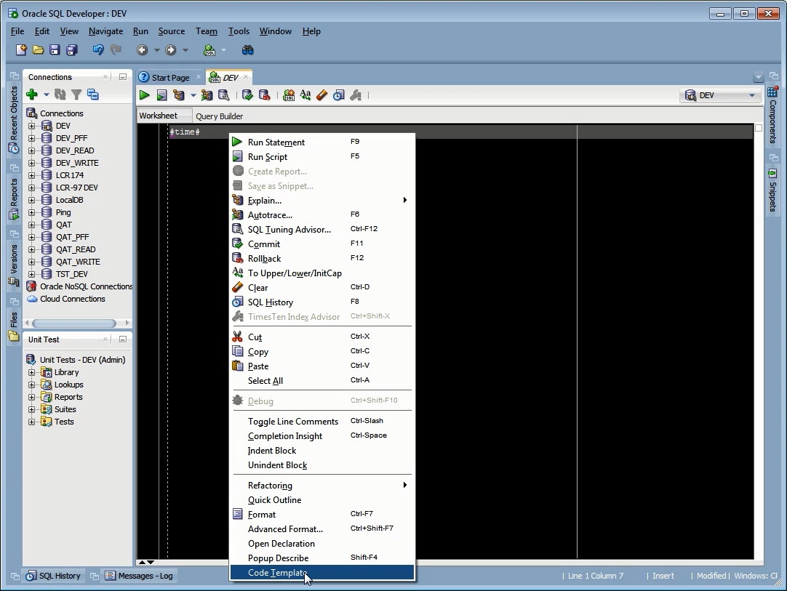
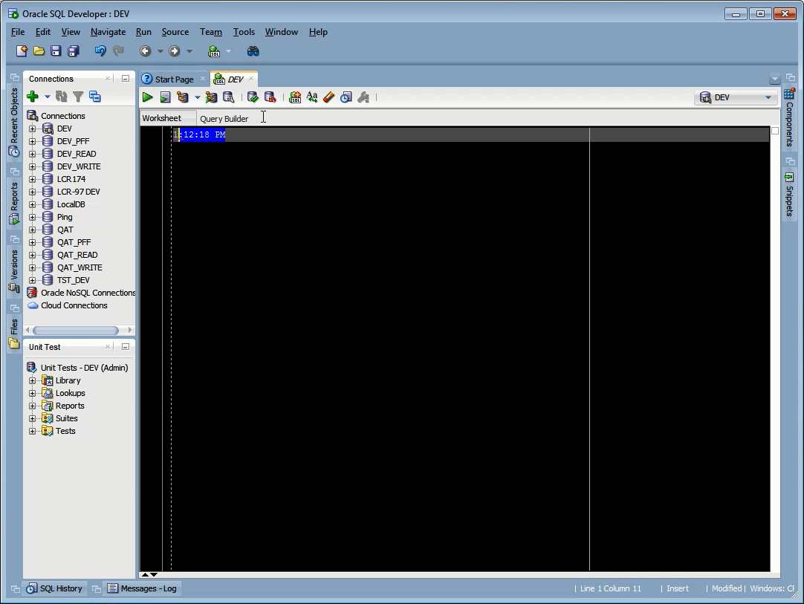
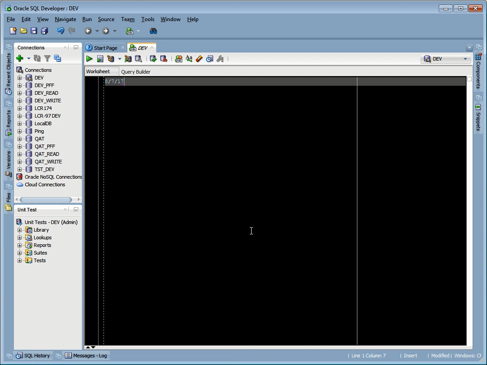
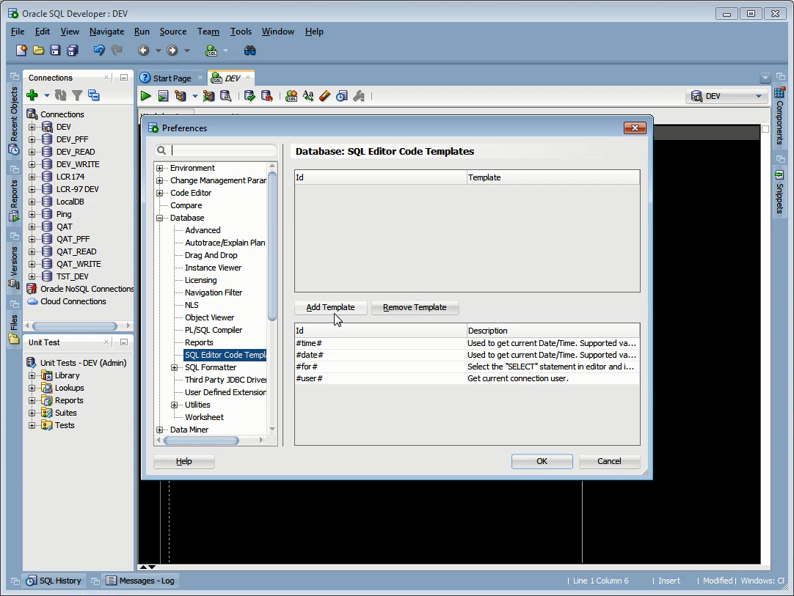
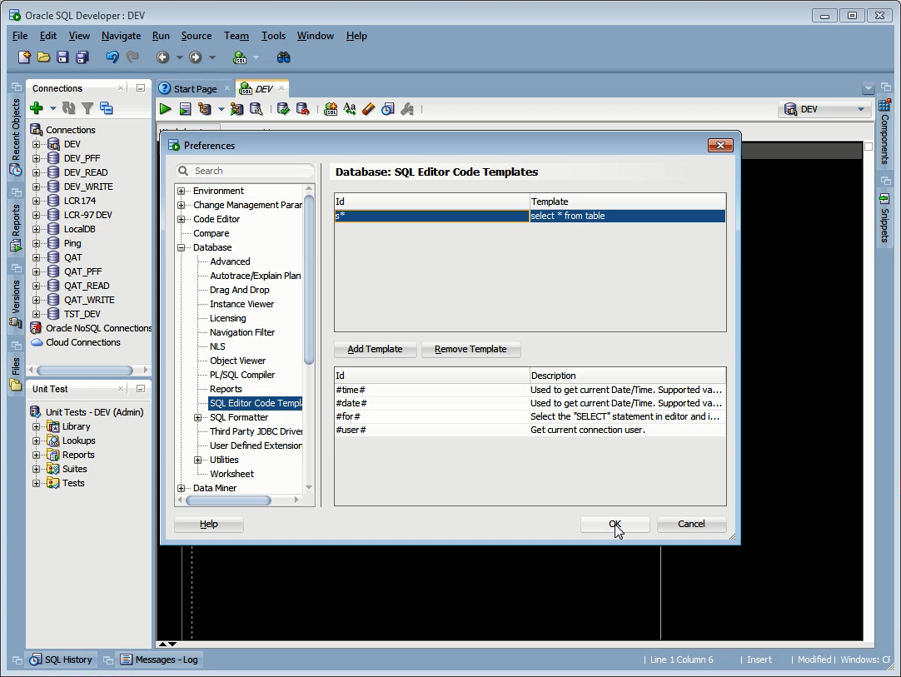
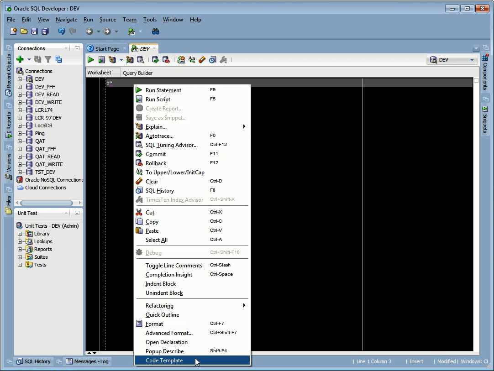
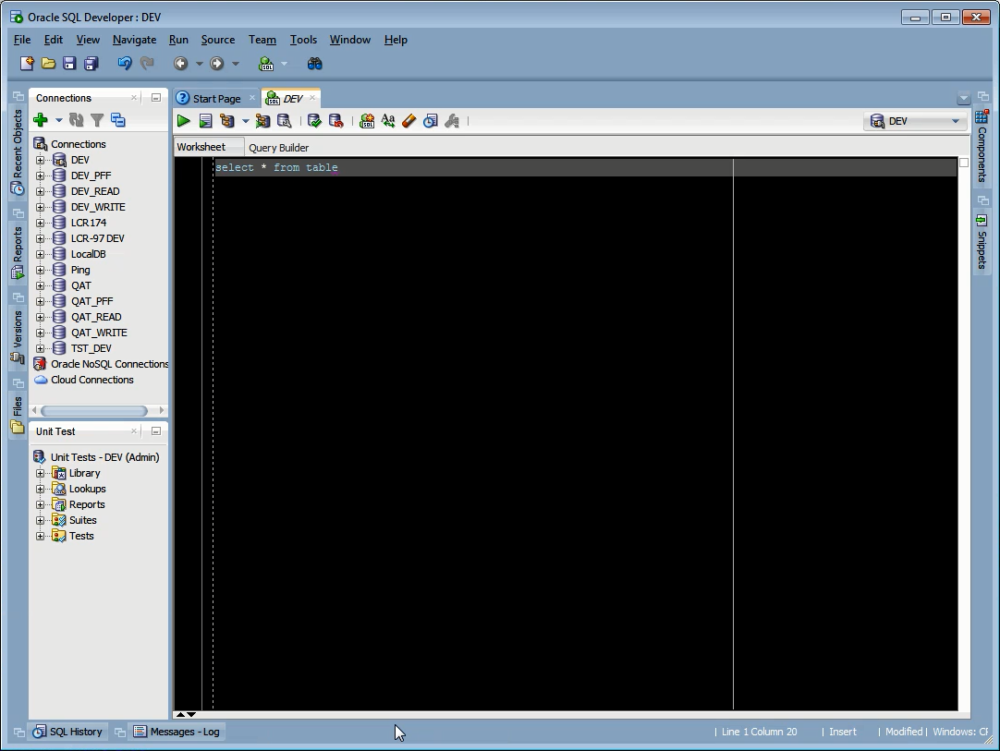

Oracle SQL Developer 可透過 [Tools | Preferences...] 主選單選項開啟 Preferences 視窗。  

<!-- More -->

 

切換至 [Debug | SQL Editor Code Templates]。  

 

已內建一些 Template 可供使用，像是 #time#。  

 

可用以帶入當前的時間。  

 

#date# 可用以帶入當前的日期。  

 

 

若有需要也可以自行增加 Template 使用。  

 

 

 

 
