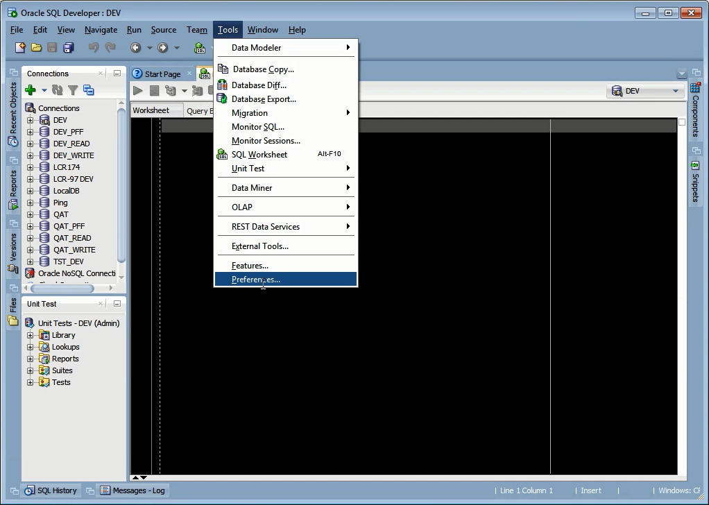
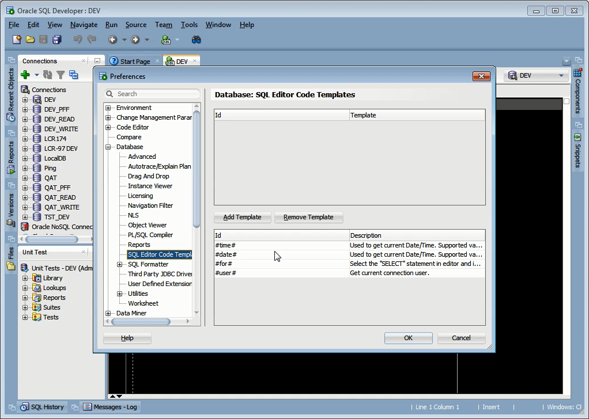
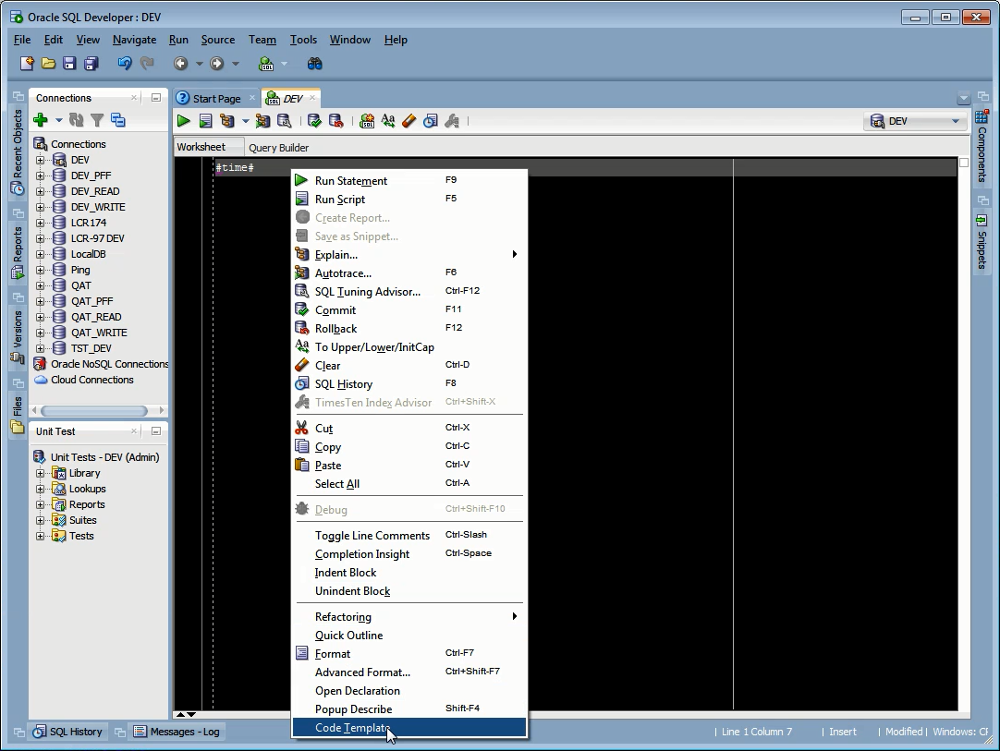
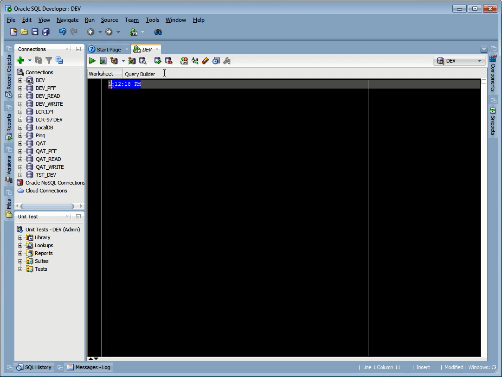
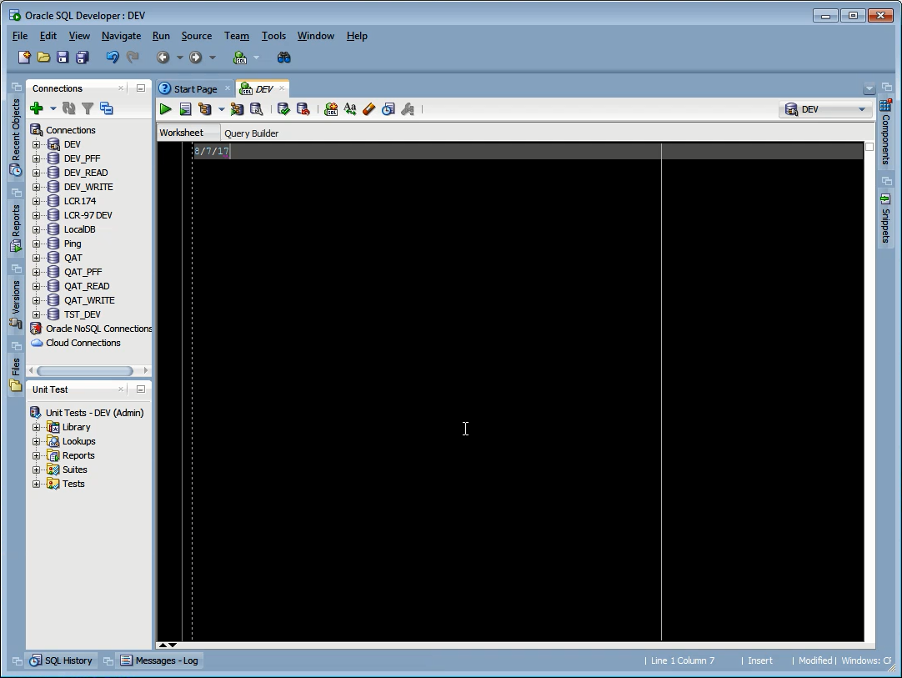
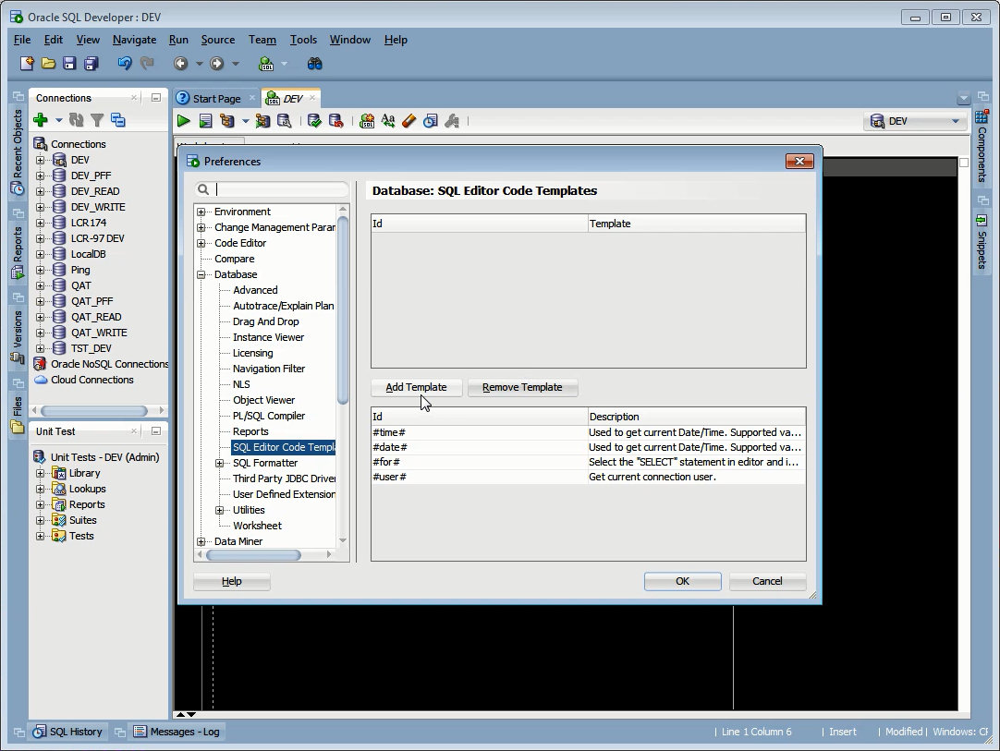
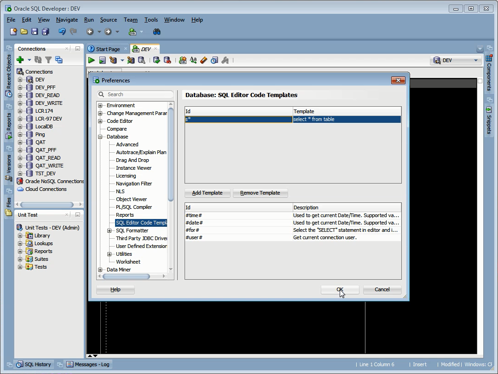
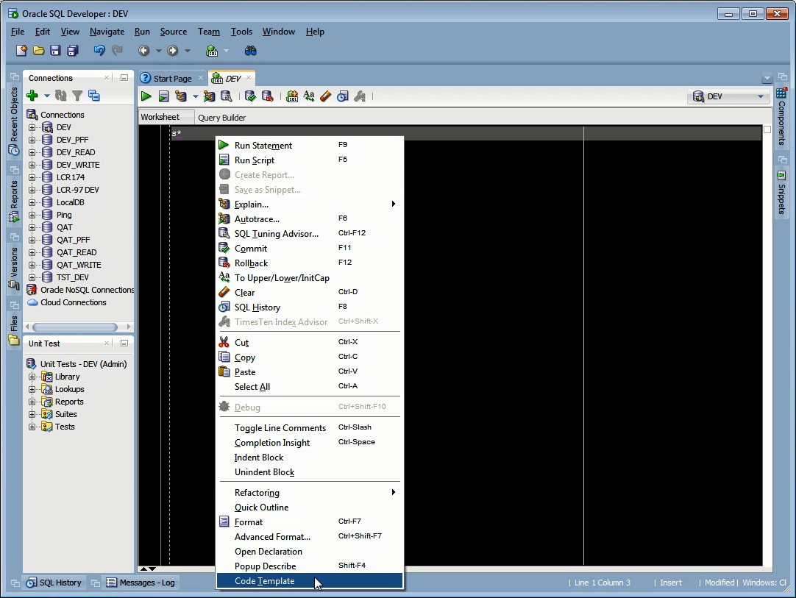
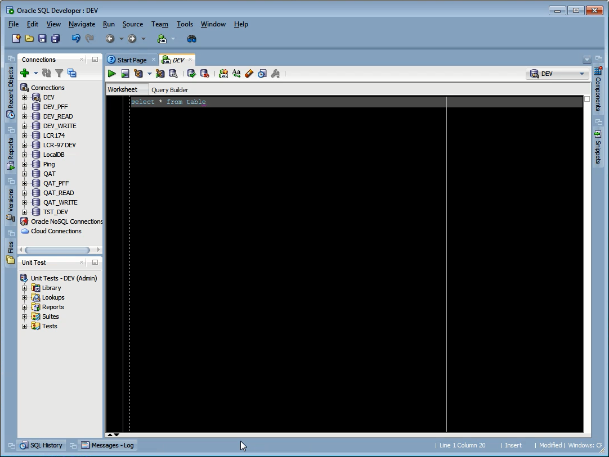

Oracle SQL Developer 可透過 [Tools | Preferences...] 主選單選項開啟 Preferences 視窗。

切換至 [Debug | SQL Editor Code Templates]。

已內建一些 Template 可供使用，像是 #time#。

可用以帶入當前的時間。

#date# 可用以帶入當前的日期。

若有需要也可以自行增加 Template 使用。

