要用 Oracle SQL Developer 撰寫單元測試，可點選 [View | Unit Test] 主選單選項。  

<!-- More -->

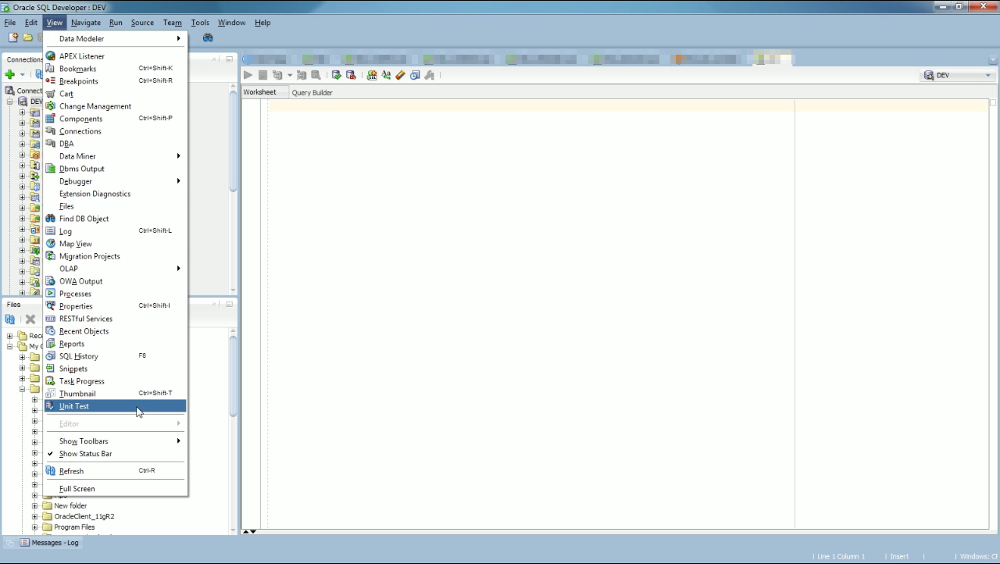

 

將 Unit Test 視窗開啟。  

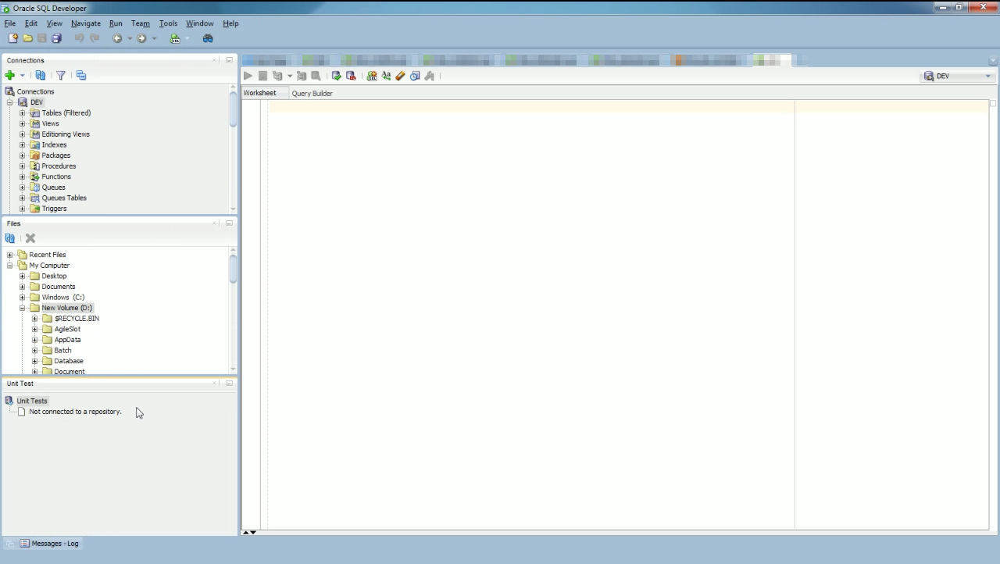

 

點選 [Tools| | Unit Test | Select Current Repository...]。  

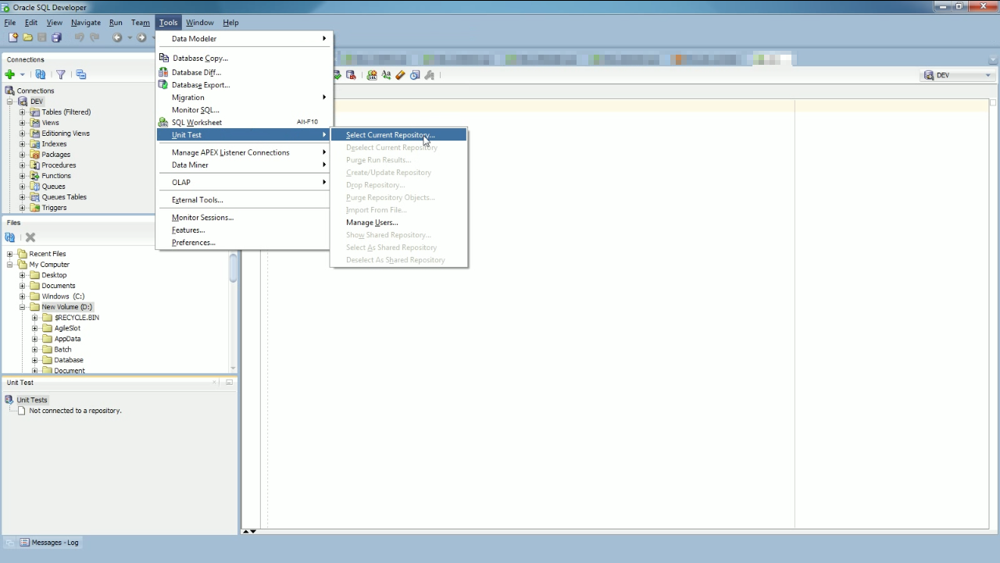

 

選取 Connection。  

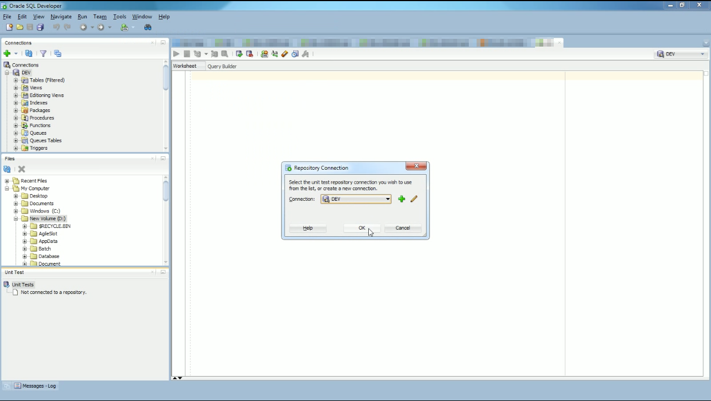

 

如果 Connection 未建立過 Unit Test 的 Repository，Oracle SQL Developer 可直接幫我們建立。  

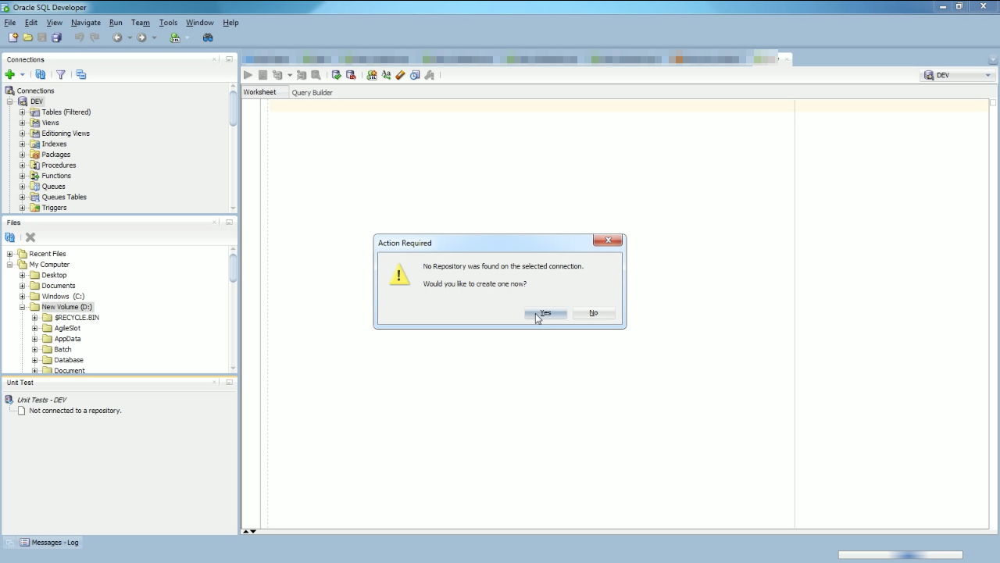

 

連到 Repository 後，Unit Test 視窗就會多出 Library、Lookups、Reports、Suites、Tests 這些目錄。  

 

我們可以直接在 SP 上或是 Unit Test 視窗上按下滑鼠右鍵，點選 Create Test... 滑鼠右鍵快顯選單，開始建立 Unit Test。   

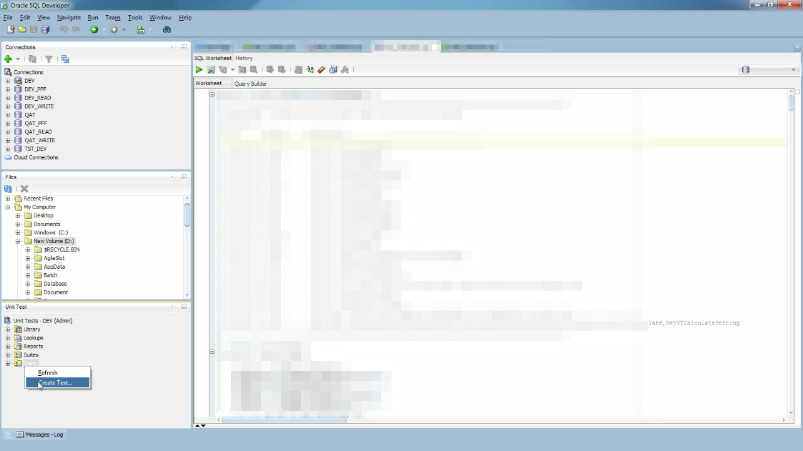

 

選取要撰寫 Unit Test 的 SP。  

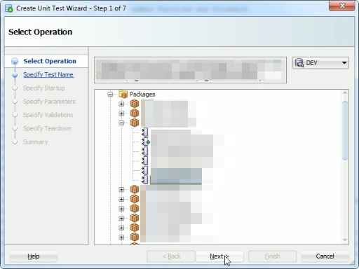

 

設定 Unit Test 的名稱。  

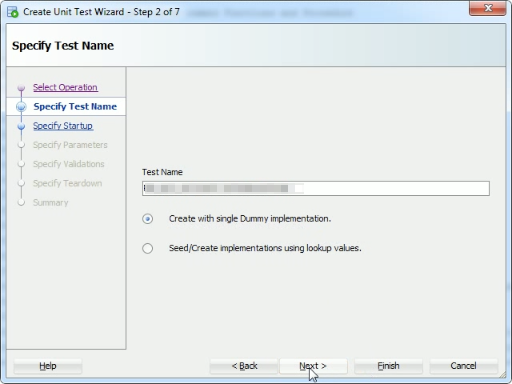

 

設定 Unit Test 前要做的前置動作。  

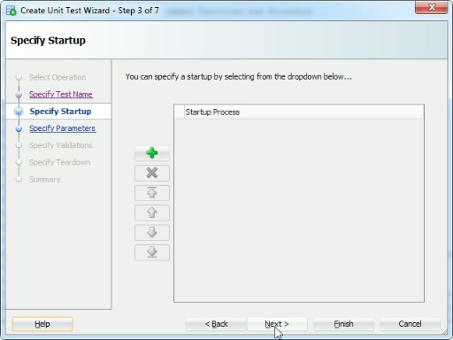

 

設定 SP 運行時所需要的參數。  

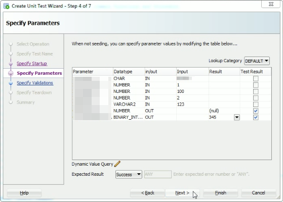

 

設定 Unit Test 的驗證部分。  

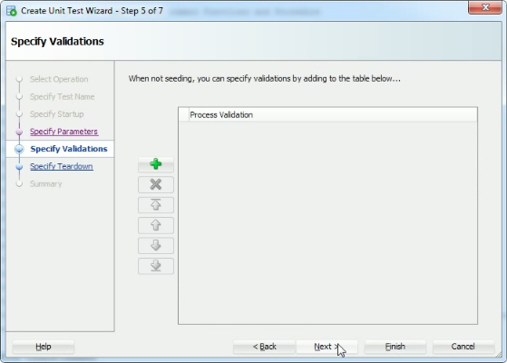

 

設定 Unit Test 後要做的後置動作。  

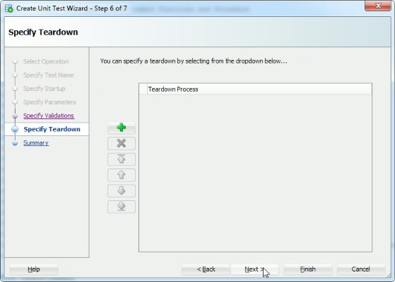

 

按下 Finish 按鈕完成 Unit Test 設定。  

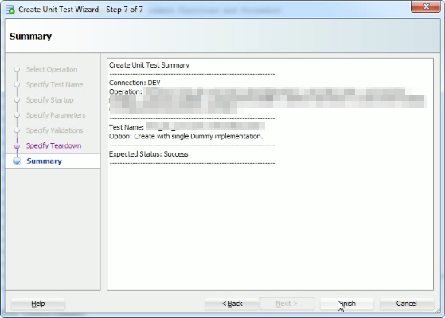

 

建立的 Unit Test 會出現在 Unit Test 視窗的 Tests 目錄下方，點選開啟該單元測試，可以看到該單元測試的設定值，若有需要也可以直接在這介面做設定的調動。若設定無誤，可點選上方工具列的 Run Test 按鈕或是按下熱鍵 F9 開始運行測試。     

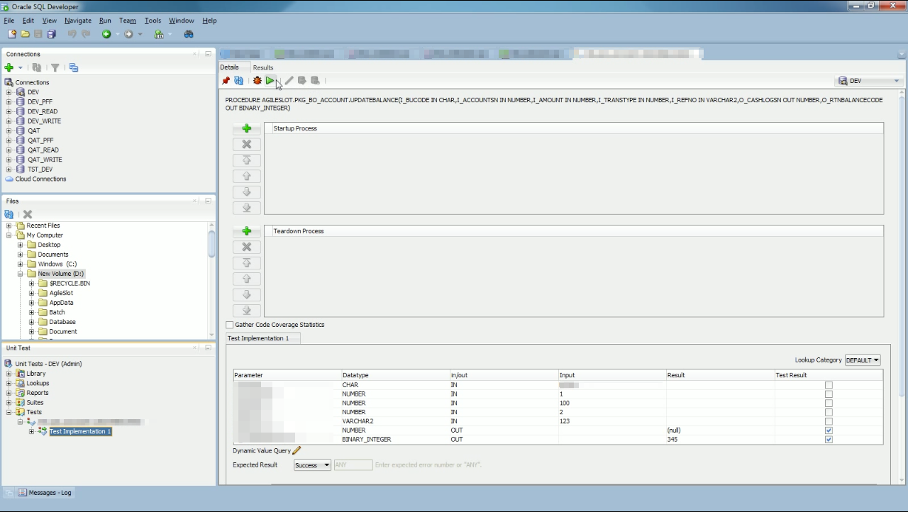

 

測試運行完成即可看到測試的結果。  

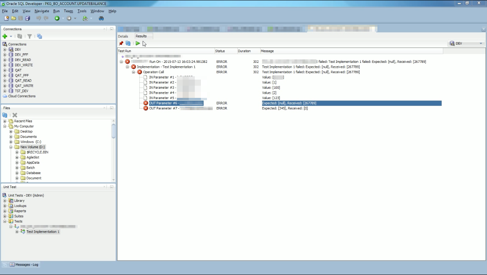

 
