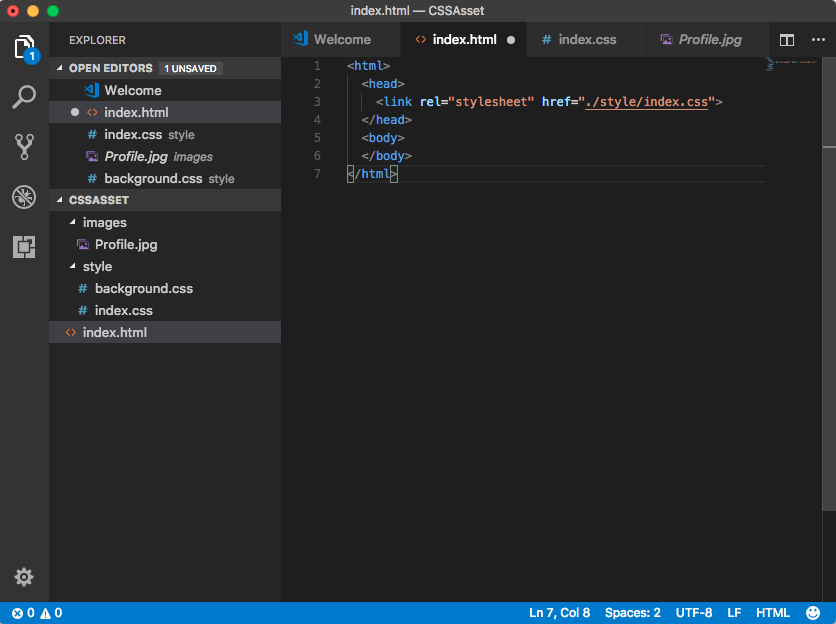
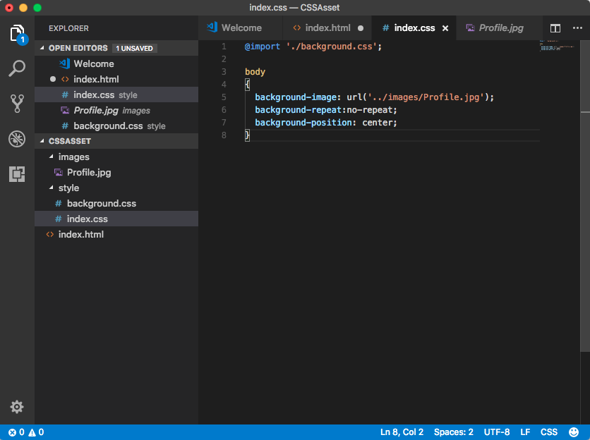
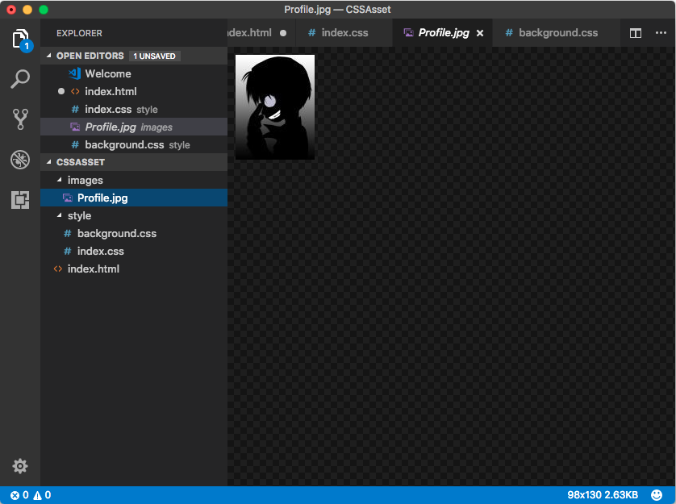
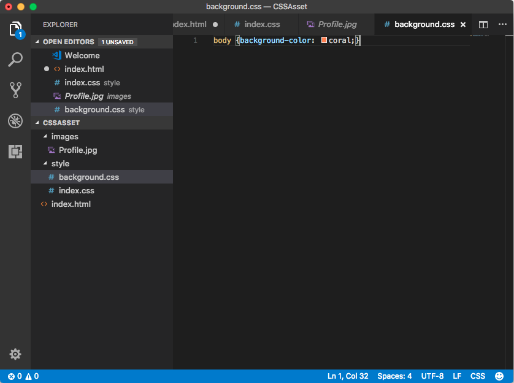
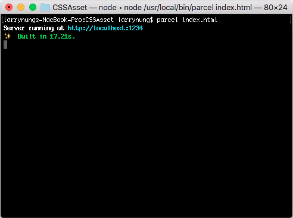
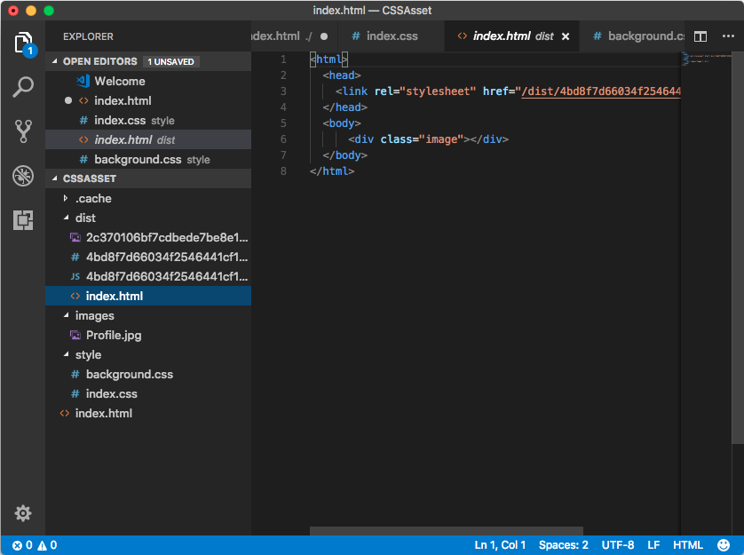
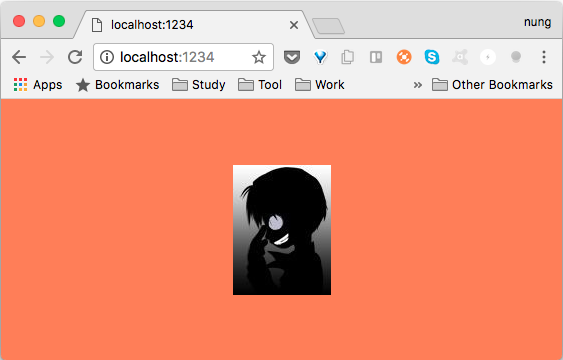

Parcel 支援 CSS 文件的處理，可在 CSS 中透過 @import 載入另一個 CSS。
```css
...
@import './background.css';
...
```
也可以透過 url 函式引用圖片、字型。
```css
...
background-image: url('../images/Profile.jpg');
...
```
像是下面這邊筆者創建了個簡單的範例，建立了個 index.html，裡面引用了 index.css。
```html
<html>
  <head>
    <link rel="stylesheet" href="./style/index.css">
  </head>
  <body>
  </body>
</html>
```


index.css 內透過 @import 引用了 background.css 檔，用 url 方法使用指定圖片設定背景圖片。
```css
@import './background.css';

body
{
background-image: url('../images/Profile.jpg');
background-repeat:no-repeat;
background-position: center;
}
```




background.css 設定背景為指定顏色。
```css
body {background-color: coral;}
```


範例準備好後調用 Parcel 命令建置並啟用服務。



Parcel 解析網站後會將需要的檔案處理後移至輸出目錄。



連至啟動的服務網址，可看到網站正確的被運行。



Link
------
* [📦 資源(Assets)](https://parceljs.org/assets.html)