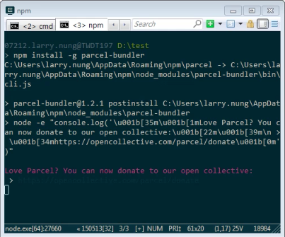
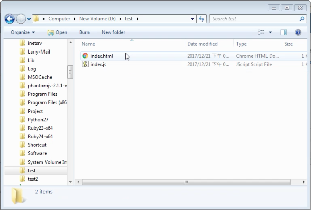
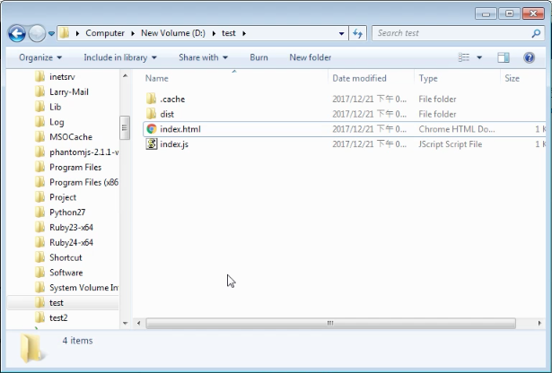
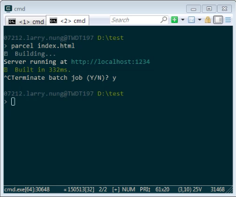

Parcel 使用前需先安裝套件。  

<!-- More -->

<br/>


可以透過 yarn。   

    yarn global add parcel-bundler

<br/>


或是透過 npm 安裝。  

    npm install -g parcel-bundler
    
<br/>


 
 
 <br/>


安裝完準備要進行打包的程式。  

 
 
 <br/>


Index.html 檔案內容為：  

```html
<html>
<body>
  <script src="./index.js"></script>
</body>
</html>
```

<br/>


Index.js 檔案內容為：  

```js
console.log("hello world");
```

<br/>


調用 Parcel 命令進行編譯並運行網站服務。  

    parcel [WebFile]

 
 
 <br/>


編譯後的檔案會產生在 dist 目錄下。  

 
 
 <br/>


連至網站可看到打包後運行起來的樣子。  

 
 
 <br/>


要退出網站服務的話，按下熱鍵 Ctrl + C，鍵入 Y 後 Enter 即可。  

 
 
 <br/>
