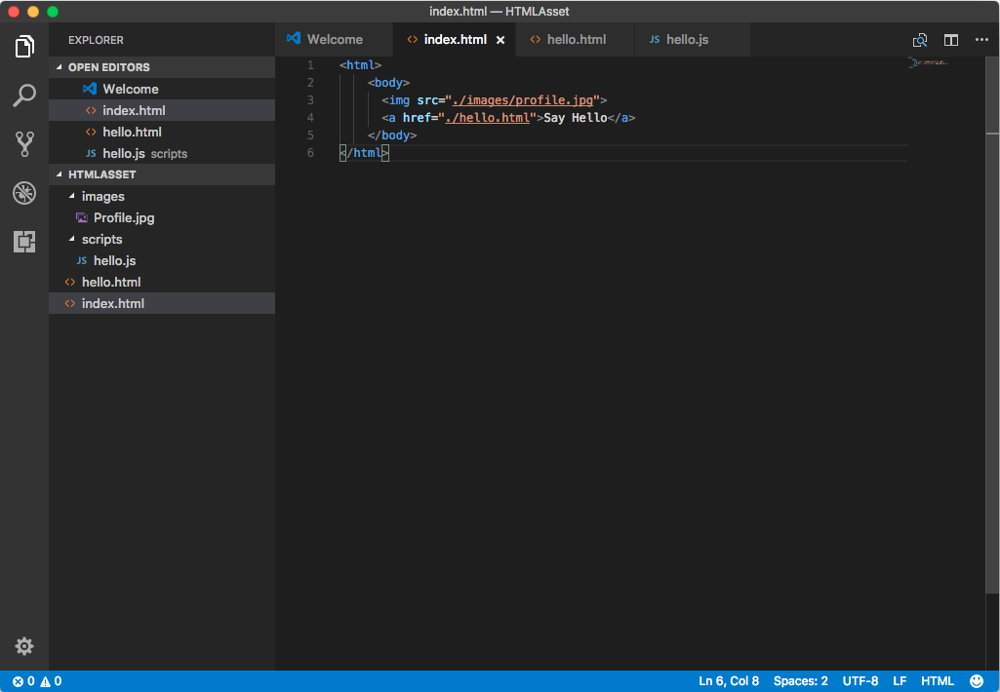
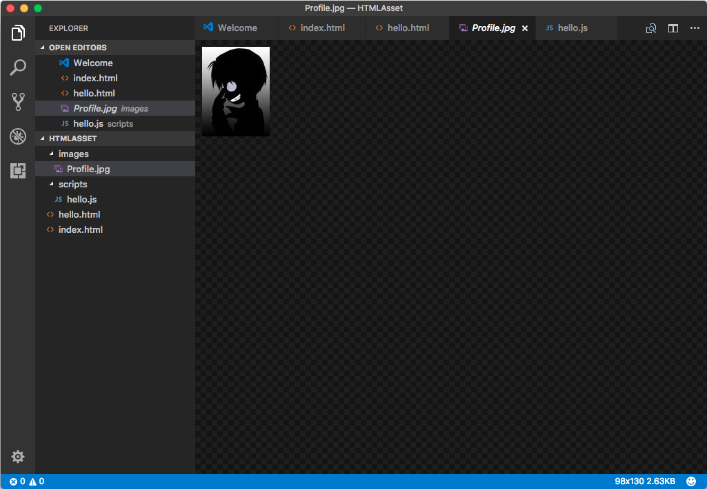
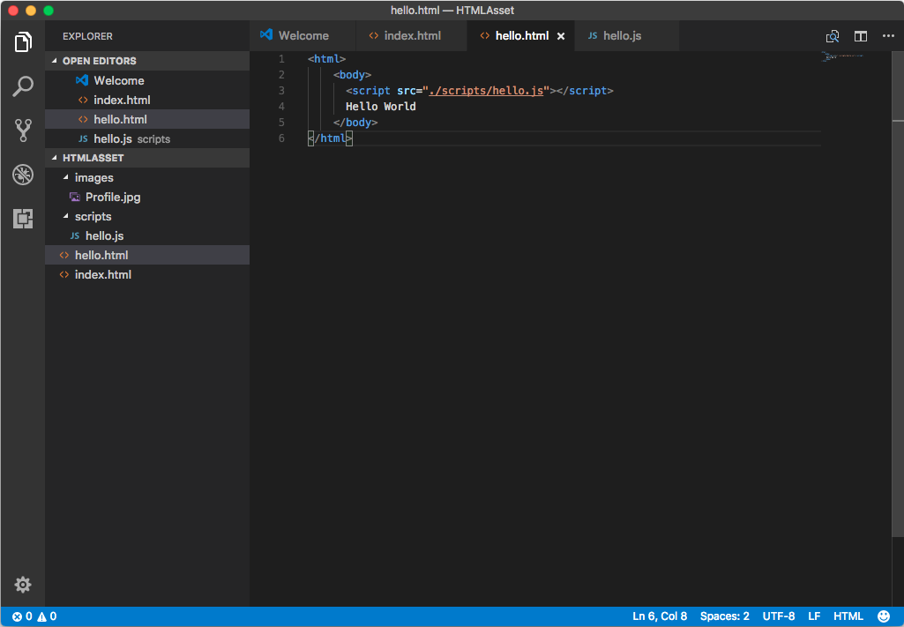
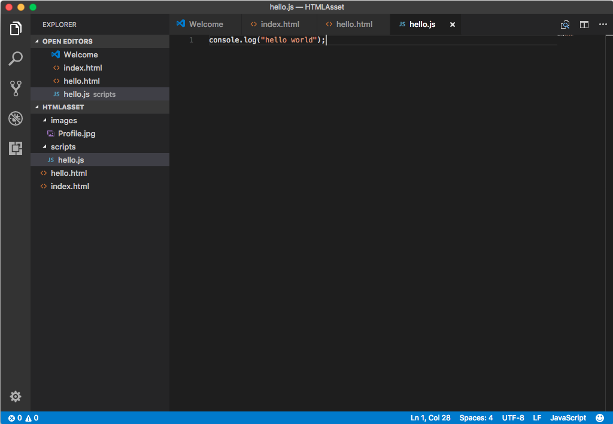
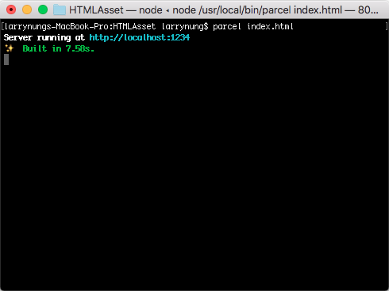
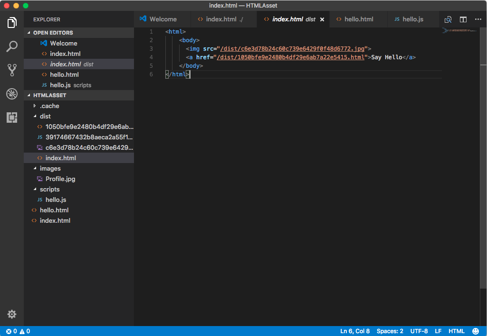
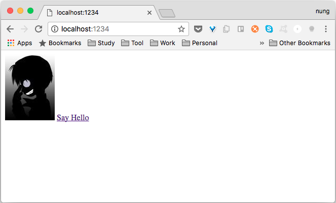
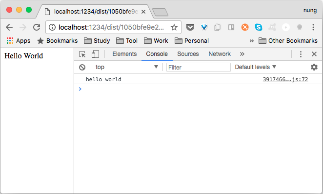

除了 JavaScript 文件外，Parcel 也支援 HTML 文件的處理。

像是下面這邊筆者創建了個簡單的範例，建立了個 index.html，裡面載入了 profile.jpg 且連結了 hello.html 頁面。
```html


[Say Hello](./hello.html)
```


profile.jpg 是很單純的大頭照。



hello.html 內引用了 hello.js 並輸出 Hello World 字樣。
```html

Hello World
```


hello.js 內則是很簡單的利用 Console 輸出 hello world 字樣。
```js
console.log("hello world");
```


調用 Parcel 命令建置並啟用服務。



Parcel 解析網站後會將需要的檔案處理後移至輸出目錄。



連至啟動的服務網址，可看到網站正確的被運行。





Link
----
* [📦 資源(Assets)](https://parceljs.org/assets.html)