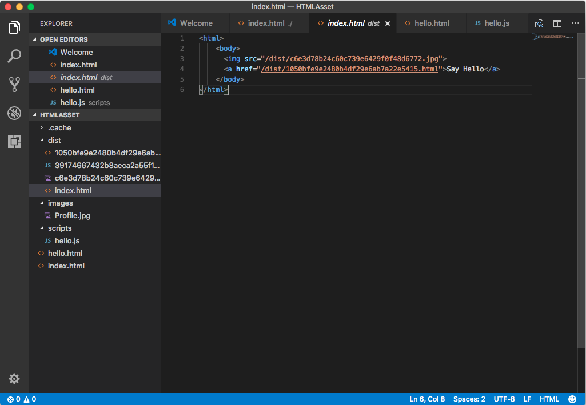

除了 JavaScript 文件外，Parcel 也支援 HTML 文件的處理。  

<!-- More -->

<br/>


像是下面這邊筆者創建了個簡單的範例，建立了個 index.html，裡面載入了 profile.jpg 且連結了 hello.html 頁面。  

```html
<html>
    <body>
      
      <a href="./hello.html">Say Hello</a>
    </body>
</html>
```


 
<br/>


profile.jpg 是很單純的大頭照。  


 
<br/>


hello.html 內引用了 hello.js 並輸出 Hello World 字樣。  

```html
<html>
    <body>
      <script src="./scripts/hello.js"></script>
      Hello World
    </body>
</html>
```


 
<br/>


hello.js 內則是很簡單的利用 Console 輸出 hello world 字樣。  

```js
console.log("hello world");
```


 
<br/>


調用 Parcel 命令建置並啟用服務。  


 
<br/>


Parcel 解析網站後會將需要的檔案處理後移至輸出目錄。  


 
<br/>


連至啟動的服務網址，可看到網站正確的被運行。


 
<br/>


 
<br/>


Link
----
* [📦 資源(Assets)](https://parceljs.org/assets.html)
