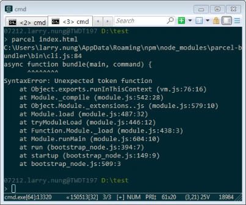
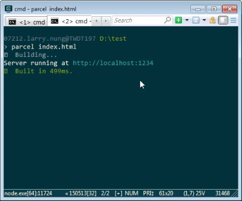

使用 Parcel 時若發生 SyntaxError: Unexpected token function 錯誤。  

<!-- More -->

 

這是因為 Parcel 用到了 Node.js 8.x 的語法，確認 Node.js 是否已更新到指定版本，更新完後即可正常運行。  

 

Link
----
* [🐛 about SyntaxError: Unexpected token function · Issue #244 · parcel-bundler/parcel · GitHub](https://github.com/parcel-bundler/parcel/issues/244)
* [parcel 錯誤：SyntaxError: Unexpected token function - JJC 前端進階- SegmentFault](https://segmentfault.com/a/1190000012392912)
