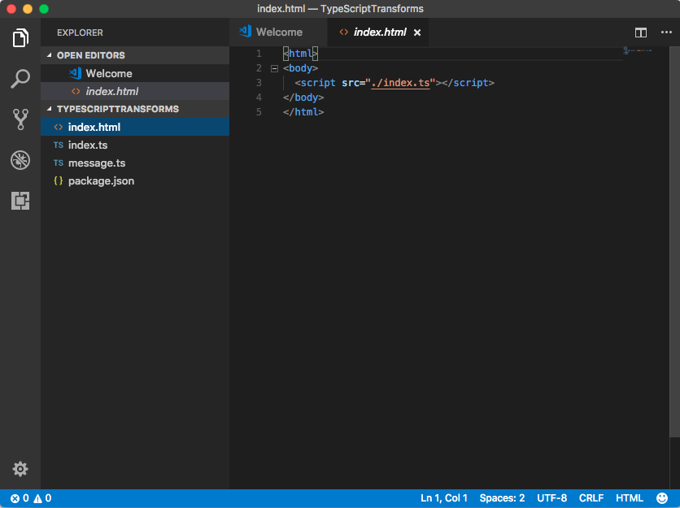
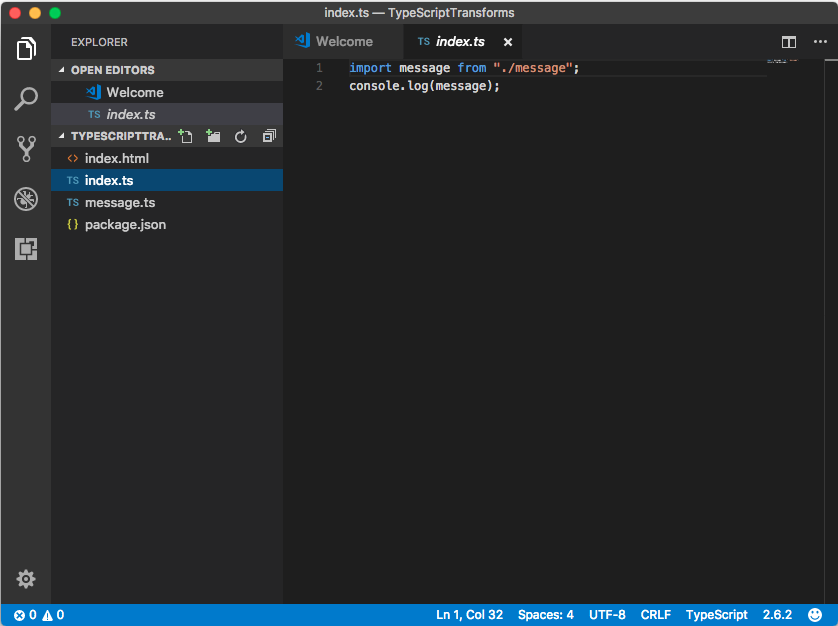
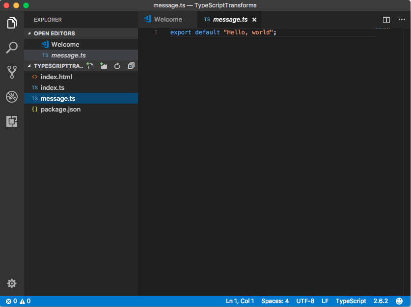
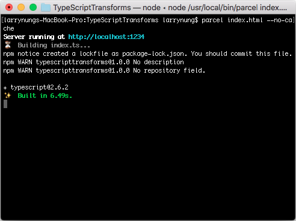
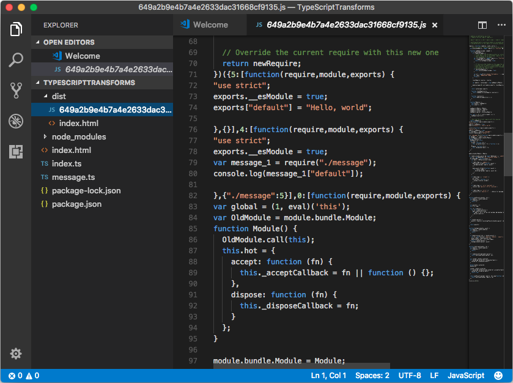
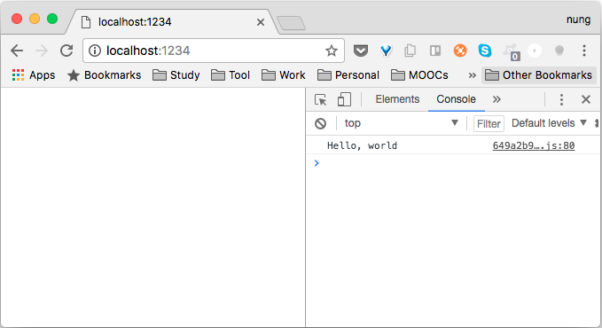

Parcel 支援 TypeScript 的轉換。  

<!-- More -->

<br/>


像是下面這邊筆者創建了個簡單的範例，建立了個 index.html，裡面引用了 index.ts。  
```html
<html>
<body>
  <script src="./index.ts"></script>
</body>
</html>
```


 
<br/>


index.ts 內引用 message.ts，並將 message.ts 傳回的訊息輸出到主控台。  

```typescript
import message from "./message";
console.log(message);
```


 
<br/>


message.ts 則是將要顯示的訊息輸出。  

```typescript
export default "Hello, world";
```


 
<br/>


範例準備好後調用 Parcel 命令建置並啟用服務，Parcel 會自行下載 TypeScript 套件編譯 TypeScript。  


 
<br/>


Parcel 解析網站後會將需要的檔案處理後移至輸出目錄。  


 
<br/>


連至啟動的服務網址，可看到網站正確的被運行。


 
<br/>


Link
----
* [🐠 轉換(Transforms)](https://parceljs.org/transforms.html)
