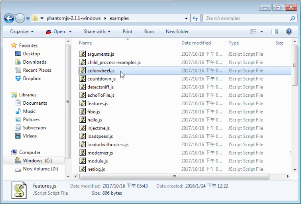
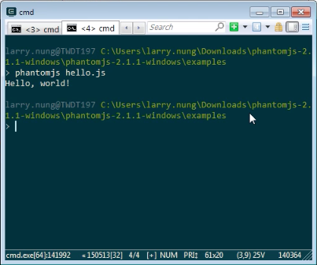
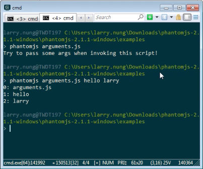
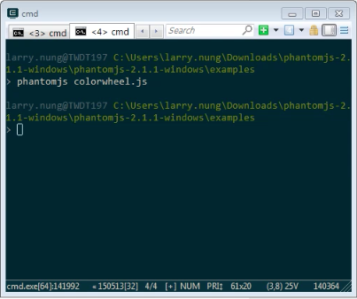
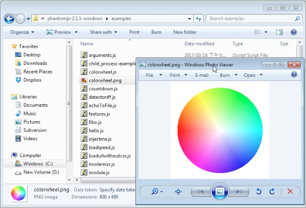

PhantomJS 下載下來解壓縮，裡面有個 examples 目錄，放置著 PhantomJS 提供的範例程式。   

<!-- More -->

 

可透過 PhantomJS 將範例運行起來學習。  

 

像是運行 hello.js 學習如何顯示訊息到主控台視窗。  

    phantomjs hello.js

 

運行 arguments.js 學習如何傳遞參數給 PhantomJS。  

    phantomjs arguments.js [arg1] [arg2] ...

 

運行 colorwheel.js 學習如何渲染並擷取畫面。  

    phantomjs colorwheel.js

 

 

還有很多的範例可以一一的運行起來測試、學習。

 
  

Link
----
* [Examples | PhantomJS](http://phantomjs.org/examples/index.html)
