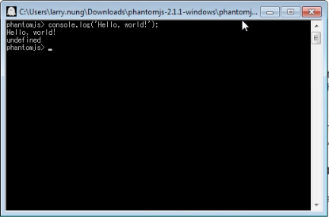
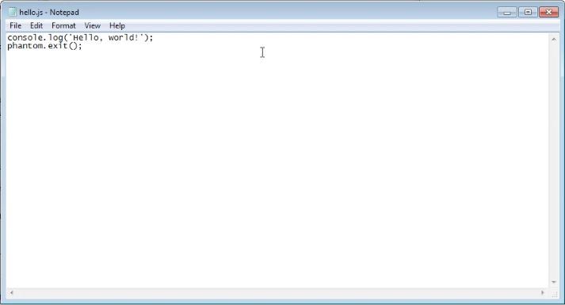
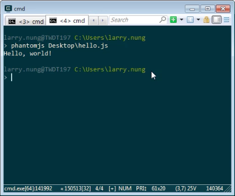

要使用 PhantomJS ，可以直接調用 PhantomJS 進入交互模式，輸入要調用的 Script。  

<!-- More -->

 

像是簡單的秀出 Hello world 字樣。  

 

或是將要調用的 Script 寫入檔案。  

 

用 PhantomJS 帶上檔名調用也可。  

 

Link
----
* [Quick Start | PhantomJS](http://phantomjs.org/quick-start.html)
