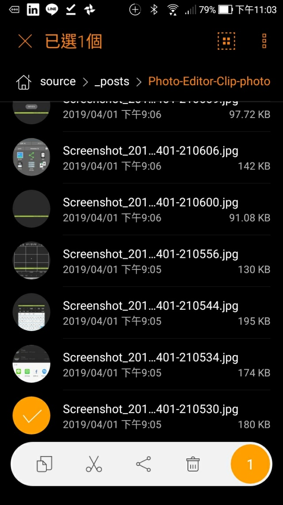
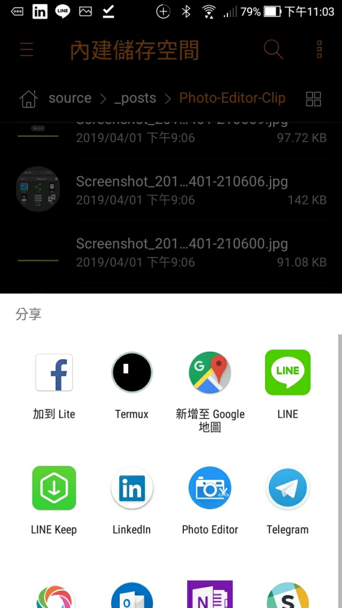
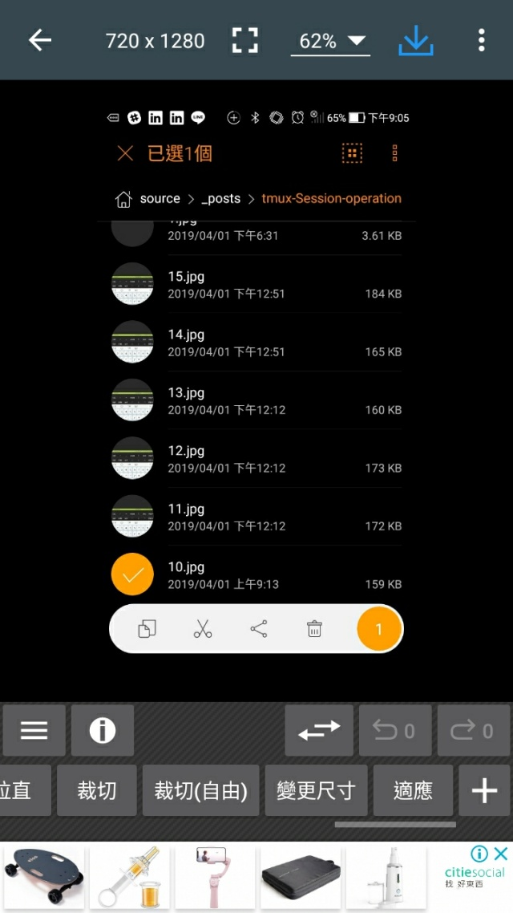
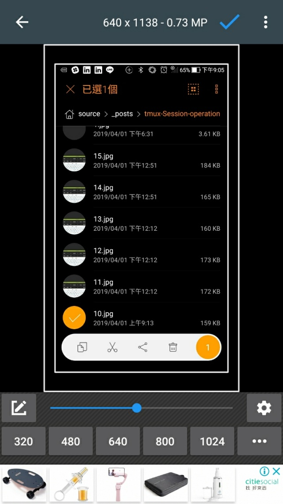
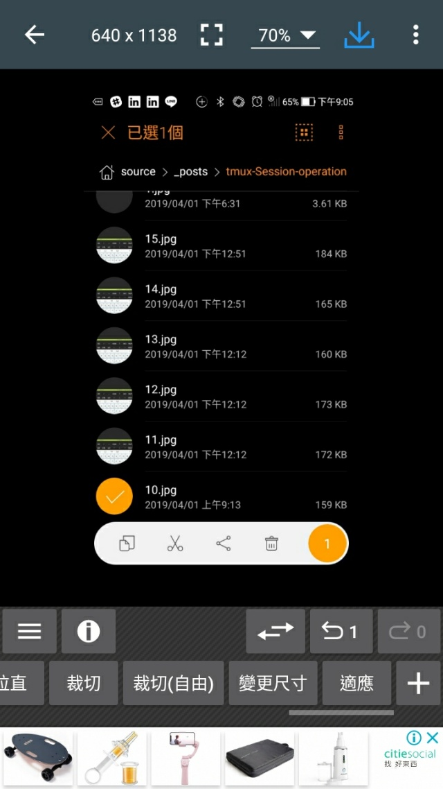
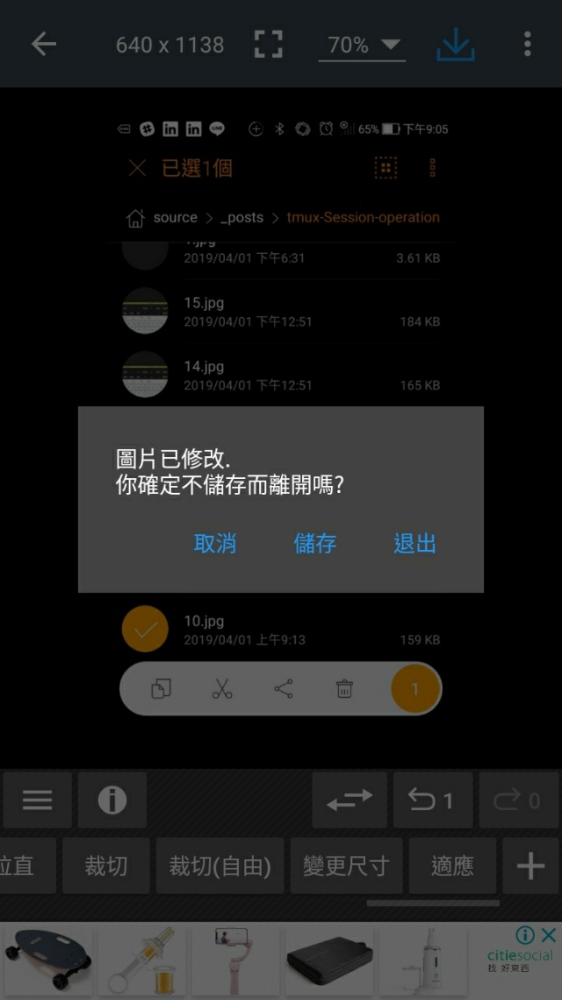
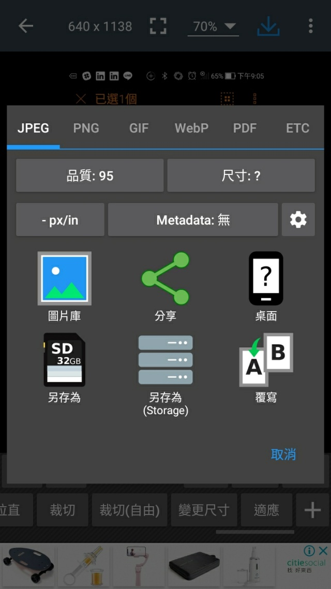
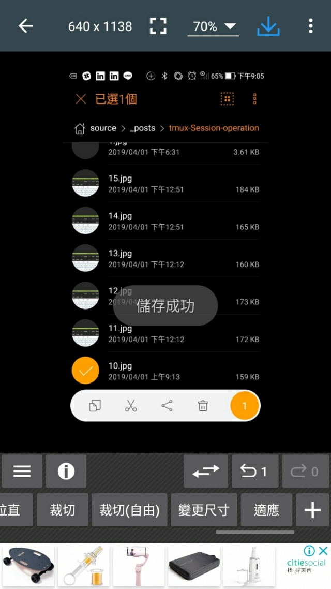

要使用 Photo Editor 在 Android 上進行圖片大小的調整。

<!-- More -->

 

可先選取要處理的圖片，選取分享。

 

將圖片分享至 Photo Editor。  

 

然後在 Photo Editor 下方找到變更尺寸按鈕。  

 

透過下方的按鈕或是拖曳下方水平 bar 調整適當的尺寸，如果要輸入指定尺寸，可按下左下方畫有筆的按鈕輸入設定。  

 

尺寸調整完按下右上方的勾勾按鈕確認圖片尺寸變更。  

 

最後按下左上方的箭頭。  

 

按下儲存。  

 

將變更尺寸的圖片儲存起來。  

 

