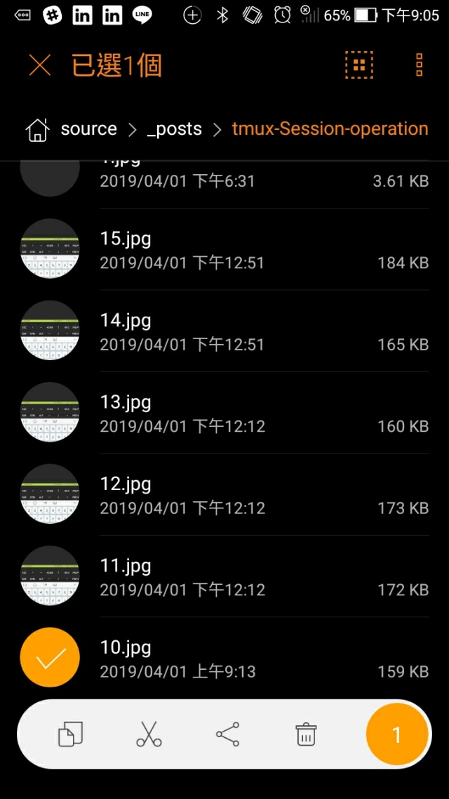
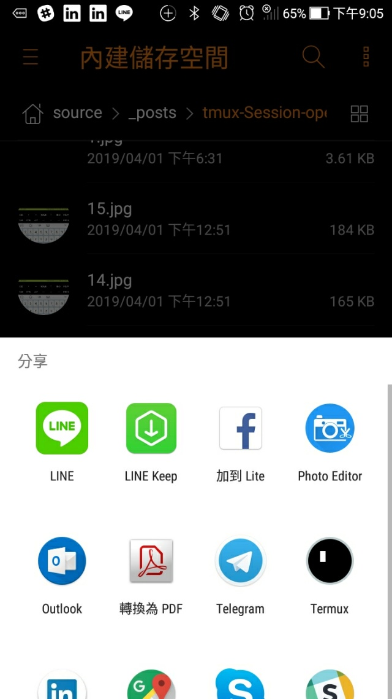
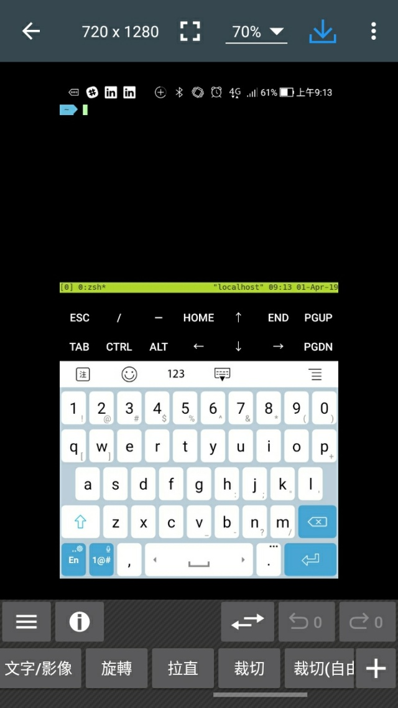
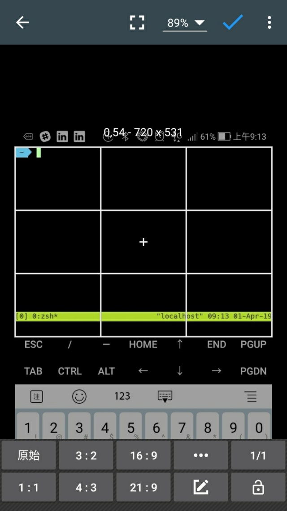
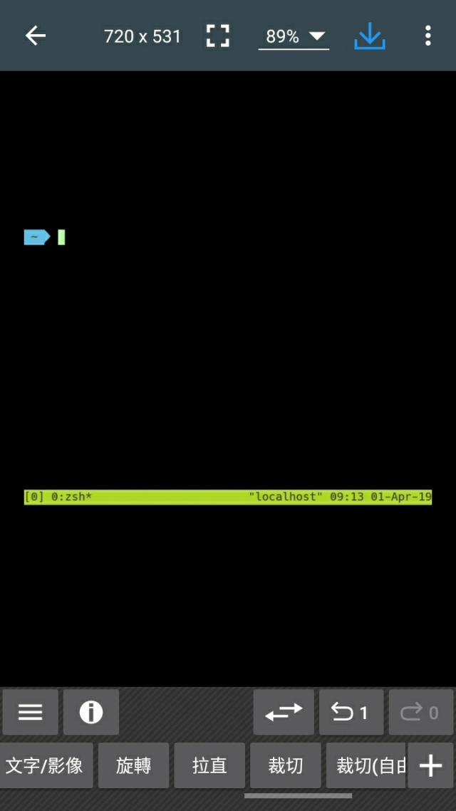
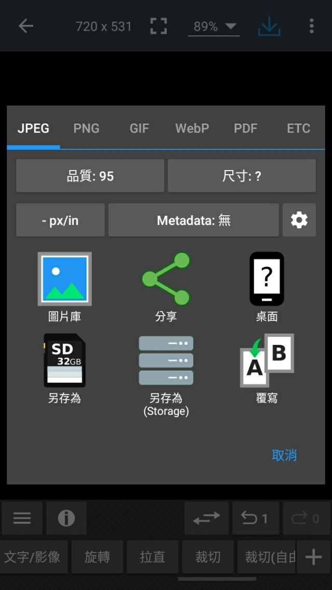
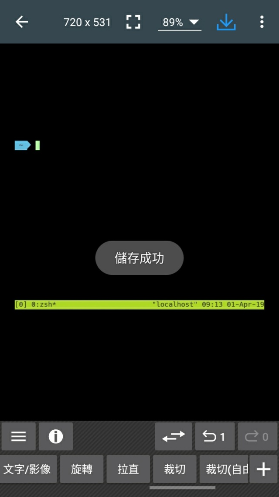

要使用 Photo Editor 在 Android 上進行圖片的裁切。  

<!-- More -->

 

可先選取要處理的圖片，選取分享。  

 

將圖片分享至 Photo Editor。  

 

然後在 Photo Editor 下方找到裁切按鈕。  

 

按下裁切按鈕後框出裁切後要留下來的部份，按下右上方的勾勾按鈕確認裁切。  

 

圖片會被裁切成只剩下剛所框出的部份。  

 

最後按下左上方的箭頭，儲存裁切的結果即可。  

 

