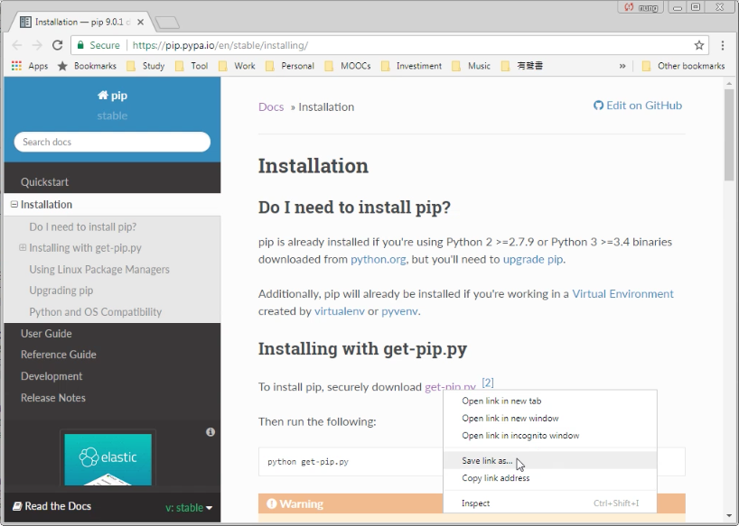
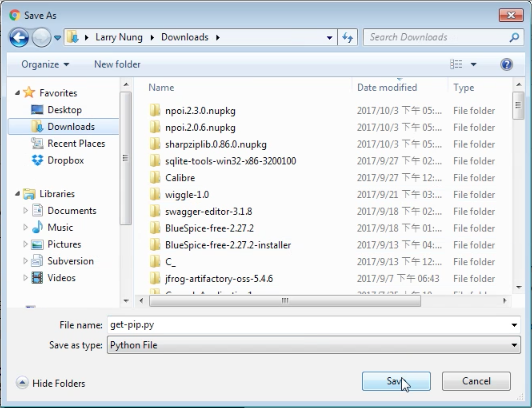
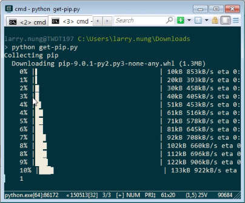
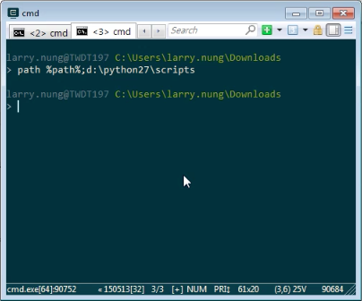
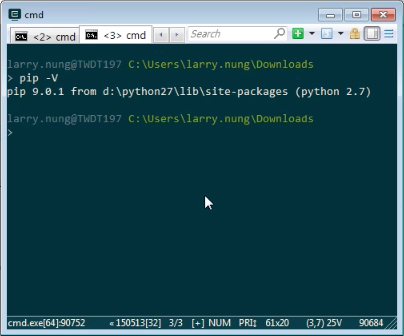

要使用 get-pip.py 安裝 pip，可先至 [Installation — pip 9.0.1 documentation](https://pip.pypa.io/en/stable/installing/) 這邊下載 [get-pip.py](https://bootstrap.pypa.io/get-pip.py) 檔。  

<!-- More -->

 

 

然後用 Python 運行 get-pip.py。  

    python get-pip.py

 

pip 就會被下載並安裝於 Python 安裝目錄下的 scripts 目錄。  

 

設定路徑。  

 

簡單的查詢 pip 版號測試一下，沒意外的話應該可以正常的運行。  

    pip -V

 

Link
----
* [Installation — pip 9.0.1 documentation](https://pip.pypa.io/en/stable/installing/)
